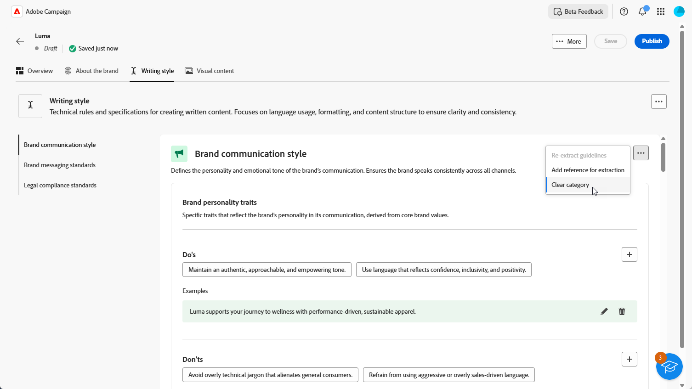
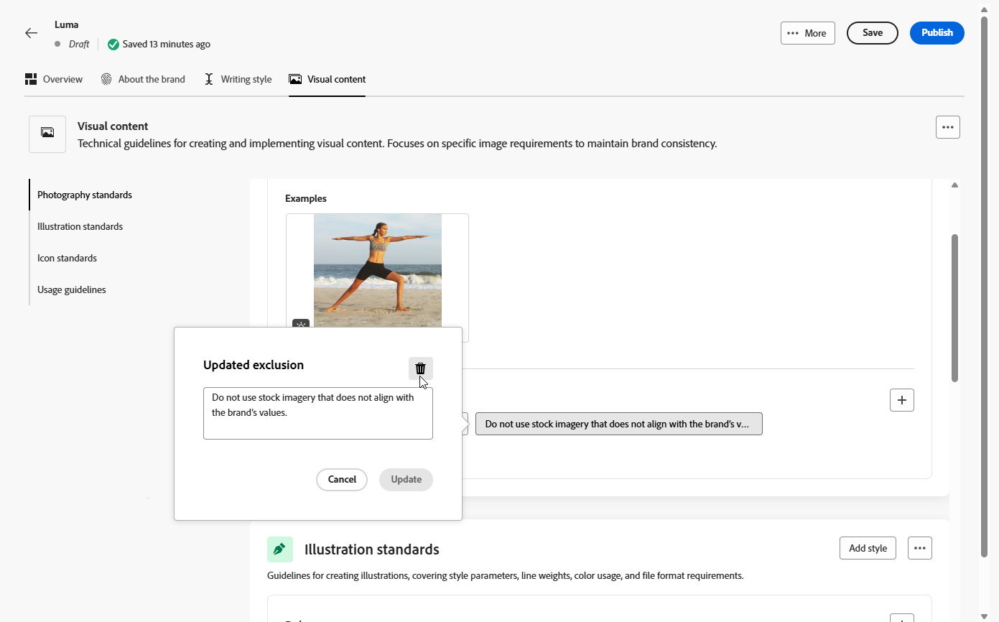

# Create and manage your brands {#brands}

Brand guidelines are a comprehensive set of rules and standards that define a brand's visual and verbal identity. They serve as a reference to ensure consistent brand representation across all marketing and communication channels.

In [!DNL Adobe Campaign Web], users can manually enter and organize brand information or upload brand guideline documents for automatic data extraction.

## Access brands {#generative-access}

To access the **[!UICONTROL Brands]** menu in [!DNL Adobe Campaign Web], users must be assigned the **[!UICONTROL Administrator (admin)]** and **[!UICONTROL Brand kit]** product profiles to create and manage brands. For read-only access, users need the [!UICONTROL AI assistant] product profile. [Learn more](https://experienceleague.adobe.com/en/docs/campaign/campaign-v8/admin/permissions/manage-permissions)

+++ Learn how to assign brand-related permissions

1. In the [Admin Console](https://adminconsole.adobe.com/enterprise) home page, access your Campaign product.

    

1. Select the **[!DNL Product profile]** based on the level of permissions you want to grant your user.

    

1. Click **[!DNL Add users]** to assign the selected product profile.

    

1. Type your user's name, user group, or email address.

1. Click **Save** to apply changes.

Users already assigned to this role have their permissions automatically updated.

+++

## Create your brand {#create-brand-kit}

To create and manage your brand guidelines, follow the steps below.

Users can either enter the details manually or upload a brand guidelines document to extract the information automatically:

1. In the **[!UICONTROL Brands]** menu, click **[!UICONTROL Create brand]**.

    

1. Enter a **[!UICONTROL Name]** for your brand.

1. Drag and drop or select your file to upload your brand guidelines and extract automatically relevant brand information. Click **[!UICONTROL Create brand]**.

    The information extraction process now begins. Note that it may take several minutes to complete.

    

1. Your Content and visual creation standards are now automatically populated. Browse through the different tabs to adapt the information as needed. [Learn more](#personalize)

1. From the advanced menu of each section or category, you can add references to extract relevant brand information automatically.

    To remove existing content, use the **[!UICONTROL Clear section]** or **[!UICONTROL Clear category]** options.

    

1. Once configured, click **[!UICONTROL Save]**, then **[!UICONTROL Publish]** to make your brand guideline available in AI Assistant.

1. To make modifications to your published brand, click **[!UICONTROL Edit brand]**. 

    >[!NOTE]
    >
    >This creates a temporary copy in edit mode, replacing the live version once published.

    

1. From your **[!UICONTROL Brands]** dashboard, open the advanced menu by clicking the  icon to: 

    * View brand
    * Edit
    * Mark as default brand
    * Duplicate
    * Publish
    * Unpublish
    * Delete

    

Your brand guidelines are now accessible from the **[!UICONTROL Brand]** drop-down in AI Assistant menu. This enables AI Assistant to generate content and assets aligned with your specifications. [Learn more about AI Assistant](../content/generative-gs.md)

### Set a default brand {#default-brand}

You can designate a default brand to be automatically applied when generating content and calculating alignment scores during campaign creation.

To set a default brand, go to your **[!UICONTROL Brands]** dashboard. Open the advanced menu by clicking the by clicking the  icon and select **[!UICONTROL Mark as default brand]**.

## Personalize your brand {#personalize}

### About the brand {#about-brand}

Use the **[!UICONTROL About the brand]** tab to establish the core identity of your brand—outlining its purpose, personality, tagline, and other defining attributes.

1. Start by filling in the foundational information for your brand in the **[!UICONTROL Key details]** category:

    * **[!UICONTROL Brand Kit Name]**: Enter your brand kit name.

    * **[!UICONTROL When to Use]**: Specify scenarios or contexts where this brand kit should be applied.

    * **[!UICONTROL Brand Name]**: Enter the official name of the brand.

    * **[!UICONTROL Brand Description]**: Provide an overview of what this brand represents.

    * **[!UICONTROL Default Tagline]**: Add the primary tagline associated with the brand.

      

1. In the **[!UICONTROL Guiding principles]** category, clarify the core direction and philosophy of your brand:

    * **[!UICONTROL Mission]**: Detail your brand's purpose.

    * **[!UICONTROL Vision]**: Describe your long-term goal or desired future state.

    * **[!UICONTROL Market Positioning]**: Explain how your brand is positioned in the market.

    

1. From the **[!UICONTROL Core brand values]** category, click  to add brand's core values and fill in the details:

    * **[!UICONTROL Value]**: Name a core brand value.

    * **[!UICONTROL Description]**: Explain what this value means to your brand.

    * **[!UICONTROL Behaviors]**: Outline the actions or attitudes that reflect this value in practice.

    * **[!UICONTROL Manifestations]**: Give examples of how this value is expressed in real-world branding.

      

1. If needed, click the icon to update or delete one of your core brand value.

    

You can now further personalize your brand or [publish your brand](#create-brand-kit).

### Writing style {#writing-style}

The **[!UICONTROL Writing style]** section outlines the standards for writing content, detailing how language, formatting, and structure should be used to maintain clarity, coherence, and consistency across all materials.

+++ Available category and examples

<table>
  <thead>
    <tr>
      <th>Category</th>
      <th>Subcategory</th>
      <th>Guidelines Example</th>
      <th>Exclusions Example</th>
    </tr>
  </thead>
  <tbody>
    <tr>
      <td rowspan="4">Content Creation Standards</td>
      <td>Brand Messaging Standards</td>
      <td>Highlight innovation and customer-first messaging.</td>
      <td>Do not overpromise product capabilities.</td>
    </tr>
    <tr>
      <td>Tagline Usage</td>
      <td>Place the tagline beneath the logo on all digital marketing assets.</td>
      <td>Do not modify or translate the tagline.</td>
    </tr>
    <tr>
      <td>Core Messaging</td>
      <td>Emphasize the key benefit statement—such as improved productivity.</td>
      <td>Do not use unrelated value propositions.</td>
    </tr>
    <tr>
      <td>Naming Standards</td>
      <td>Use simple, descriptive names such as "ProScheduler".</td>
      <td>Do not use complex terms or special characters.</td>
    </tr>
    <tr>
      <td rowspan="5">Brand Communication Style</td>
      <td>Brand Personality Traits</td>
      <td>Friendly and approachable.</td>
      <td>Do not be defeatist.</td>
    </tr>
    <tr>
      <td>Writing Mechanics</td>
      <td>Keep sentences short and impactful.</td>
      <td>Do not use excessive jargon.</td>
    </tr>
    <tr>
      <td>Situational Tone</td>
      <td>Maintain a professional tone in crisis communications.</td>
      <td>Do not be dismissive in support communications.</td>
    </tr>
    <tr>
      <td>Word Choice Guidelines</td>
      <td>Use words like "innovative" and "smart".</td>
      <td>Avoid words like "cheap" or "hack".</td>
    </tr>
    <tr>
      <td>Language Standards</td>
      <td>Follow American English conventions.</td>
      <td>Do not mix British and American spellings.</td>
    </tr>
    <tr>
      <td rowspan="3">Legal Compliance Standards</td>
      <td>Trademark Standards</td>
      <td>Always use the &#8482; or &#174; symbol.</td>
      <td>Do not omit legal symbols when required.</td>
    </tr>
    <tr>
      <td>Copyright Standards</td>
      <td>Include copyright notices on marketing materials.</td>
      <td>Do not use third-party content without permission.</td>
    </tr>
    <tr>
      <td>Disclaimer Standards</td>
      <td>Display disclaimers legibly on digital assets.</td>
      <td>Do not hide disclaimers in non-visible areas.</td>
    </tr>
</table>

+++

 

To personalize your **[!UICONTROL Writing Style]**:

1. From the **[!UICONTROL Writing Style]** tab, click  to add a guideline, exception or exclusion.

1. Enter your guideline, exception or exclusion. You can also include **[!UICONTROL Examples]** to better illustrate how it should be applied.

    

1. Specify the **[!UICONTROL Usage context]** for your guideline, exception or exclusion:

    * **[!UICONTROL Channel type]**: Choose where this guideline, exception, or exclusion should apply. For example, you may want a specific writing style to appear only in Email, Mobile, Prints, or other communication channels.

    * **[!UICONTROL Element type]**: Specify which content element the rule applies to. This could include elements such as Headings, Buttons, Links, or other components within your content.

    

1. Once your guideline, exception, or exclusion is set up, click **[!UICONTROL Add]**. 
1. If needed, select one of your guideline or exclusion to update or delete.

1. Click the  to edit your example or the icon to delete it. 

    

You can now further personalize your brand or [publish your brand](#create-brand-kit).

### Visual content {#visual-content}

The **[!UICONTROL Visual Content]** section defines the standards for imagery and design, detailing the specifications needed to maintain a unified and consistent brand look.

+++ Available categories and examples

<table>
  <thead>
    <tr>
      <th>Category</th>
      <th>Guidelines Example</th>
      <th>Exclusions Example</th>
    </tr>
  </thead>
  <tbody>
    <tr>
      <td>Photography Standards</td>
      <td>Use natural lighting for outdoor shots.</td>
      <td>Avoid overly edited or pixelated images.</td>
    </tr>
    <tr>
      <td>Illustration Standards</td>
      <td>Use clean, minimalistic styles.</td>
      <td>Avoid overly complex.</td>
    </tr>
    <tr>
      <td>Icon standards</td>
      <td>Use a consistent 24px grid system.</td>
      <td>Do not mix icon dimensions, use inconsistent stroke weights, or deviate from grid rules.</td>
    </tr>
    <tr>
      <td>Usage guidelines</td>
      <td>Choose lifestyle images that reflect real customers using the product in professional environments.</td>
      <td>Do not use imagery that contradicts brand tone or appears out of context.</td>
    </tr>
</table>

+++

 

To personalize your **[!UICONTROL Visual content]**:

1. From the **[!UICONTROL Visual content]** tab, click  to add a guideline, exclusion or example. 

1. Enter your guideline, exclusion or example.

    

1. Specify the **[!UICONTROL Usage context]** for your guideline or exclusion:

    * **[!UICONTROL Channel type]**: Choose where this guideline, exception, or exclusion should apply. For example, you may want a specific writing style to appear only in Email, Mobile, Prints, or other communication channels.

    * **[!UICONTROL Element type]**: Specify which content element the rule applies to. This could include elements such as Headings, Buttons, Links, or other components within your content.

      

1. Once your guideline, exception, or exclusion is set up, click **[!UICONTROL Add]**. 

1. To add an image showing correct usage, select **[!UICONTROL Example]** and click **[!UICONTROL Select image]**. You can also add an image showing incorrect usage as an exclusion example.

    

1. Select one of your guideline or exclusion to update or delete.

1. Select one your guideline or exclusion to update it. Click the icon to delete it. 

    

You can now further personalize your brand or [publish your brand](#create-brand-kit).
