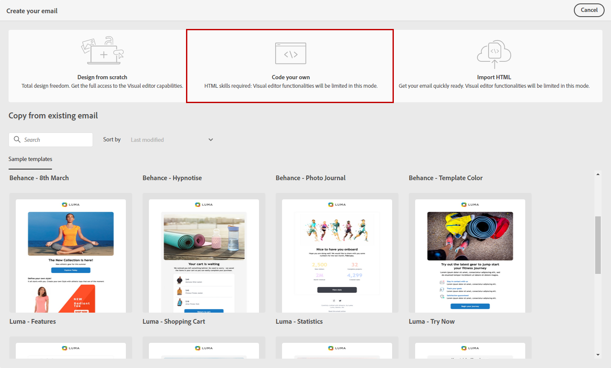

# Code your own email content {#code-content}

Use the **[!UICONTROL Code your own]** mode to import raw HTML and/or code your email content.

>[!CAUTION]
>
>This method requires HTML skills.

1. On the [Email Designer](get-started-email-designer.md) home page, select **[!UICONTROL Code your own]**.

    

1. Enter or paste your raw HTML code into the main canvas. 

1. Use the left pane to leverage personalization capabilities. [Learn more](../personalization/gs-personalization.md)

    

1. Click the **[!UICONTROL Simulate content]** button to check the message design and personalization using test profiles. [Learn more](../preview-test/preview-test.md)

1. Once your code is ready, click **[!UICONTROL Save & close]** to go back to the message creation screen and finalize your message.
