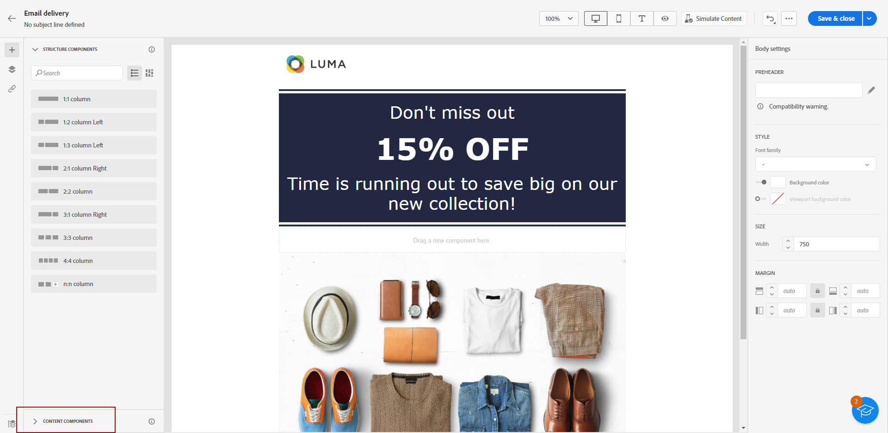
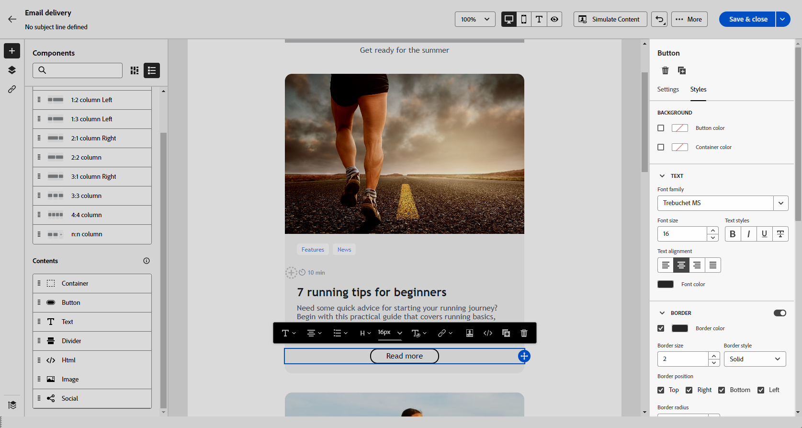
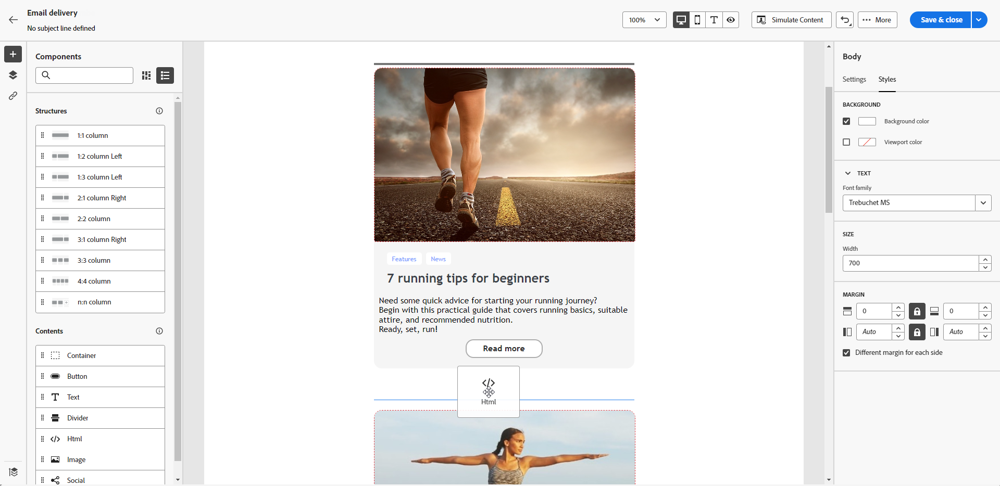
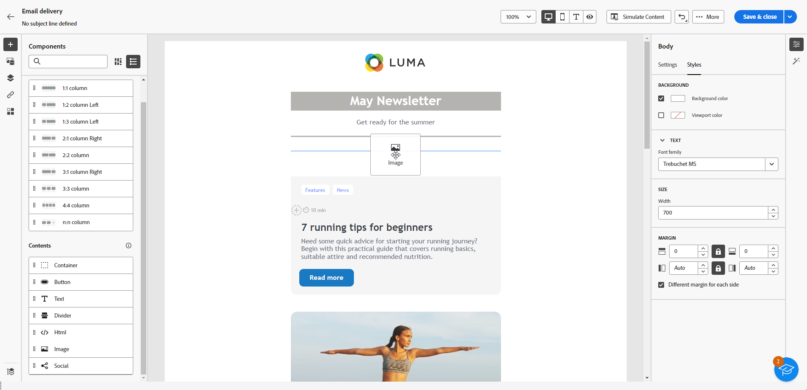

# Use the Email designer content components {#content-components}

>[!CONTEXTUALHELP]
>id="ac_content_components_email"
>title="About Content components"
>abstract="Content components are empty content placeholders that you can use to create the layout of an email."

>[!CONTEXTUALHELP]
>id="ac_content_components_landing_page"
>title="About Content components"
>abstract="Content components are empty content placeholders that you can use to create the layout of a landing page."

>[!CONTEXTUALHELP]
>id="ac_content_components_fragment"
>title="About Content components"
>abstract="Content components are empty content placeholders that you can use to create the layout of a fragment."

>[!CONTEXTUALHELP]
>id="ac_content_components_template"
>title="About Content components"
>abstract="Content components are empty content placeholders that you can use to create the layout of a template."

## Add content components {#add-content-components}

To add content components to your email and adjust them to your needs, follow the steps below.

1. In the Email Designer, use an existing content or drag and drop **[!UICONTROL Structure components]** into your empty content to define the layout of your email. [Learn how](create-email-content.md)

1. To access the **[!UICONTROL Content components]** section, select the corresponding button from the Email Designer left pane.

    

1. Drag and drop the content components of your choice inside the relevant structure components.

    

    >[!NOTE]
    >
    >You can add several components into a single structure component and into each column of a structure component.

1. Adjust the styling attributes for each component using the **[!UICONTROL Component settings]** pane on the right. For example, you can change the text style, padding or margin of each component. [Learn more about alignment and padding](alignment-and-padding.md)

    

When creating your email content from scratch, **[!UICONTROL Content components]** allows you to further personalize your email with raw, empty components that you can use once placed in an email.
You can add as many **[!UICONTROL Content components]** as you need inside a **[!UICONTROL Structure component]** which defines the layout of your email.

## Container {#container}

You can add a simple container inside which you will be able to add another content component. This allows you to apply a specific styling to the container, which will be different from the component used inside.

For example, add a **[!UICONTROL Container]** component and then add a [Button](#button) component inside that container. You can use a specific background for the container, and another one for the button.

## Button {#buttons}

Use the **[!UICONTROL Button]** component to insert one or multiple buttons into your email and redirect your email audience to another page.

1. From **[!UICONTROL Content components]**, drag and drop the **[!UICONTROL Button]** component into a **[!UICONTROL Structure component]**.

    

1. Click your newly added button to personalize the text and to have access to the **[!UICONTROL Components settings]** in the Email Designer right pane.

    

1. In the **[!UICONTROL Link]** field, add the URL you want to redirect to when clicking the button.

1. Choose how your audience will be redirected with the **[!UICONTROL Target]** drop-down list:

    * **[!UICONTROL None]**: opens the link in the same frame as it was clicked (default).
    * **[!UICONTROL Blank]**: opens the link in a new window or tab.
    * **[!UICONTROL Self]**: opens the link in the same frame as it was clicked.
    * **[!UICONTROL Parent]**: opens the link in the parent frame.
    * **[!UICONTROL Top]**: opens the link in the full body of the window.

    

1. You can further personalize your button by changing styling attributes such as **[!UICONTROL Border]**, **[!UICONTROL Size]**, **[!UICONTROL Margin]**, etc. from the **[!UICONTROL Component settings]** pane.

## Text {#text}

Use the **[!UICONTROL Text]** component to insert text into your email, and adjust the style (border, size, padding, etc.) using the **[!UICONTROL Component settings]** pane.

1. From **[!UICONTROL Content Components]**, drag and drop **[!UICONTROL Text]** in a **[!UICONTROL Structure component]**.

    

1. Click on your newly added component to personalize the text and to have access to the **[!UICONTROL Components Settings]** in the right pane of the email designer.

1. Change your text with the following options available in the toolbar:

    

    * **[!UICONTROL Change text style]**: apply bold, italic, underline or strike through to your text.
    * **Change alignment**: choose between left, right, center or justified alignment for your text.
    * **[!UICONTROL Create list]**: add bullet or number list to your text.
    * **[!UICONTROL Set heading]**: add up to six heading levels to your text.
    * **Font size**: select the font size of your text in pixels.
    * **[!UICONTROL Edit image]**: add an image or an asset to your text component.
    * **[!UICONTROL Show the source code]**: display the source code of your text. It cannot be modified.
    * **[!UICONTROL Duplicate]**: add a copy of your text component.
    * **[!UICONTROL Delete]**: delete the selected text component from your email.
    * **[!UICONTROL Add personalization]**: add personalization fields to customize the content from your profiles data.
    * **[!UICONTROL Enable conditional content]**: add conditional content to adapt the content of the component to the targeted profiles.

1. Adjust the other styling attributes such as text color, font family, border, padding, margin, etc. from the **[!UICONTROL Component settings]** pane.

    

## Divider {#divider}

Use the **[!UICONTROL Divider]** component to insert a dividing line to organize the layout and content of your email.

You can adjust styling attributes such as the line color, style and height from the **[!UICONTROL Component settings]** pane.

## HTML {#HTML}

Use the **[!UICONTROL HTML]** component to copy-paste the different parts of your existing HTML. This enables you to create free modular HTML components to reuse some external content.

1. From **[!UICONTROL Content Components]**, drag and drop the **[!UICONTROL HTML]** component into a **[!UICONTROL Structure component]**.

    

1. Click on your newly added component, then select **[!UICONTROL Show the source code]** from the contextual toolbar to add your HTML.

    

>[!NOTE]
>
>To simply make an external content compliant with the Email Designer, Adobe recommends creating a message from scratch and copy the content from your existing email into components.

## Image {#image}

Use the **[!UICONTROL Image]** component to insert an image file from your computer in your email.

1. In **[!UICONTROL Content Components]**, drag and drop **[!UICONTROL Image]** in a **[!UICONTROL Structure component]**.

    

1. Click **[!UICONTROL Browse]** to choose an image file from your assets.

1. Click your newly added component and set up your image properties using the **[!UICONTROL Components settings]** pane:

    * **[!UICONTROL Image title]** lets you define a title to your image.
    * **[!UICONTROL Alt text]** lets you define the caption linked to your image. This corresponds to the alt HTML attribute.

    

1. Adjust the other styling attributes such as margin, border, etc. or adding a link to redirect your audience to another content from the **[!UICONTROL Component settings]** pane.

## Social {#social}

Use the **[!UICONTROL Social]** component to insert links to social media pages into your email content.

1. From **[!UICONTROL Content Components]**, drag and drop the **[!UICONTROL Social]** component into a **[!UICONTROL Structure component]**.

1. Click your newly added component.

1. In the **[!UICONTROL Social]** field of the **[!UICONTROL Components settings]** pane, choose which social media you want to add or remove.

    

1. Choose the size of your icons in the **[!UICONTROL Size of images]** field.

1. Click on each of your social media icons to configure the **[!UICONTROL URL]** to which your audience will be redirected.

    

1. You can also change the icons of each of your social media if needed in the **[!UICONTROL Image]** field.

1. Adjust the other styling attributes such as style, margin, border, etc. from the **[!UICONTROL Component settings]** pane.
