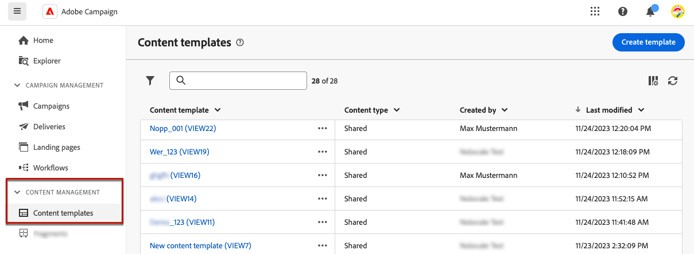

# Work with content templates {#content-templates}

>[!CONTEXTUALHELP]
>id="acw_contenttemplate_menu"
>title="Define your own content"
>abstract="Create a standalone custom template from scratch to make your content reusable across multiple emails."
 
For an accelerated and improved design process, you can create standalone templates to easily reuse custom content across [!DNL Adobe Campaign].

This functionality enables content-oriented users to work on standalone templates so that marketing users can reuse and adapt them inside their own email campaigns.

>[!NOTE]
>
>Currently only **email** content templates are supported.

## Access and manage templates {#access-manage-templates}

>[!CONTEXTUALHELP]
>id="acw_contenttemplate_edition"
>title="Edit your template content"
>abstract="Click the **Edit content** button to update your content with the Email Designer."

To access the content template list, select **[!UICONTROL Content Management]** > **[!UICONTROL Content Templates]** from the left menu.

All the templates that were created - either from an email using the [Save as template](#save-as-template) option, either from the **[!UICONTROL Content Templates]** menu - are displayed.

<!--You can sort content templates by creation or modification date. You can also choose to display only the items that you created or modified.-->

You can filter on a specific [folder](../get-started/permissions.md#folders) using the drop-down list or add rules using the [query modeler](../query/query-modeler-overview.md).

To edit a template content, click the desired item from the list. You can:

* Edit its properties.

* Click the **[!UICONTROL Edit content]** button to update your content with the [Email Designer](get-started-email-designer.md).

To delete a template, select the corresponding option from the **[!UICONTROL More actions]** menu.

>[!NOTE]
>
>When a template is deleted, deliveries created using this template are not impacted.

## Create content templates {#create-content-templates}

>[!CONTEXTUALHELP]
>id="acw_contenttemplate_design"
>title="Content template design"
>abstract="Content template design"

>[!CONTEXTUALHELP]
>id="acw_contenttemplate_selection"
>title="Content template selection"
>abstract="Content template selection"

There are two ways you can create content templates:

* Create a content template from scratch, using the left rail **[!UICONTROL Content templates]** menu. [Learn how](#create-template-from-scratch)

* When designing an email, save your email content as template. [Learn how](#save-as-template)

Once saved, whether created from scratch or from a previous email, you can now use this template when building any [email](../email/create-email.md) within [!DNL Adobe Campaign]. [Learn how](use-email-templates.md)

>[!NOTE]
>
>* Changes made to content templates are not propagated to emails.
>
>* Similarly, when templates are used in an email, any edits you make to your email content do not impact the previously used content template.

### Create template from scratch {#create-template-from-scratch}

>[!CONTEXTUALHELP]
>id="acw_contenttemplate_properties"
>title="Define your template properties"
>abstract="When creating a template from scratch, define its properties to retrieve is easily when needed."

To create a content template from scratch, follow the steps below.

1. Access the content template list through the **[!UICONTROL Content Management]** > **[!UICONTROL Content templates]** left menu.

1. Select **[!UICONTROL Create template]**.

    

1. Fill in the template details.

    

    >[!NOTE]
    >
    >Currently only the **Email** channel and **HTML** type are supported.

1. Select the folder where you want to store your template. By default, content templates are stored in a dedicated node of the Adobe Campaign hierarchy: **[!UICONTROL Explorer]** > **[!UICONTROL Resources]** > **[!UICONTROL Templates]** > **[!UICONTROL Content templates]**. [Learn how to create folders](../get-started/permissions.md#folders)

1. Click **[!UICONTROL Create]** and choose how you want to design your template from the different options:

    * [Design your email from scratch](create-email-content.md) through the Email Designer's interface.

    * [Code or copy-paste raw HTML](code-content.md) directly into the Email Designer.

    * [Import existing HTML content](existing-content.md) from a file or a .zip folder.

    * Use existing content from a list of built-in or custom templates. The steps to use a content template in an email are described in [this section](use-email-templates.md).

    

1. The [Email Designer](get-started-email-designer.md) displays. Edit your content as needed, the same way you would do for any email, according to the option you selected.

    <!--You can test your content if needed. [Learn how](#test-template)-->

1. Once your template is ready, click **[!UICONTROL Save]**.

    If needed, click the arrow next to the template name to go back to the **[!UICONTROL Details]** screen and edit your template.

    

This template is now ready to be used when building any email within [!DNL Adobe Campaign]. [Learn how](use-email-templates.md)

## Save email content as template {#save-as-template}

Once you [designed an email](create-email-content.md), you can save this content as a template for future reuse. Saved templates are available to all users of your Adobe Campaign environment.

To save an email content as a template, follow the steps below:

1. From the email designer, click the **[!UICONTROL More]** button on top right of the screen.

1. Select **[!UICONTROL Save as content template]** from the drop-down menu.

    

1. Enter a name for this template, and save.

    

You can now use this template to build a new content: it is available in the **[!UICONTROL Saved templates]** tab of the Email Designer. [Learn how](use-email-templates.md)

The template is saved into the **[!UICONTROL Content templates]** list, accessible from the [!DNL Adobe Campaign] dedicated menu. It becomes a standalone content template that can be accessed, edited and deleted as any other item on that list. [Learn more](#access-manage-templates)

>[!NOTE]
>
>Any change to that new template is not propagated to the email it comes from. Similarly, when the original content is edited within that email, the new template is not modified.

<!-->
## Test your content template {#test-template}

You can test the rendering of any email content template, whether created from scratch or from an email. To do so, follow the steps below.

1. Access the content template list through the **[!UICONTROL Content Management]** > **[!UICONTROL Content Templates]** menu and select any template.

1. Click **[!UICONTROL Edit content]** from the **[!UICONTROL Template properties]**.

1. Click **[!UICONTROL Simulate Content]** and select a test profile to check your email rendering. You can choose the desktop or mobile view. [Learn more](../content-management/preview-test.md)

    

1. You can send a proof to test your content and have it approved by some internal users before using it in a journey or a campaign.

    * To do so, click the **[!UICONTROL Send proof]** button and follow the steps described in [this section](../content-management/proofs.md).
    
    * Before sending the proof, you must select the [email surface](../configuration/channel-surfaces.md) that will be used to test your content.

        

>[!CAUTION]
>
>Currently tracking is not supported when testing email content templates, meaning that tracking events, UTM parameters and landing page links will not be effective in the proofs that are being sent from a template. To test tracking, [use the content template](../email/use-email-templates.md) in an email and [send a proof](../content-management/preview-test.md#send-proofs).-->

