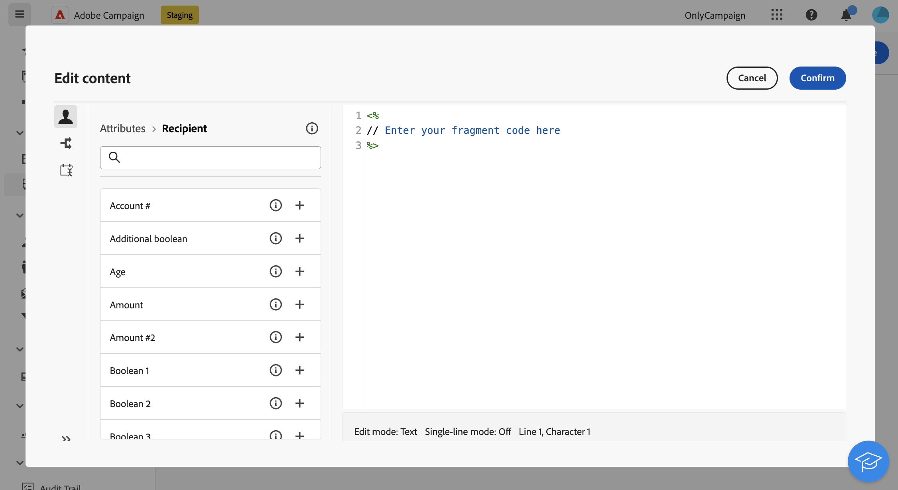

# Create content fragments {#fragments}

>[!CONTEXTUALHELP]
>id="acw_fragments_create"
>title="Define your own content fragments"
>abstract="Define the fragment properties and the type of fragment you want to create. You can then use the email designer or the expression editor to configure the content of your fragment."
<!-- pas vu dans l'UI-->

>[!CONTEXTUALHELP]
>id="acw_fragments_properties"
>title="Fragments properties"
>abstract="Enter the label of the fragment. If needed, you can define additional options, such as the fragment internal name, its folder, and a description."

>[!CONTEXTUALHELP]
>id="acw_fragments_type"
>title="Type of content fragment"
>abstract="Choose the type of fragment you want to create. **Visual fragments** are pre-defined visual blocks that you can reuse across multiple email deliveries or in content templates. **Expression fragments** are pre-defined expressions that are available from a dedicated entry in the expression editor."

There are two ways to create content fragments:

* Create a fragment from scratch, using the **[!UICONTROL Fragments]** dedicated menu. [Learn how](#create-from-scratch)
* When designing content, save a portion of your content as a fragment. [Learn how](#save-as-fragment)

    >[!NOTE]
    >
    >This capability is available for visual fragments only. Expression fragments are exclusively created from the **Fragments** menu.

Once saved, the content fragment is available for use in any delivery or content template.

## Create a content fragment from scratch {#create-from-scratch}

To create a content fragment from scratch, follow the steps below.

1. [Access the fragment list](#access-manage-fragments) through the **[!UICONTROL Content Management]** > **[!UICONTROL Fragments]** left menu and select **[!UICONTROL Create fragment]**.

    

1. Enter the label of the fragment. If needed, define additional options, such as the fragment internal name, its folder, and a description.

1. Choose the type of fragment to create: **Visual fragment** or **Expression fragment**. [Learn the differences between visual and expression fragments](fragments.md)

    

    >[!AVAILABILITY]
    >
    >Visual fragments require an update to Campaign v8.6.4. Learn more in the [Campaign v8 Client console release notes](https://experienceleague.adobe.com/en/docs/campaign/campaign-v8/releases/release-notes).
    
1. Click the **Create** button.

    * For **visual fragments**, the [Email Designer](../email/get-started-email-designer.md) displays. Edit the content as needed, the same way you would for any email inside a campaign, then click the **Save & close** button. Add images, links, personalization fields, and dynamic content.

        

    * For **expression fragments**, the Expression editor opens. Use its personalization and authoring capabilities to build the content, then click **Confirm**. [Learn how to work with the expression editor](../personalization/personalize.md)

        

1. Once the content is ready, click **Save**.

The content fragment is now ready to be used when building any delivery or [content template](../email/use-email-templates.md) within Campaign. Learn how to use visual and expression fragments in these sections:
* [Add visual fragments to your emails](use-visual-fragments.md)
* [Add expression fragments to the expression editor](use-expression-fragments.md)

## Save content as visual fragment {#save-as-fragment}

>[!CONTEXTUALHELP]
>id="acw_fragments_save"
>title="Save as fragment"
>abstract="To save content as a visual fragment, select the elements to include in the fragment, including personalization fields and dynamic content. Only adjacent sections can be selected. Empty structures or other content fragments cannot be selected. The content will then become a standalone fragment, added to the fragment list, and accessible from the dedicated menu. This fragment can be used when building any email or content template within Campaign."
<!--pas vu dans l'UI-->

Any email content can be saved as a visual fragment for future reuse. When designing a [content template](../email/use-email-templates.md) or an [email](../email/get-started-email-designer.md) delivery, save a portion of the content as a visual fragment. To do this, follow the steps below:

1. In the [Email Designer](../email/get-started-email-designer.md), click the **More** button at the top right of the screen.

1. Select **[!UICONTROL Save as fragment]** from the drop-down menu.

    

1. The **[!UICONTROL Save as fragment]** screen displays. Select the elements to include in the fragment, including personalization fields and dynamic content.

    >[!CAUTION]
    >
    >Only adjacent sections can be selected. Empty structures or other content fragments cannot be selected.

    

1. Click **[!UICONTROL Create]**. Fill in the fragment name and save it.

    

    This content is now a standalone fragment, added to the [fragment list](#manage-fragments), and accessible from the dedicated menu. Use this fragment when building any [email](../email/get-started-email-designer.md) or [content template](../email/use-email-templates.md) within Campaign. [Learn how](../content/use-visual-fragments.md)

>[!NOTE]
>
>Changes to the new fragment are not propagated to the email or template it originates from. Similarly, when the original content is edited within the email or template, the new fragment is not modified.

## Manage your content fragments {#manage-fragments}

You can edit, update, duplicate, or delete a content fragment from the fragment list.

### Edit and update a content fragment {#edit-fragments}

To edit a content fragment, follow the steps below.

1. Click on the name of the fragment to edit from the **[!UICONTROL Fragments]** list.
1. Click the **Edit content** button to open the content of the fragment.

    

1. Make the necessary changes and save the modifications.

>[!CAUTION]
>
>Changes to a fragment are propagated to the deliveries or templates using it. 

### Delete a content fragment {#delete-fragments}

To delete a content fragment, follow these steps:

1. Browse to the fragment list, and click the **[!UICONTROL More actions]** button next to the fragment to delete. 
1. Click **Delete** and confirm.

    

>[!CAUTION]
>
>When deleting a fragment, deliveries and templates using it are updated. The fragment is removed from the content but still referenced. To keep the fragment content in those deliveries and templates, break inheritance before deleting the fragment, [as detailed in this section](use-visual-fragments.md#break-inheritance).

### Archive a content fragment {#archive}

You can clean the fragments list by archiving fragments that are no longer relevant to your brand. To do so, click the **[!UICONTROL More actions]** button next to the desired fragment and select **[!UICONTROL Archive]**. The fragment is removed from the fragment list, preventing users from using it in future emails or templates.

To access archived fragments, use the filtering pane to display them. To unarchive a fragment, click the **[!UICONTROL More actions]** button and select **[!UICONTROL Unarchive]**.

>[!NOTE]
>
>Archiving a fragment does not affect content that uses it.

### Duplicate a content fragment {#duplicate-fragments}

You can easily duplicate a content fragment to create a new one. To duplicate an existing fragment, follow these steps:

1. Browse to the fragment list, and click the **[!UICONTROL More actions]** button next to the fragment to duplicate. 
1. Click **Duplicate** and confirm.
1. Enter the label of the new fragment and save the changes.

    The fragment is added to the list of content fragments. Edit and configure it as needed.