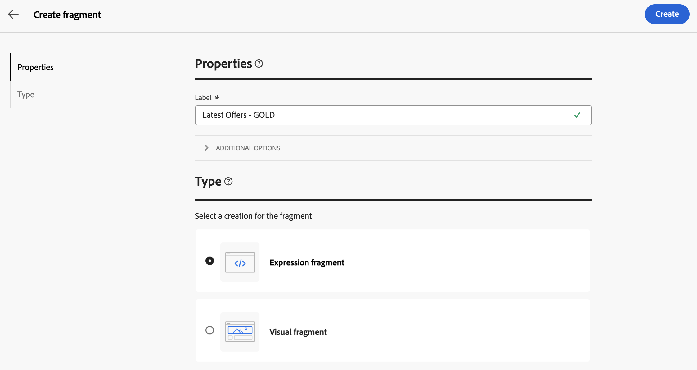
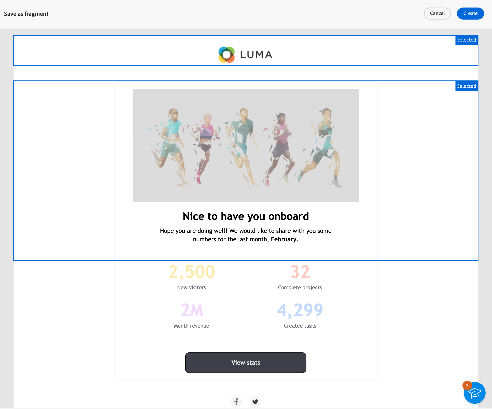
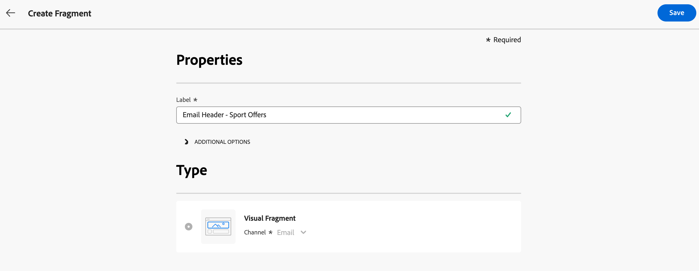
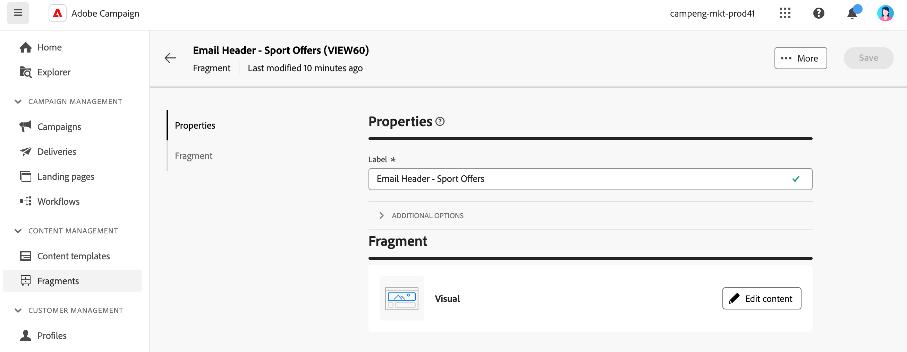

# Create content fragments {#fragments}

>[!CONTEXTUALHELP]
>id="acw_fragments_create"
>title="Define your own content fragments"
>abstract="Define the fragment properties and the type of fragment you want to create. You can then use the email designer or the expression editor to configure the content of your fragment."
<!-- pas vu dans l'UI-->

>[!CONTEXTUALHELP]
>id="acw_fragments_properties"
>title="Fragments properties"
>abstract="Enter the label of the fragment. If needed, you can define additional options, such as the fragment internal name, its folder, and a description."

>[!CONTEXTUALHELP]
>id="acw_fragments_type"
>title="Type of content fragment"
>abstract="Choose the type of fragment you want to create. **Visual fragments** are pre-defined visual blocks that you can reuse across multiple email deliveries or in content templates. **Expression fragments** are pre-defined expressions that are available from a dedicated entry in the expression editor."

There are two ways you can create content fragments:

* Create a fragment from scratch, using the **[!UICONTROL Fragments]** dedicated menu. [Learn how](#create-from-scratch)
* When designing content, save a portion of your content as fragment. [Learn how](#save-as-fragment)

    >[!NOTE]
    >
    >This capability is available for visual fragments only. Expression fragments are exclusively created from the **Fragments** menu.

Once saved, your content fragment is available for use in any delivery or content template.

## Create a content fragment from scratch {#create-from-scratch}

To create a content fragment from scratch, follow the steps below.

1. [Access the fragment list](#access-manage-fragments) through the **[!UICONTROL Content Management]** > **[!UICONTROL Fragments]** left menu and select **[!UICONTROL Create fragment]**.

    

1. Enter the label of the fragment. If needed, you can define additional options, such as the fragment internal name, its folder, and a description.

1. Choose the type of fragment you want to create: **Visual fragment** or **Expression fragment**. [Learn the differences between visual and expression fragments](fragments.md)

    
    
1. Click the **Create** button.

    * For **visual fragments**, the [Email Designer](../email/get-started-email-designer.md) displays. Edit your content as needed, the same way you would do for any email inside a campaign then click the **Save & close** button. You can add images, link, personalization fields and dynamic content.

        

    * For **expression fragments**, the Expression editor opens. Leverage its personalization and authoring capabilities to build your content then click **Confirm**. [Learn how to work with the expression editor](../personalization/personalize.md)

        

1. Once your content is ready, click **Save**.

The content fragment is now ready to be used when building any delivery or [content template](../email/use-email-templates.md) within Campaign. Learn how to use visul and expression fragments in these section:
* [Add visual fragments to your emails](use-visual-fragments.md)
* [Add expression fragment to the expression editor](use-expression-fragments.md)

## Save a content as visual fragment {#save-as-fragment}

>[!CONTEXTUALHELP]
>id="acw_fragments_save"
>title="Save as fragment"
>abstract="To save a content as visual fragment, select the elements you want to include into your fragment, including personalization fields and dynamic content. You can only select sections that are adjacent to each other. You cannot select an empty structure or another content fragment. This content will then be a standalone fragment , added to the fragment list, and accessible from the dedicated menu. You can use this fragment when building any email or content template within Campaign."
<!--pas vu dans l'UI-->

Any email content can be saved as visual fragment for future reuse. When designing a [content template](../email/use-email-templates.md) or an [email](../email/get-started-email-designer.md) delivery, you can save a portion of your content as visual fragment. To do this, follow the steps below:

1. In the [Email Designer](../email/get-started-email-designer.md), click the **More** button on top right of the screen.

1. Select **[!UICONTROL Save as fragment]** from the drop-down menu.

    

1. The **[!UICONTROL Save as fragment]** screen displays. There select the elements you want to include into your fragment, including personalization fields and dynamic content.

    >[!CAUTION]
    >
    >You can only select sections that are adjacent to each other. You cannot select an empty structure or another content fragment.

    

1. Click **[!UICONTROL Create]**. Fill in the fragment name and save it.

    

    This content is now a standalone fragment , added to the [fragment list](#manage-fragments), and accessible from the dedicated menu. You can now use this fragment when building any [email](../email/get-started-email-designer.md) or [content template](../email/use-email-templates.md) within Campaign. [Learn how](../content/use-visual-fragments.md)

>[!NOTE]
>
>Any change to that new fragment is not propagated to the email or template it comes from. Similarly, when the original content is edited within that email or template, the new fragment is not modified.-->

## Manage your content fragments {#manage-fragments}

You can edit, update, duplicate or delete a content fragment from the fragment list.

### Edit and update a content fragment {#edit-fragments}

To edit a content fragment, follow the steps below.

1. Click on the name of the fragment to edit from the **[!UICONTROL Fragments]** list.
1. Click the **Edit content** button to open the content of this fragment.

    

1. Make the necessary changes and save your modifications.

>[!CAUTION]
>
>Any change to a fragment is propagated to the deliveries or templates using it. 

### Delete a content fragment {#delete-fragments}

To delete a content fragment, follow these steps:

1. Browse to the fragment list, and click the **[!UICONTROL More actions]** button next to the fragment to delete. 
1. Click **Delete** and confirm.

    

>[!CAUTION]
>
>When deleting a fragment, deliveries and templates using it are updated: the fragment is removed from the content, but still referenced. To keep the fragment content in those deliveries and templates, you must break inheritance before deleting the fragment, [as detailed in this section](use-visual-fragments.md#break-inheritance).

### Duplicate a content fragment {#duplicate-fragments}

You can easily duplicate a content fragment to create a new one. To duplicate an existing fragment, follow these steps:

1. Browse to the fragment list, and click the **[!UICONTROL More actions]** button next to the fragment to delete. 
1. Click **Duplicate** and confirm.
1. Enter the label of the new fragment and save your changes.

    The fragment is added to the list of content fragments. You can edit it and configure it as needed.
