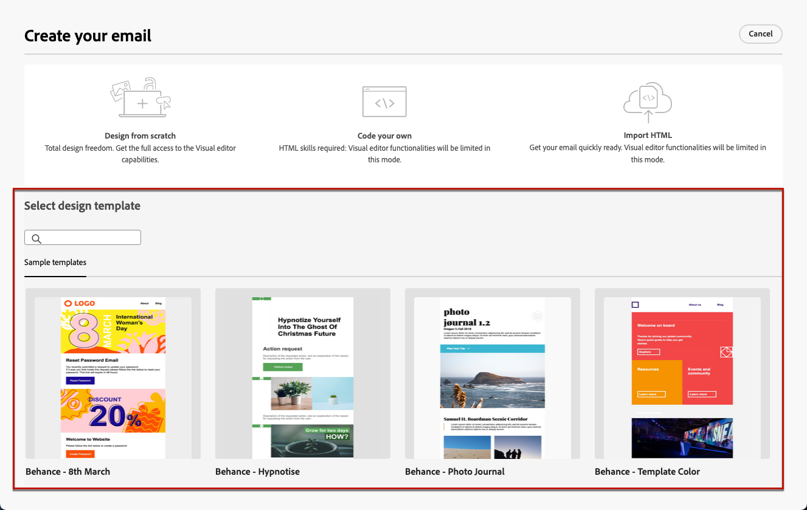

# Work with email templates {#email-saved-content-templates}

When [creating an email](../email/create-email.md), use the **[!UICONTROL Select design template]** section of the **[!UICONTROL Create your email]** interface to start building your content from a template.

Campaign comes with a set of built-in email content templates that you can choose from.

To start building your content with one of the sample templates, follow the steps below.

1. Open the [Email Designer](get-started-email-designer.md).

1. On the **[!UICONTROL Create your email]** screen, the list of **[!UICONTROL Sample templates]**  displays.

1. Select a template from the list to display its content.

1. Use the right and left arrrows to navigate between the templates.

    

1. Click **[!UICONTROL Use this template]** on top right of the screen.

1. Edit your content as desired using the Email Designer. [Learn more](create-email-content.md)
