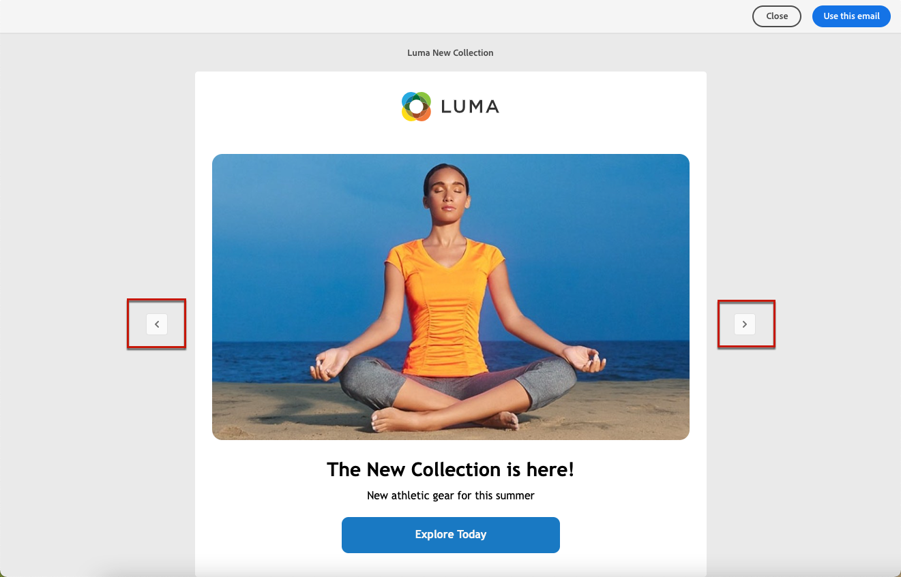

# Work with email templates {#email-content-templates}

When [creating an email](#create-email), use the **[!UICONTROL Select design template]** section of the **[!UICONTROL Create your email]** interface to start building your content from a template.

You can choose from:

* **Sample templates**. Campaign comes with a set of built-in templates that you can choose from.

* **Saved templates**. You can also use a custom template that you saved as template from an existing content.

Learn how to use templates and how to save an email content as a template in the sections below.

## Use a template {#use-templates}

To start building your content with one of the sample or saved templates, follow the steps below.

1. Open the [email designer](create-email-content.md).

1. On the **[!UICONTROL Create your email]** screen, the **[!UICONTROL Sample templates]** tab is selected by default.

1. To use an existing custom template, browse to the **[!UICONTROL Saved templates]** tab.

    

1.  The list of all [saved templates](#save-as-template) displays. You can sort them **[!UICONTROL By name]**, **[!UICONTROL Last modified]** and **[!UICONTROL Last created]**.

    
    

1. Select a template from the list to display its content.

1. Use the right and left arrrows to navigate between the templates (sample or saved depending on your selection).

    

1. Click **[!UICONTROL Use this template]** on top right of the screen.

1. Edit your content as desired using the email designer. [Learn more](create-email-content.md)

## Save email content as template {#save-as-template}

Once you [designed an email]((create-email-content.md)), you can save this content as a template for future reuse. Saved templates are available to all users of your Adobe Campaign environment.

To save an email content as a template, follow the steps below:

1. From the email designer, click the ellipsis on top right of the screen.

1. Select **[!UICONTROL Save as content template]** from the drop-down menu.

    

1. Enter a name for this template, and save.

    

You can now [use this template](#use-templates) to build a new content: it is available in the **[!UICONTROL Saved templates]** tab of the Email designer.

