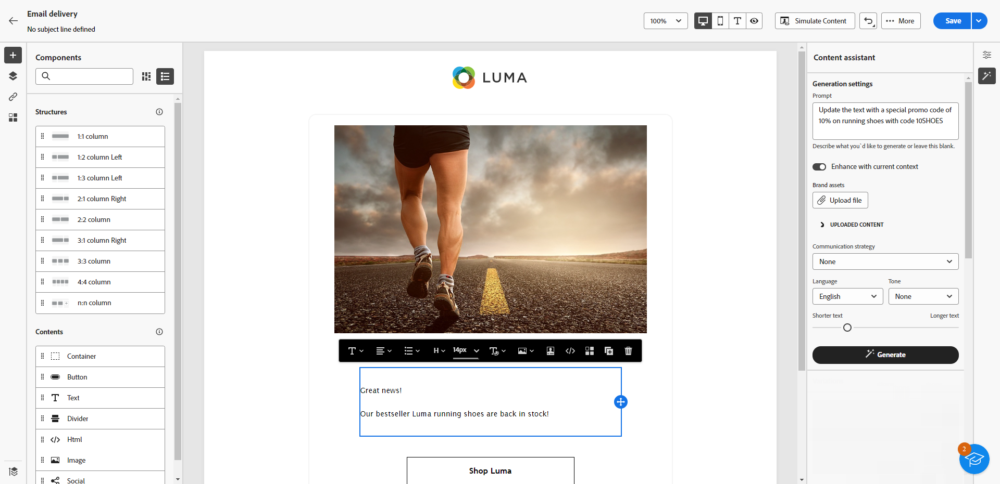
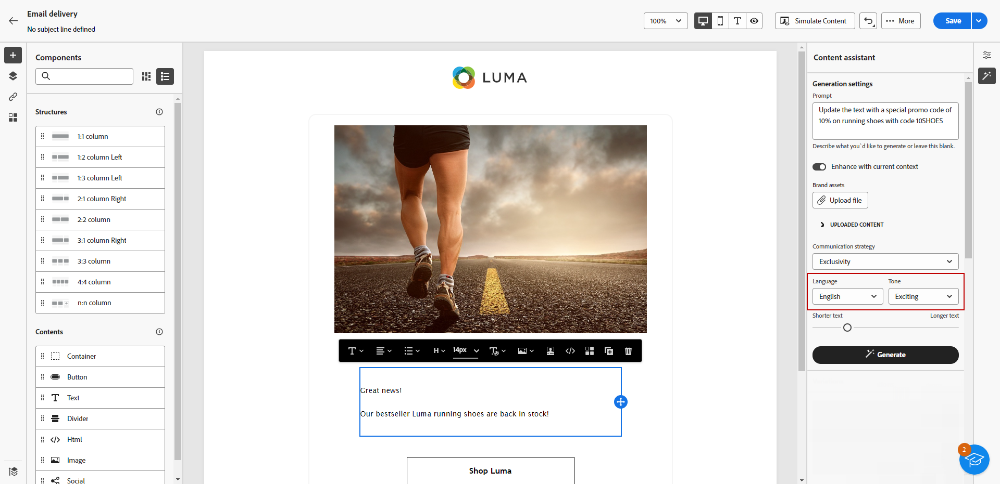
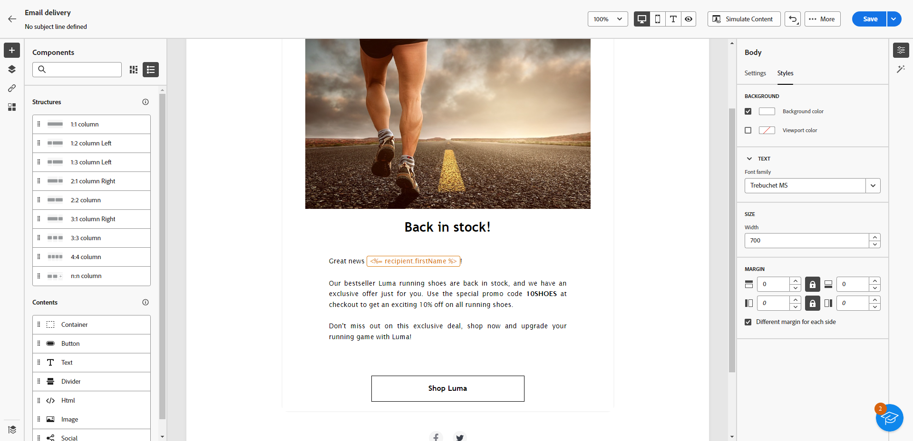
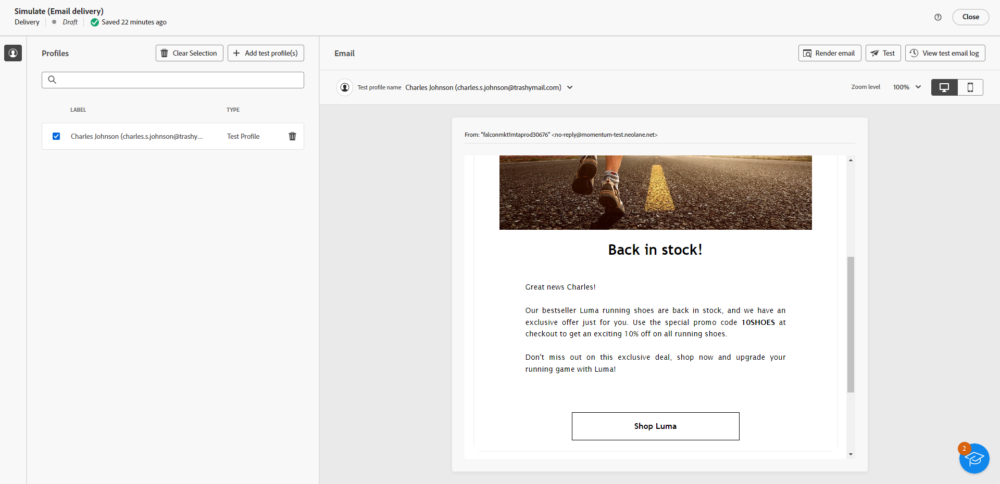

# Text generation with the Content assistant {#generative-content}

Once you have created and personalized your Emails, use the Content Assistant powered by generative AI to take your content to the next level.

The Content Assistant can help you optimize the impact of your deliveries by suggesting different content that is more likely to resonate with your audience.

1. After creating and configuring your Email delivery, click **[!UICONTROL Edit content]**.

    For more information on how to configure your email delivery, refer to [this page](../content/create-email-content.md).

1. Fill in the **[!UICONTROL Basic details]** for your delivery. Once done, click **[!UICONTROL Edit email content]**.

1. Personalize your email as needed.

1. Select the **[!UICONTROL Text component]** you want to update and access the Experience generation menu.

    

1. Fine tune the content by describing what you want to generate. 
    
    Enable the **[!UICONTROL Enhance with current content]** option for the Content assistant to personalize new content based on your delivery, delivery name, and selected audience.

    

1. Select **[!UICONTROL Upload file]** if you want to add a Marketing brief to give more context to the Content assistant. 

    You can also click **[!UICONTROL Uploaded content]** to find previously updated files.

1. Select the **[!UICONTROL Communication strategy]** that best suits your needs. This will affect the tone and style of the generated text.

1. Choose the **[!UICONTROL Language]** and **[!UICONTROL Tone]** that you want the generated text to have. This will ensure that the text is appropriate for your audience and purpose.

      

1. Use the slider control to set the length of the generated text.

1. Once your prompt is ready, click **[!UICONTROL Generate]**.

1. Browse through the generated **[!UICONTROL Variations]** and click **[!UICONTROL Apply]** once you found the appropriate content.

      

1. Insert personalization fields to customize your email content based on profiles data. [Learn more about content personalization](../personalization/personalize.md)

      

1. After defining your message content, click the **[!UICONTROL Simulate content]** button to control the rendering, and check personalization settings with test profiles. [Learn more](../preview-test/preview-content.md)

    

1. When you have defined your content, audience and schedule, you are ready to prepare your email delivery. [Learn more](../monitor/prepare-send.md)

