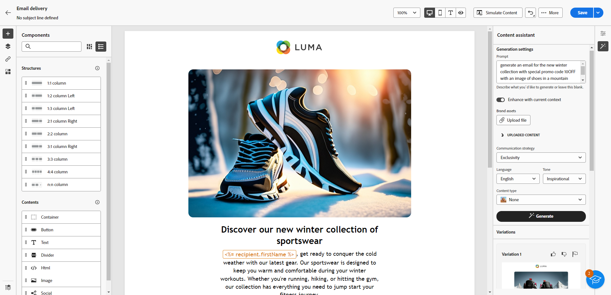

# Get started with the Content assistant {#generative-gs}

>[!CONTEXTUALHELP]
>id="acw_generation_settings"
>title="Create the email content"
>abstract="Once you have crafted and personalized your delivery, you can use the Content Assistant to enhance your content. This feature simplifies the process of personalization and content improvement by allowing you to fine-tune the content by describing what you want to generate."

  
