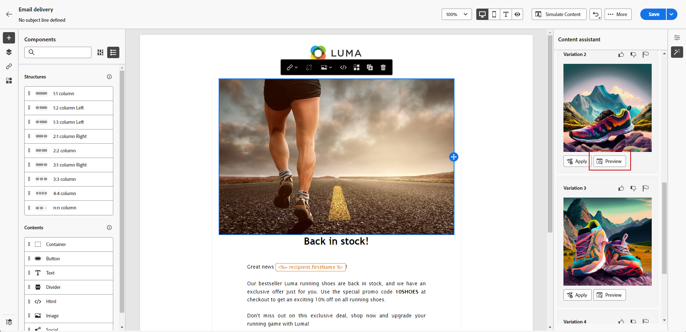
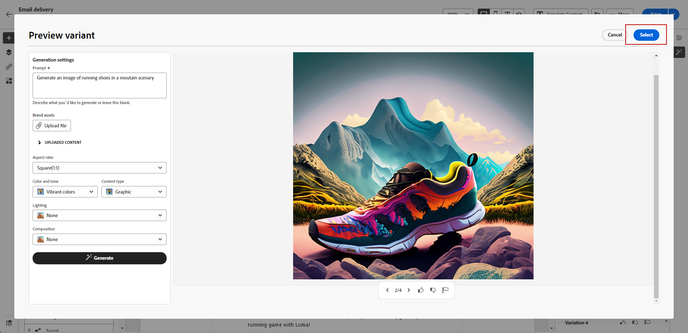
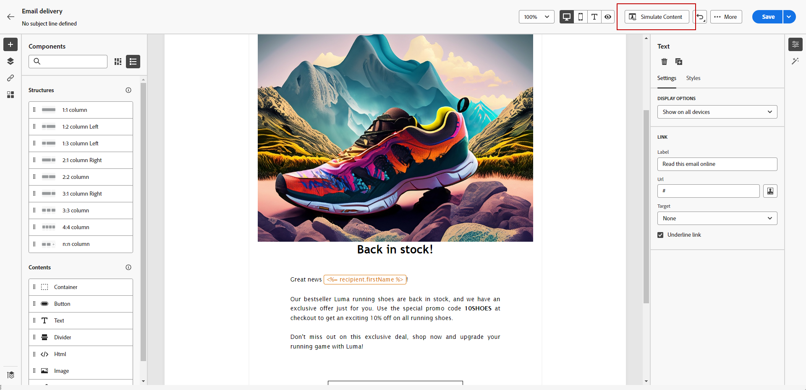

# Image generation with the Content assistant {#generative-image}

After you've crafted and personalized your emails, you can enhance your content using the Content Assistant. This feature simplifies the process of personalization and content improvement.

In the example below, how to leverage the Content Assistant to optimize and improve your content, ensuring a more user-friendly experience. Follow these steps:

1. After creating and configuring your Email delivery, click **[!UICONTROL Edit content]**.

    For more information on how to configure your email delivery, refer to [this page](../content/create-email-content.md).

1. Fill in the **[!UICONTROL Basic details]** for your delivery. Once done, click **[!UICONTROL Edit email content]**.

1. Select the asset you want to change with the Content assistant.

1. From the right-hand menu, select **[!UICONTROL Experience generation]**.

    

1. Add a prompt to better fine-tune your results.

    

1. Select **[!UICONTROL Upload file]** if you want to add a Marketing brief to give more context to the Content assistant. 

    You can also click **[!UICONTROL Uploaded content]** to find previously updated files.

1. Select the **[!UICONTROL Aspect ratio]** of your asset. This determines the width and height of the asset. 

    You have the option to choose from common ratios like 16:9, 4:3, 3:2, or 1:1, or you can enter a custom size.

1. Customize the **[!UICONTROL Color & tone]**, **[!UICONTROL Content type]**, **[!UICONTROL Lighting]** and **[!UICONTROL Composition]** settings to match your desired asset characteristics.

      

1. Once you are satisfied with your prompt configuration, click **[!UICONTROL Generate]**.

1. Browse the **[!UICONTROL Variation suggestions]** to find the desired Asset. Click **[!UICONTROL Preview]** to view a full-screen version of the selected variation.

      

1. Click **[!UICONTROL Select]** once you found the appropriate content.

      

1. After defining your message content, click the **[!UICONTROL Simulate content]** button to control the rendering, and check personalization settings with test profiles.  [Learn more](../preview-test/preview-content.md)

    

1. When you have defined your content, audience and schedule, you are ready to prepare your email delivery. [Learn more](../monitor/prepare-send.md)