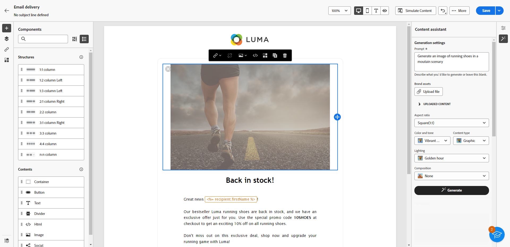
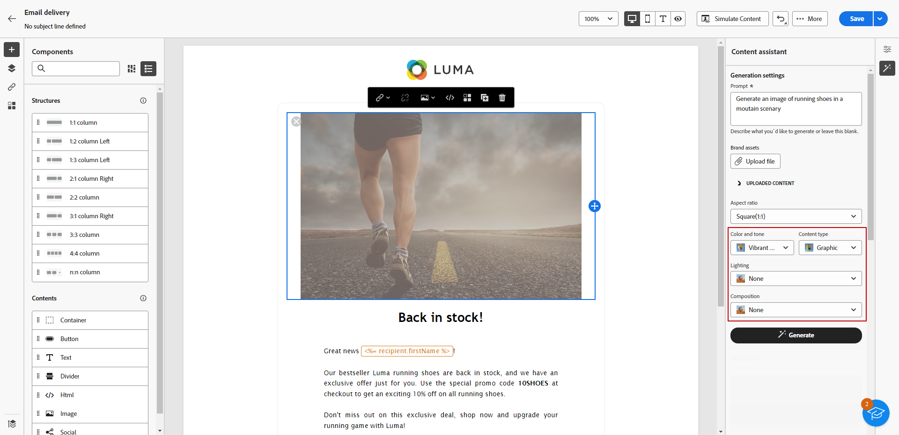

# Generate images with AI Assistant {#generative-image}

>[!IMPORTANT]
>
>Before starting to use this capability, read the related [Guardrails and Limitations](generative-gs.md#generative-guardrails).
> 
>
>You must agree to a [user agreement](https://www.adobe.com/legal/licenses-terms/adobe-dx-gen-ai-user-guidelines.html){target="_blank"} before using AI Assistant in Adobe Campaign Web. For more information, contact your Adobe representative.

Use AI Assistant in Adobe Campaign Web to create compelling visual content that enhances your messages across email, landing pages, and push notifications. AI Assistant helps you generate and optimize images, ensuring your content is visually engaging and aligned with your brand.

## For Email and Landing Pages {#email-web-channels}

AI Assistant can generate complete visual experiences for your email deliveries and landing pages. This capability allows you to produce on-brand, attention-grabbing images that resonate with your audience across digital touchpoints.

### Access and configure {#access-configure}

To start generating images with AI Assistant, first set up your delivery and open the content editor. Follow the steps below to prepare your workspace and access the AI Assistant panel.

1. Create and configure your delivery:

   * **Email**: After creating and configuring your email delivery, click **[!UICONTROL Edit content]**. [Learn more](../email/create-email-content.md)
   * **Landing Page**: After creating and configuring your landing page, click **[!UICONTROL Edit content]**. [Learn more](../landing-pages/create-lp.md)

1. Select the asset you want to change with AI Assistant and access the **[!UICONTROL AI Assistant]** menu.

    {zoomable="yes"}

### Generate content {#generate-content}

Learn how to craft effective prompts and configure image settings to generate visually compelling images with AI Assistant. Customize parameters such as aspect ratio, visual intensity, and lighting to create images that align with your brand and campaign objectives.

1. Enable the **[!UICONTROL Reference style]** option for AI Assistant to personalize new content based on the selected content.

1. Select your **[!UICONTROL Brand]** to ensure AI-generated content aligns with your brand specifications. [Learn more](brands.md) on Brands.

1. Fine-tune the content by describing what you want to generate in the **[!UICONTROL Prompt]** field. 

    If you need assistance crafting your prompt, access the **[!UICONTROL Prompt Library]**, which provides a diverse range of prompt ideas to improve your deliveries. [Learn more on prompt best practices](ai-assistant-prompting-guide.md)

    {zoomable="yes"}

1. Tailor your prompt using the **[!UICONTROL Image settings]** option:

    * **[!UICONTROL Aspect ratio]**: Determine the width and height of the asset. Choose from common ratios such as 16:9, 4:3, 3:2, or 1:1, or enter a custom size.
    * **[!UICONTROL Content type]**: Categorize the nature of the visual element, distinguishing between different forms of visual representation such as photos, graphics, or art.
    * **[!UICONTROL Visual intensity]**: Control the image's impact by adjusting its intensity. A lower setting (2) creates a softer appearance, while a higher setting (10) makes the image more vibrant.
    * **[!UICONTROL Color & tone]**: Adjust the overall appearance of the colors and the mood or atmosphere conveyed.
    * **[!UICONTROL Lighting]**: Modify the lighting in the image to shape its atmosphere and highlight specific elements.
    * **[!UICONTROL Composition]**: Arrange elements within the frame of the image.

        {zoomable="yes"}

1. From the **[!UICONTROL Reference content]** menu, click **[!UICONTROL Upload file]** to add any brand asset which contains content that can provide additional context AI Assistant or select a previously uploaded one.

    Previously uploaded files are available in the **[!UICONTROL Uploaded reference content]** drop-down. Simply toggle the assets you wish to include in your generation.

1. Once you are satisfied with your prompt configuration, click **[!UICONTROL Generate]**.

### Refine and finalize {#refine-finalize}

After generating image variations, you can review the results, check brand alignment, and select the best option for your content.

1. Browse through the generated **[!UICONTROL Variations]**.

1. Click the percentage icon to view your **[!UICONTROL Brand Alignment Score]** and identify any misalignments with your brand.

    Learn more on [Brand alignment score](../content/brands-score.md).

    {zoomable="yes"}

1. Click **[!UICONTROL Preview]** to view a full-screen version of the selected variation or **[!UICONTROL Apply]** to replace your current content.

1. Choose **[!UICONTROL Generate Similar]** if you want to view related images to this variant.

1. Open the **[!UICONTROL Brand Alignment]** tab to see how your content aligns with your [brand guidelines](../content/brands.md).

1. Click **[!UICONTROL Select]** once you find the appropriate content.

1. After defining your message content, click the **[!UICONTROL Simulate content]** button to control the rendering and check personalization settings with test profiles. [Learn more](../preview-test/preview-content.md)

1. Review and activate your content:
   * **Email**: When you have defined your content, audience and schedule, you are ready to prepare your email delivery. [Learn more](../monitor/prepare-send.md)
   * **Landing Page**: Once your landing page is ready, you can publish it to make it available for use in a message. [Learn more](../landing-pages/create-lp.md)

## For Mobile Channels {#mobile-channels}

AI Assistant enables you to generate engaging images for push notifications, helping you create visually compelling mobile communications that capture attention and resonate with your audience.

### Access and configure {#mobile-access-configure}

To begin generating images for push notifications with AI Assistant, first set up your delivery and open the AI Assistant.

1. After creating and configuring your push notification delivery, click **[!UICONTROL Edit content]**. [Learn more](../push/create-push.md)

1. Access the **[!UICONTROL Show AI Assistant]** menu.

    {zoomable="yes"}

### Generate content {#mobile-generate-content}

After accessing AI Assistant, you can adjust the generation settings to create images that align with your brand and support your push notification objectives. Configure the prompt and image parameters to generate visuals optimized for mobile displays.

1. Select your **[!UICONTROL Brand]** to ensure AI-generated content aligns with your brand specifications. [Learn more](brands.md) on Brands.

1. Fine tune the content by describing what you want to generate in the **[!UICONTROL Prompt]** field. 

    If you are looking for assistance in crafting your prompt, access the **[!UICONTROL Prompt Library]** which provides a diverse range of prompt ideas to improve your campaigns. [Learn more on prompt best practices](ai-assistant-prompting-guide.md)
    
    {zoomable="yes"}

1. Select **[!UICONTROL Image]** to only generate assets.

1. Choose your **[!UICONTROL Image settings]**:

    * **[!UICONTROL Content type]**: Categorize the nature of the visual element, distinguishing between different forms of visual representation such as photos, graphics, or art.
    * **[!UICONTROL Visual intensity]**: Control the image's impact by adjusting its intensity. A lower setting (2) creates a softer, more restrained appearance, while a higher setting (10) makes the image more vibrant and visually powerful.
    * **[!UICONTROL Lighting]**: Adjust the lighting in the image to shape its atmosphere and highlight specific elements.
    * **[!UICONTROL Composition]**: Arrange elements within the frame of the image.

        {zoomable="yes"}

1. From the **[!UICONTROL Reference content]** menu, click **[!UICONTROL Upload file]** to add any brand asset which contains content that can provide additional context AI Assistant or select a previously uploaded one.

    Previously uploaded files are available in the **[!UICONTROL Uploaded reference content]** drop-down. Simply toggle the assets you wish to include in your generation.

1. Once your prompt is ready, click **[!UICONTROL Generate]**.

### Refine and finalize {#mobile-refine-finalize}

After generating image variations for your mobile messages, you can fine-tune the results to ensure they meet your exact requirements. 

1. After generation, browse through the **[!UICONTROL Variations]**.

1. Click the percentage icon to view your **[!UICONTROL Brand Alignment Score]** and identify any misalignments with your brand.

    Learn more on [Brand alignment score](../content/brands-score.md).

    {zoomable="yes"}

1. Click **[!UICONTROL Preview]** to browse through the **[!UICONTROL Variations]**.

1. Open the **[!UICONTROL Brand Alignment]** tab to see how your content aligns with your [brand guidelines](brands.md).

1. Click **[!UICONTROL Select]** once you found the appropriate content.

Once you have defined your content, audience, and schedule, prepare your push delivery. [Learn more](../monitor/prepare-send.md)
