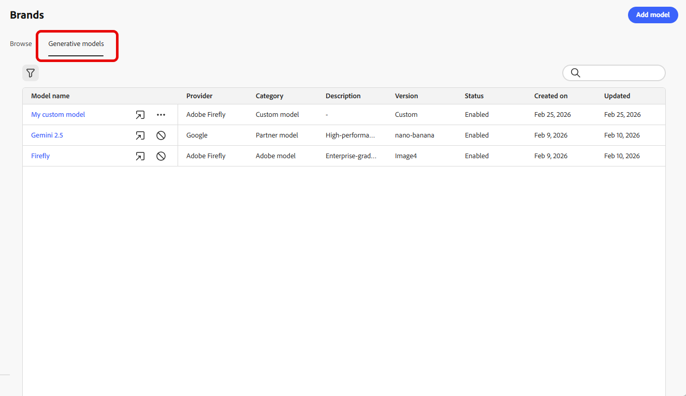
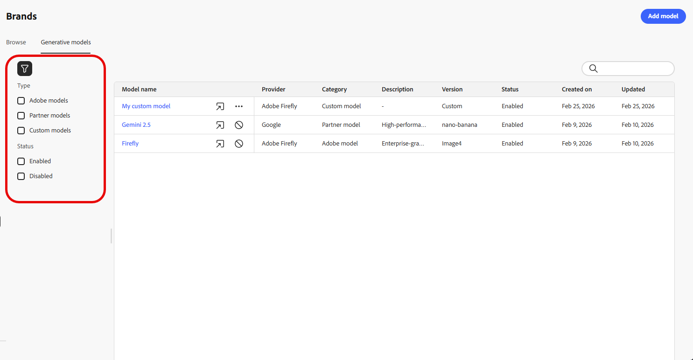
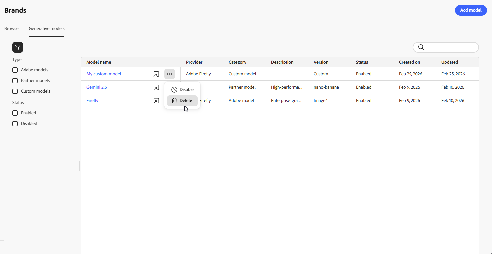
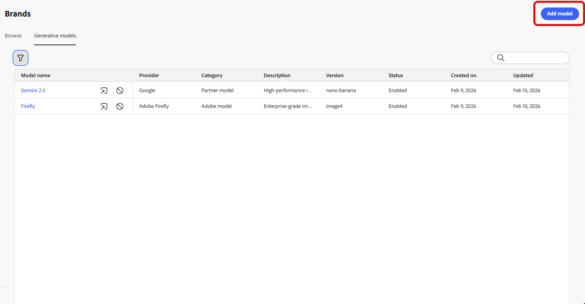
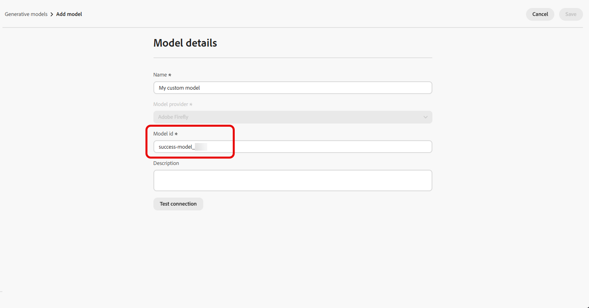
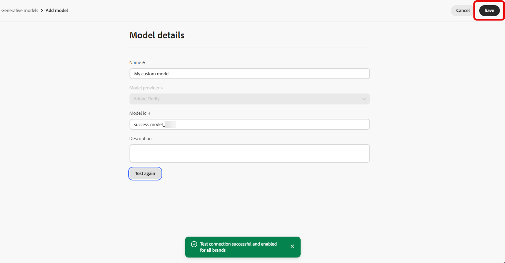
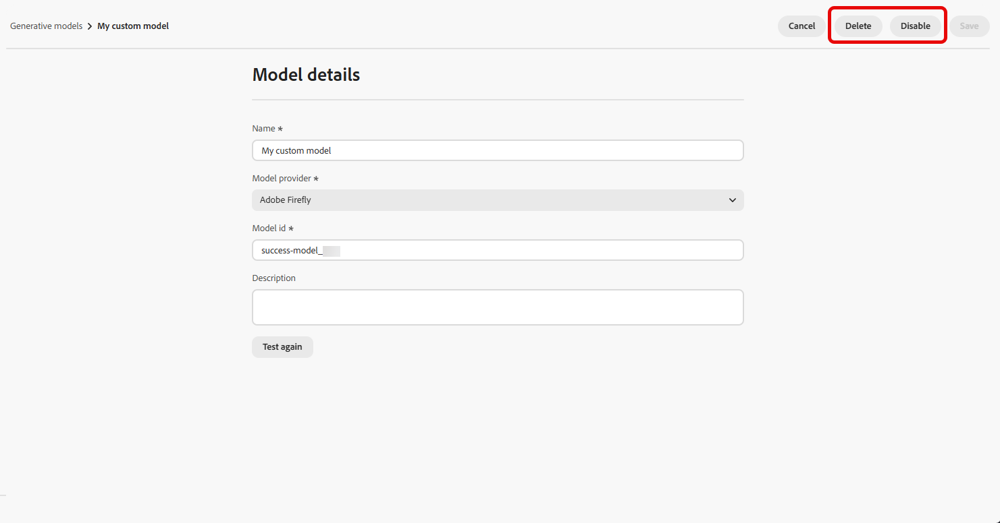

# Create and manage generative models {#generative-models}

Expand your AI image creation capabilities with built-in models, custom Firefly models, and third-party image generation providers to meet your specific needs and improve brand alignment.

Choose the right model for your needs:

- **[!UICONTROL Adobe model]**, powered by Firefly Image Model 4, is provided out of the box and ready to use for immediate image generation without additional setup.
- **[!UICONTROL Partner model]**, powered by Gemini 2.5 Flash, offers specialized capabilities for specific use cases.
- **[!UICONTROL Custom models]** are brand-specific models trained on your own assets and added by your organization.

    Learn more on **[!UICONTROL Custom models]** in [Adobe Firefly documentation](https://helpx.adobe.com/firefly/web/work-with-enterprise-features/train-custom-models/custom-models-overview.html)

Once configured, you can select any of your generative models when creating images in your content. [Learn more about generating images](generative-image.md).

## Manage generative models

Manage your generative models from a centralized location. View all available models, filter and search to find specific ones, and configure their settings for your brands.

1. From the **[!UICONTROL Brands]** menu, select the **[!UICONTROL Generative models]** tab.

    {zoomable="yes"}

1. Click the  icon to access the filter menu. Filter models by **[!UICONTROL Type]** or **[!UICONTROL Status]**.

    {zoomable="yes"}

1. Use the search bar to find a specific generative model by name.

1. Click the  icon to access the advanced menu, where you can enable or disable your model, or delete it.

    Note that only **[!UICONTROL Custom models]** can be deleted.

    {zoomable="yes"}

1. Click **[!UICONTROL Add model]** to create a new generative model from scratch.

You can now select any of your generative models when creating images in your content. [Learn more about generating images](generative-image.md).

## Add a generative model

>[!IMPORTANT]
>
>Creating custom Firefly models requires a Firefly ETLA agreement. 

Custom Firefly models are brand-specific AI models trained on your own assets, enabling you to generate images that align precisely with your brand identity, style, and visual guidelines. 

By creating custom Firefly model providers, you can expand your AI capabilities beyond the default models and ensure that generated content consistently reflects your brand's unique aesthetic and requirements.

➡️ [Learn how to train your custom model](https://helpx.adobe.com/firefly/web/work-with-enterprise-features/train-custom-models/train-firefly-custom-models.html)

1. From the **[!UICONTROL Brands]** menu, access the **[!UICONTROL Generative Models]** tab and click **[!UICONTROL Add model]**.

    {zoomable="yes"}

1. Enter a **[!UICONTROL Name]** for your model.

1. Enter your **[!UICONTROL Model ID]**.

    To find your Firefly model ID, access the Firefly website and navigate to your trained models. The unique identifier is available in the model's management section once published. For more information, refer to the [Firefly custom models documentation](https://helpx.adobe.com/firefly/web/work-with-enterprise-features/train-custom-models/manage-custom-models.html). 

    {zoomable="yes"}

1. Optionally, enter a **[!UICONTROL Description]** to help identify the model.

1. Click **[!UICONTROL Test connection]** to verify the model configuration.

1. Once the connection test is successful, click **[!UICONTROL Save]** to save your model configuration.

     {zoomable="yes"}

1. After saving, your custom model is added to your models list. You can disable or delete it at any time.

     {zoomable="yes"}

<!--
1. Once the connection test is successful, choose whether to enable the model for selected brands.

1. Enable or disable the option to connect the model to all brands.

    If disabled, select which brands this model should be applied to.
-->

Once configured, you can select any of your custom generative models when creating images in your content. [Learn more about generating images](generative-image.md).

{zoomable="yes"}
