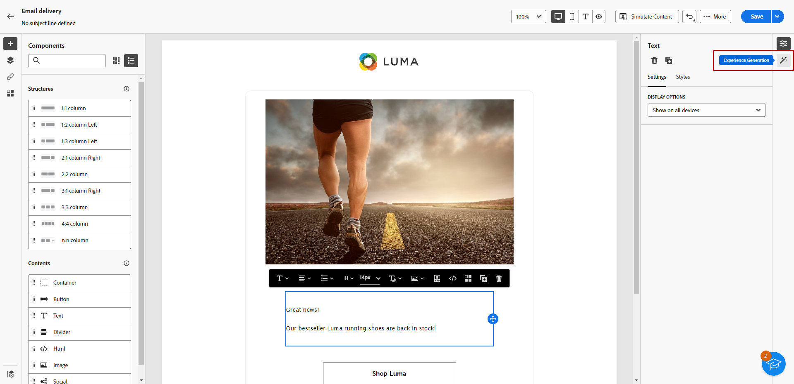
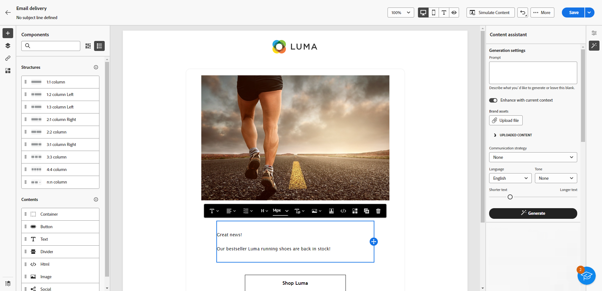
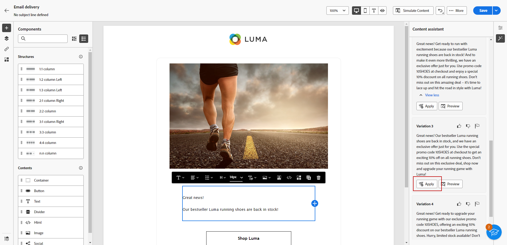

# Generate text with AI Assistant {#generative-text}

>[!IMPORTANT]
>
>Before starting to use this capability, read the related [Guardrails and Limitations](generative-gs.md#generative-guardrails).
> 
>
>You must agree to a [user agreement](https://www.adobe.com/legal/licenses-terms/adobe-dx-gen-ai-user-guidelines.html){target="_blank"} before using AI Assistant in Adobe Campaign Web. For more information, contact your Adobe representative.

Use AI Assistant in Adobe Campaign Web to generate engaging text that resonates with your audience. Whether you’re enhancing email copy, crafting persuasive landing page content, writing push notification messages, or composing SMS text, AI Assistant helps you deliver clear, impactful communication.

## For Email and Landing Pages {#email-web-channels}

AI Assistant can generate high-quality text content for your email deliveries and landing pages. This capability enables you to create compelling, on-brand messaging that connects with your audience across digital touchpoints.

### Access and configure {#access-configure}

Before you can start generating text content with AI Assistant, you will need to set up your delivery and access the content editor. Follow these steps to prepare your workspace and open the AI Assistant panel.

1. Create and configure your delivery:

   * **Email**: After creating and configuring your email delivery, click **[!UICONTROL Edit content]**. [Learn more](../email/create-email-content.md)
   * **Landing Page**: After creating and configuring your landing page, click **[!UICONTROL Edit content]**. [Learn more](../landing-pages/create-lp.md)

1. Select a **[!UICONTROL Text component]** to target specific content, and access the **[!UICONTROL AI Assistant]** menu.

    {zoomable="yes"}

### Generate content {#generate-content}

Learn how to craft clear prompts, fine-tune settings, and generate tailored text using AI Assistant, ensuring that your messaging aligns with your brand and communication goals.

1. Select your **[!UICONTROL Brand]** to ensure AI-generated content aligns with your brand specifications. [Learn more](brands.md) on Brands.

1. Fine-tune the content by describing what you want to generate in the **[!UICONTROL Prompt]** field. 

    If you need assistance crafting your prompt, access the **[!UICONTROL Prompt Library]**, which provides a diverse range of prompt ideas to improve your deliveries. [Learn more on prompt best practices](ai-assistant-prompting-guide.md)

    {zoomable="yes"}

1. Tailor your prompt using the **[!UICONTROL Text settings]** option:

    * **[!UICONTROL Communication strategy]**: Choose the most suitable communication style for your generated text.
    * **[!UICONTROL Languages]**: Choose the language of your generated content.
    * **[!UICONTROL Tone]**: Ensure the tone of your email resonates with your audience. Whether you want to sound informative, playful, or persuasive, AI Assistant adapts the message accordingly.
    * **Text Length**: Use the slider to select the desired length of your text.

        {zoomable="yes"}

1. From the **[!UICONTROL Reference content]** menu, click **[!UICONTROL Upload file]** to add any brand asset which contains content that can provide additional context AI Assistant or select a previously uploaded one.

    Previously uploaded files are available in the **[!UICONTROL Uploaded reference content]** drop-down. Simply toggle the assets you wish to include in your generation.

1. Once your prompt is ready, click **[!UICONTROL Generate]**.

### Refine and finalize {#refine-finalize}

Learn how to review the generated text, make refinements, and apply personalization to finalize your content, creating polished and engaging messages ready for delivery.

1. Browse through the generated **[!UICONTROL Variations]**.

1. Click the percentage icon to view your **[!UICONTROL Brand Alignment Score]** and identify any misalignments with your brand.

    Learn more on [Brand alignment score](brands-score.md).

    {zoomable="yes"}

1. Click **[!UICONTROL Preview]** to view a full-screen version of the selected variation or **[!UICONTROL Apply]** to replace your current content.

1. Navigate to the **[!UICONTROL Refine]** option within the **[!UICONTROL Preview]** window to access additional customization features:

    * **[!UICONTROL Use as reference content]**: The chosen variant serves as the reference content for generating other results.
    * **[!UICONTROL Elaborate]**: Expand on specific topics, providing additional details for better understanding and engagement.
    * **[!UICONTROL Summarize]**: Condense key points into clear, concise summaries to grab attention and encourage further reading.
    * **[!UICONTROL Rephrase]**: Rephrase your message in different ways, keeping your writing fresh and engaging for diverse audiences.
    * **[!UICONTROL Use simpler language]**: Simplify your language to ensure clarity and accessibility for a wider audience.
    * **[!UICONTROL Translate]**: Simplify your language to ensure clarity and accessibility for a wider audience.

    You can also change the **[!UICONTROL Tone]** and **[!UICONTROL Communication strategy]** of your text.

    {zoomable="yes"}

1. Open the **[!UICONTROL Brand Alignment]** tab to see how your content aligns with your [brand guidelines](../content/brands.md).

1. Click **[!UICONTROL Select]** once you find the appropriate content.

1. Insert personalization fields to customize your content based on profile data. Then, click the **[!UICONTROL Simulate content]** button to control the rendering and check personalization settings with test profiles. [Learn more](../preview-test/preview-content.md)

1. Review and activate your content:
   * **Email**: When you have defined your content, audience and schedule, you are ready to prepare your email delivery. [Learn more](../monitor/prepare-send.md)
   * **Landing Page**: Once your landing page is ready, you can publish it to make it available for use in a message. [Learn more](../landing-pages/create-lp.md)

## For Mobile Channels {#mobile-channels}

AI Assistant can generate compelling text content for your push notifications and SMS messages, helping you create engaging mobile communications that connect with your audience across all mobile touchpoints.

### Access and configure {#mobile-access-configure}

Before you begin generating text with AI Assistant for mobile channels, you must set up your delivery and access the AI Assistant. 

1. Create and configure your mobile delivery:
   * **Push notifications**: After creating and configuring your push notification delivery, click **[!UICONTROL Edit content]**. [Learn more](../push/create-push.md)
   * **SMS**: After creating and configuring your SMS delivery, click **[!UICONTROL Edit content]**. [Learn more](../sms/create-sms.md)

1. Personalize your message as needed:
   * **Push notifications**: [Learn more](../push/content-push.md)
   * **SMS**: [Learn more](../sms/content-sms.md)

1. Access the **[!UICONTROL Show AI Assistant]** menu.

    {zoomable="yes"}

### Generate content {#mobile-generate-content}

Once you have accessed AI Assistant, you can configure the generation settings to create mobile content that matches your brand and delivery goals. Customize text parameters, add brand assets, and provide prompts to guide the AI in generating relevant variations.

1. Select your **[!UICONTROL Brand]** to ensure AI-generated content aligns with your brand specifications. [Learn more](brands.md) on Brands.

1. Fine tune the content by describing what you want to generate in the **[!UICONTROL Prompt]** field. 

    If you are looking for assistance in crafting your prompt, access the **[!UICONTROL Prompt Library]** which provides a diverse range of prompt ideas to improve your delivery. [Learn more on prompt best practices](ai-assistant-prompting-guide.md)
    
    {zoomable="yes"}

1. **For Push notifications**, choose the text field you want to generate: **[!UICONTROL Title]**, **[!UICONTROL Subtitle]** and/or **[!UICONTROL Message]**.

1. Tailor your prompt with the **[!UICONTROL Text settings]** option:

    * **[!UICONTROL Communication strategy]**: Choose the most suitable communication style for your generated text.
    * **[!UICONTROL Languages]**: Choose the language of your generated content.
    * **[!UICONTROL Tone]**: The tone should resonate with your audience. Whether you want to sound informative, playful, or persuasive, AI Assistant can adapt the message accordingly.
    * **[!UICONTROL Length]**: Select the length of your content using the range slider. 

        {zoomable="yes"}

1. From the **[!UICONTROL Reference content]** menu, click **[!UICONTROL Upload file]** to add any brand asset which contains content that can provide additional context AI Assistant or select a previously uploaded one.

    Previously uploaded files are available in the **[!UICONTROL Uploaded reference content]** drop-down. Simply toggle the assets you wish to include in your generation.

1. Once your prompt is ready, click **[!UICONTROL Generate]**.

### Refine and finalize {#mobile-refine-finalize}

After generating text variations for your mobile messages, you can fine-tune the results to ensure they meet your exact requirements. Review the brand alignment, adjust tone and language, and prepare the content for activation.

1. After generation, browse through the **[!UICONTROL Variations]**.

1. Click the percentage icon to view your **[!UICONTROL Brand Alignment Score]** and identify any misalignments with your brand.

    Learn more on [Brand alignment score](brands-score.md).

    {zoomable="yes"}

1. Click **[!UICONTROL Preview]** to view a full-screen version of the selected variation or click **[!UICONTROL Apply]** to replace your current content.

1. Navigate to the **[!UICONTROL Refine]** option within the **[!UICONTROL Preview]** window to access additional customization features:

    * **[!UICONTROL Use as reference content]**: The chosen variant will serve as the reference content for generating other results.

    * **[!UICONTROL Rephrase]**: Rewrite the message while preserving its meaning. This option helps you generate alternative wording, improve flow, or adjust phrasing without changing the core message.

    * **[!UICONTROL Use simpler language]**: Leverage AI Assistant to simplify your language, ensuring clarity and accessibility for a wider audience.

    * **[!UICONTROL Translate]**: Simplify your language to ensure clarity and accessibility for a wider audience.

    * **[!UICONTROL Change tone]**: Adjust the tone of the message to better match your communication style, i.e. making it more friendly, professional, urgent, or inspirational.

    * **[!UICONTROL Change Communication strategy]**: Modify the messaging approach based on your objectives, such as creating urgency, or emphasizing exciting appeal.

        {zoomable="yes"}

1. Open the **[!UICONTROL Brand Alignment]** tab to see how your content aligns with your [brand guidelines](brands.md).

1. Click **[!UICONTROL Select]** once you found the appropriate content.

1. Insert personalization fields to customize your content based on profiles data. Then, click the **[!UICONTROL Simulate content]** button to control the rendering, and check personalization settings with test profiles. [Learn more](../personalization/personalize.md)

1. Review and activate your content:
   * **Push notification**: When you have defined your content, audience and schedule, you are ready to prepare your push notification delivery. [Learn more](../push/send-push.md)
   * **SMS**: Once your SMS is ready, you can publish it to make it available for use in a message. [Learn more](../sms/send-sms.md)
