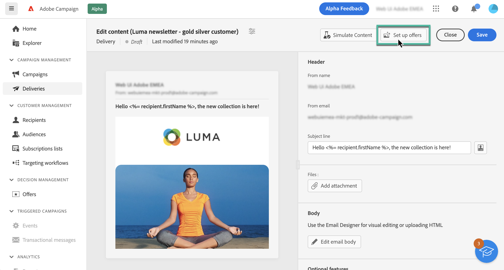

# Send offers {#offers-content}

Adobe Campaign v8 Web allows you to send with your deliveries offers that have been created in the console using the **[!UICONTROL Interaction]** module. For more information on Interaction and how to manage an offer catalog in the console, refer to the [Campaign v8 (console) documentation](https://experienceleague.adobe.com/docs/campaign/campaign-v8/offers/interaction.html){target="_blank"}.

The steps to send offers with an delivery are as follows:

1. [Configure the offers to propose](#configure)
1. [Insert the offers into the delivery](#insert)

## Configure the offers to propose {#configure}

>[!CONTEXTUALHELP]
>id="acw_deliveries_email_offers_settings"
>title="Offers settings"
>abstract="Configure which offers should be proposed to the recipients."

>[!CONTEXTUALHELP]
>id="acw_deliveries_email_offers_advanced_settings"
>title="Offers advanced settings"
>abstract="Configure advanced options on offers."

1. To select the offers to propose in your delivery, click the **[!UICONTROL Set up offers]** button from the delivery content edition screen.

    

1. Configure which offers should be proposed to the recipients.

    First select the **[!UICONTROL Offer space]** that matches your offer environment. Learn how to create an offer space in the [Campaign v8 (console) documentation](https://experienceleague.adobe.com/docs/campaign/campaign-v8/offers/interaction-settings/interaction-offer-spaces.html){target="_blank"}

    

1. To refine the engine's choice of offers, select a specific **[!UICONTROL Offer category]** in which offers are sorted.

    When selecting a folder, all sub-folders are automatically included, and cannot be removed. Note that the [!DNL Campaign] interface does not reflect this behavior.

    >[!NOTE]
    >
    >If no category is specified, all the offers contained in the environment are taken into account by the Offer engine, unless an **[!UICONTROL Offer theme]** is selected.

1. (optional) Enter a theme to filter categories. Themes are key words defined upstream in the categories. They act as a filter and let you refine the number of offers to be presented by selecting them in a set of categories. 

1. Use the **[!UICONTROL Propositions]** field to specify the number of offers you want to insert into the delivery.

1. Select the **[!UICONTROL Exclude non-eligible recipients]** option if necessary.

    This option lets you activate or deactivate the exclusion of recipients for whom there are not enough eligible offers.
    
    * If the option is enabled, recipients who do not have enough propositions are excluded from the delivery.
    * If the option is disabled, these recipients are not excluded but they cannot have the requested number of propositions.

1. If necessary, select the **[!UICONTROL Hide everything if no offer is selected]** option.

    This option lets you choose how the message is processed in case one of the propositions does not exist.
    
    * If the option is enabled, the representation of the missing proposition is not displayed and no content appears in the message for this proposition.
    * If the option is disabled, the message itself is cancelled during sending and recipients can no longer receive any messages.

Once you have configured the offers to propose into your delivery, you can insert them into the delivery content using the Expression Editor.

## Insert offers into the delivery {#insert}

Offers can be added into the delivery using the [Expression Editor](../personalization/gs-personalization.md#access). They can be inserted either in the subject line or in the delivery body.

>[!CAUTION]
>
>Before inserting an offer into a delivery, make sure you have [configured which offers to propose with that delivery](#configure).

To insert an offer using the Expression Editor, follow the steps below.

1. Access the subject line or the content of any delivery.

1. Place the cursor of your mouse where you want to insert the offer and open the Expression Editor using the personalization icon.

1. Select the **[!UICONTROL Propositions]** menu. Available propositions display in the list.

    >[!NOTE]
    >
    >The number of propositions is defined when [setting up offers](#configure) for the current delivery.

    

1. Add the propositions into the delivery subject line or body using the personalization fields, rendering functions or offer attributes available for each proposition.

    

    >[!NOTE]
    >
    >The number of propositions available depends on the way the engine call is configured and their order depends on the priority of offers.

1. Save your changes.

1. Finalize the content, test and send your delivery.

Now when a recipient receives the delivery, the right offer is displayed to that specific profile.
