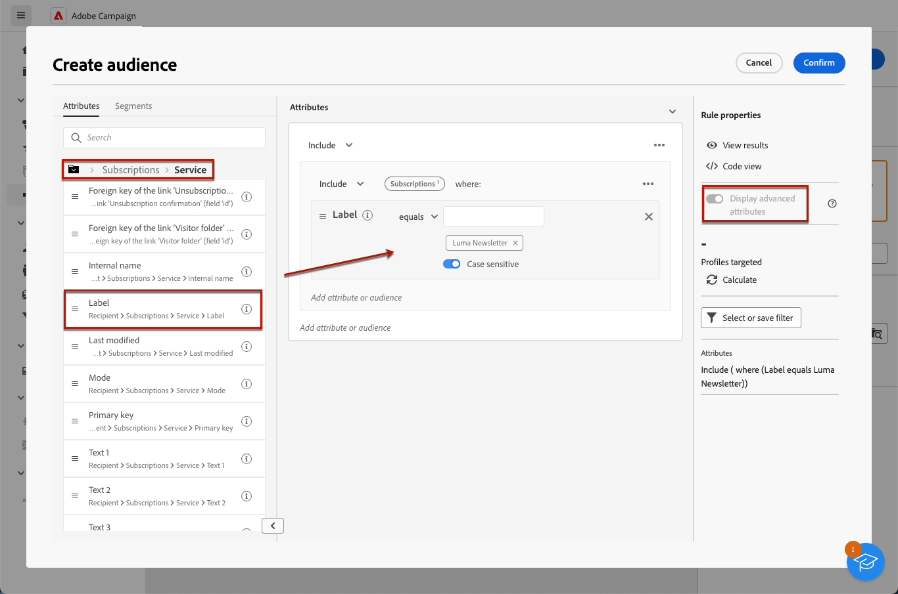
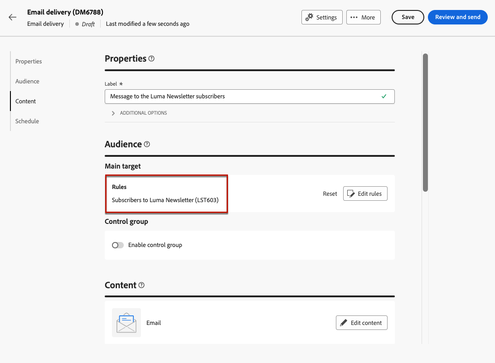

# Send messages to the subscribers of a service

You can create subscription services in Adobe Campaign, and send messages to your subcribers. Learn how to create subscriptions services in [this page](../audience//manage-services.md#create-service). 

To send messages to your subscribers, create a specific audience to identify the subscribers, and then create the delivery as detailed below. 

1. Create an audience. Learn more about audiences in [this page](../audience/create-audience.md).

1. In the **[!UICONTROL Build audience]** activity, display the advanced attributes and select **[!UICONTROL Recipient]** > **[!UICONTROL Subscriptions]** > **[!UICONTROL Service]**.
    
    In this example, select the users who are subscribed to the service that has the **Luma Newsletter** label.

    

1. Save the audience.
1. Create a delivery. Steps to create a delivery are detailed in [this page](../msg/gs-messages.md#create-delivery).
1. Browse to your delivery settings, change the default target mapping to **Subscriptions (nms:subscriptions)**.

    

1. In the main target section of the delivery, select the audience that you created above.

    

1. Create your message content, test and send the delivery, as detailed in [this section](../preview-test/preview-test.md).

    

Your delivery is sent to the subscribers of that service only.
