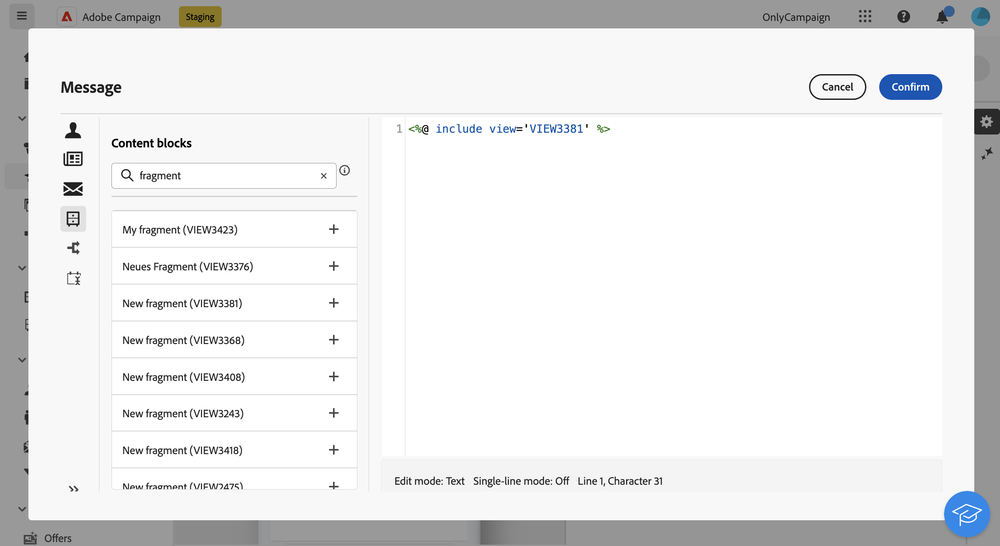

# Add expression fragments in the expression editor {#expression}

>[!CONTEXTUALHELP]
>id="acw_fragments_list"
>title="Fragments"
>abstract="All expression fragments created on the current sandbox display in this list. To use a fragment, click the + button to add the fragment ID into the editor."
<!-- pas vu dans l'UI-->

Expression fragments can be used in any field that can be edited using the expression editor. To add expression fragments to your content, follow the steps below.

1. Open the [Expression editor](../personalization/gs-personalization.md), and select the **[!UICONTROL Fragments]** menu in the left pane.

    The list shows all the expression fragments created on the current sandbox.

1. Click the `+` icon next to an expression fragment to add it to your content.

    

1. The fragment ID is added to the editor. If you open the corresponding expression fragment and edit it from the interface, the changes synchronize automatically. They propagate to all **[!UICONTROL Draft]** deliveries containing that fragment ID.