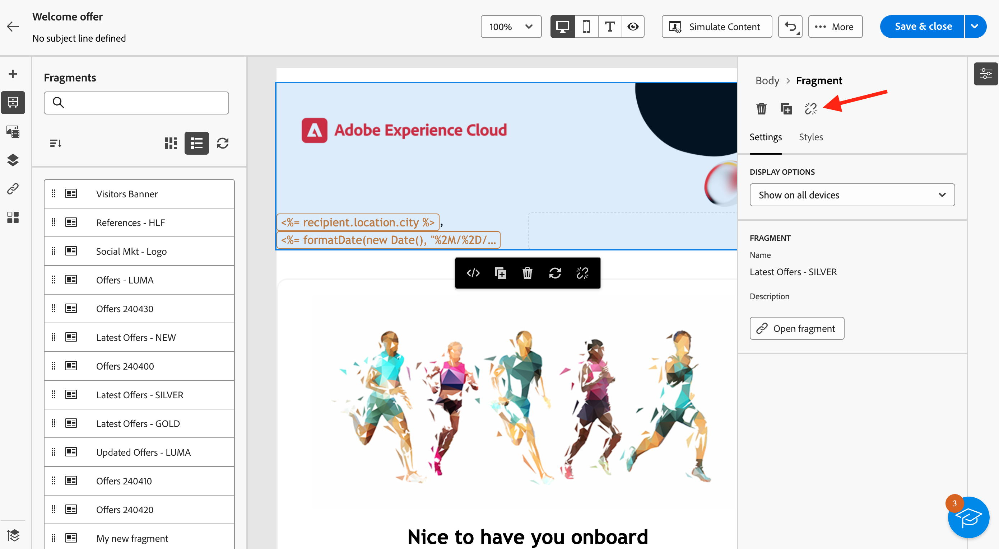

# Add visual fragments to your emails {#use-visual-fragments}

You can use a visual fragment in an [email delivery](../email/get-started-email-designer.md), or in a [content template](../email/use-email-templates.md). Steps are detailed below. [Learn how to create and manage content fragments](fragments.md).

## Use a visual fragment {#use-fragment}

To insert a visual fragment in an email content, follow the steps below:

1. Open any email or template content using the [Email Designer](../email/get-started-email-designer.md).

1. Select the **[!UICONTROL Fragments]** icon from the left rail.

    

1. The list of all visual fragments created on the current sandbox is displayed. You can:

    * Search for a specific fragment by starting typing its label.
    * Sort fragments in ascending or descending order.
    * Change the way the fragments are displayed (cards or list view).

    >[!NOTE]
    >
    >Fragments are sorted by creation date: recently added fragments are shown first in the list.

    If some visual fragments were modified or added while you are editing your content, click the **Refresh** icon to update the list with the latest changes.

1. Drag and drop any visual fragment from the list into the area where you want to insert it. Like any other component, you can move the fragment around in your content.

1. Select the fragment to display its options on the right pane. 

    
    
    From the **[!UICONTROL Settings]** tab, you can:

    * Choose the devices you want the fragment to be displayed on.
    * Click the **Edit content** button to open the content of this fragment. [Learn more](../content/fragments.md#edit-fragments)
        
        You can further customize your fragment using the **[!UICONTROL Styles]** tab.

1. If needed, you can break the inheritance with the original visual fragment. [Learn more](#break-inheritance) 
    You can also delete the fragment from your content, or duplicate it. These actions can be performed directly from the contextual menu that displays on top of the fragment.

1. Add as many visual fragments as you want and **[!UICONTROL Save]** your changes.

## Break inheritance {#break-inheritance}

When you edit a visual fragment, the changes are synchronized. They are automatically propagated to all email deliveries and content templates containing that fragment.

When added to an email or a content template, fragments are synchronized by default.

However, you can break the inheritance from the original fragment. In that case, the content of the fragment is copied into the current design, and the changes are not synchronized anymore.

To break inheritance, follow the steps below:

1. Select the visual fragment.

1. Click the unlock icon from the contextual toolbar.

    

1. That fragment becomes a standalone element that is not linked anymore to the original fragment. Edit it as any other content component in your content. [Learn more](../email/content-components.md)
