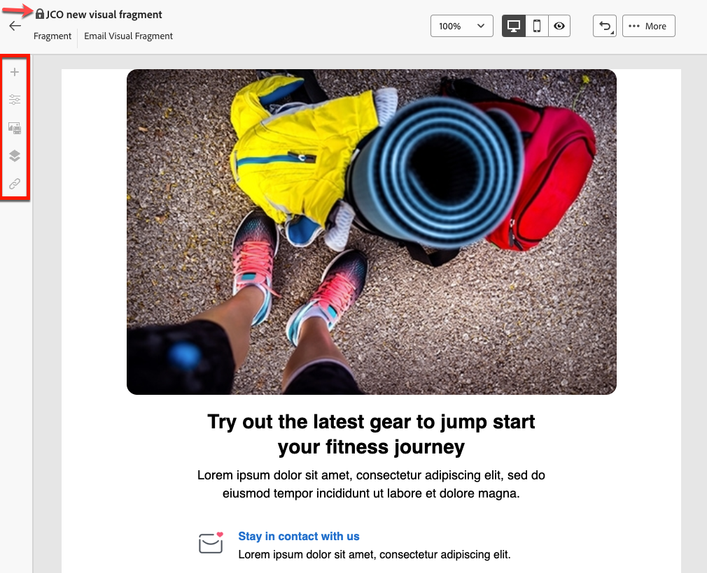

# Add visual fragments to your emails {#use-visual-fragments}

>[!AVAILABILITY]
>
>This capability requires an update to Campaign v8.6.4. Learn more in the [Campaign v8 Client console release notes](https://experienceleague.adobe.com/en/docs/campaign/campaign-v8/releases/release-notes).

In the Campaign web interface, **Visual fragments** are pre-defined visual blocks that you can reuse across multiple [email deliveries](../email/get-started-email-designer.md) or in [content templates](../content/use-email-templates.md). Learn how to create and manage content fragments in [this section](fragments.md).

## Use a visual fragment {#use-fragment}

>[!CONTEXTUALHELP]
>id="acw_fragments_details"
>title="Fragments options"
>abstract="This pane provides options related to the selected fragment. It allows you to choose the devices you want the fragment to be displayed on, and to open the content of this fragment. Use the **[!UICONTROL Styles]** tab to further customize your fragment. You can also break the inheritance with the original visual fragment."
<!-- pas vu dans l'UI-->

To insert a visual fragment in email content, follow these steps:

1. Open any email or template content using the [Email Designer](../email/get-started-email-designer.md).

1. Select the **[!UICONTROL Fragments]** icon from the left rail.

    

1. The list of all visual fragments created on the current sandbox is displayed. You can:

    * Search for a specific fragment by typing its label.
    * Sort fragments in ascending or descending order.
    * Change the way the fragments are displayed (cards or list view).

    >[!NOTE]
    >
    >Fragments are sorted by creation date. Recently added fragments appear first in the list.

    If visual fragments are modified or added while you are editing your content, click the **Refresh** icon to update the list with the latest changes.

1. Drag and drop any visual fragment from the list into the area where you want to insert it. Like any other component, you can move the fragment around in your content.

1. Select the fragment to display its options on the right pane.

    

    From the **[!UICONTROL Settings]** tab, you can:

    * Choose the devices you want the fragment to be displayed on.
    * Click the **Edit content** button to open the content of this fragment. [Learn more](../content/fragments.md#edit-fragments)
        
        You can further customize your fragment using the **[!UICONTROL Styles]** tab.

1. If needed, break the inheritance with the original visual fragment. [Learn more](#break-inheritance) 
    
    You can also delete the fragment from your content or duplicate it. Perform these actions directly from the contextual menu that displays on top of the fragment.

1. Add as many visual fragments as needed and **[!UICONTROL Save]** your changes.

### Visual fragment in read-only mode {#fragment-readonly}

Access rights may apply to visual fragments.

If permission edition is not granted for a particular visual fragment, the content template is displayed in **read-only mode**. In this case, the **[!UICONTROL Edit content]** button is replaced with the **[!UICONTROL View content]** button, allowing you to view the fragment without making changes.

{zoomable="yes"}

As shown below, all feature icons are deactivated, limiting interaction to viewing only.

{zoomable="yes"}

## Break inheritance {#break-inheritance}

When you edit a visual fragment, the changes are synchronized and automatically propagated to all email deliveries and content templates containing that fragment.

By default, fragments are synchronized when added to an email or a content template.

However, you can break the inheritance from the original fragment. In this case, the content of the fragment is copied into the current design, and the changes are no longer synchronized.

To break inheritance, follow these steps:

1. Select the visual fragment.

1. Click the unlock icon from the contextual toolbar.

    

1. The fragment becomes a standalone element that is no longer linked to the original fragment. Edit it as any other content component in your content. [Learn more](../email/content-components.md)