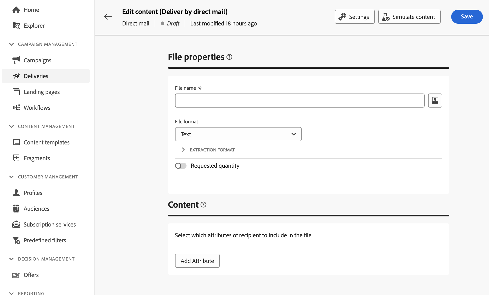

# Design the extraction file {#design-direct-mail}

>[!CONTEXTUALHELP]
>id="acw_directmail_content"
>title="Extraction file content"
>abstract="Click the **Edit content** button to start designing the extraction file required by your direct mail provider. This allows you to define the file properties such as its label and format, and to specify the columns that you want to include in the file."

>[!CONTEXTUALHELP]
>id="acw_directmail_properties_file"
>title="File properties"
>abstract="Configure the properties of the extraction file such as its name and format. You can personalize the file name using attributes from the database using the expression editor."

>[!CONTEXTUALHELP]
>id="acw_directmail_properties_content"
>title="Content"
>abstract="In this section, specify the columns to display in the extraction file. Once done, you can get a preview of the extraction file using the **Simulate content** button."

To design the content of the extraction file generated by your direct mail delivery, click the **[!UICONTROL Edit content]** button from your delivery page then configure the file properties and content.

## Configure the extraction file properties {#properties}

1. In the **[!UICONTROL File name]** field, specify the desired name for the extraction file. You can personalize the file name using attributes from the database. To do this, click the **[!UICONTROL Open personalization dialog]** icon to open the expression editor. [Learn how to personalize your content](../personalization/personalize.md)

1. In the **[!UICONTROL File format]** field, choose the desired format for the extraction file; **Text**, **Text using fixed with columns**, **CSV (Excel)** or **XML**. 

1. Expand the **[!UICONTROL Extraction format]** section to access specific options related to the format of the extraction file. Available values depend on the selected format.

    +++ Available Extraction format options
    
    * **[!UICONTROL Use first line as column header]** (Text / CSV (Excel) format): Toggle this option on to use the first column as header.
    * **[!UICONTROL Column separator]** (Text format): Specify the character to use as column separator in the extraction file.
    * **[!UICONTROL String delimiter]** (Text format): Specify how to delimit strings in the extraction file.
    * **[!UICONTROL End of line]** (Text format): Specify how to delimit the end of lines in the extraction file.
    * **[!UICONTROL Encoding]**: Choose the encoding of the extraction file.
    * **[!UICONTROL Date format and separators]**: Specify how dates should be formatted in the extraction file.
    * **[!UICONTROL Number format]**: Specify how numbers should be formatted in the extraction file.
    * **[!UICONTROL Export labels instead of internal values of enumerations]**: Toggle this option on in case you export enumeration values and you want to retrieve columns labels, which are easier to understand, rather than internal IDs.

    +++

1. Toggle on the **[!UICONTROL Requested quantity]** option to restrict the number of recipients for your delivery.

    {zoomable="yes"}

## Configure the extraction file columns {#content}

In the **[!UICONTROL Content]** section, specify the columns to display in the extraction file. To do this, follow these steps:

1. Click the **[!UICONTROL Add Attribute]** button to create a new column.
1. Choose the attribute to display in the column then confirm. Once the column added, you can change its label and modify the associated attribute using the edit icon.
1. Repeat these steps to add as many columns as needed for your extraction file.
1. To sort the extraction file using one of the columns, click the icon in the **[!UICONTROL Sorting]** column and select the desired sorting method.
1. To change the position of a column, use the up and down arrows.

You can now preview the extraction file and send the delivery to generate the extraction file. [Learn how to test & send direct mail messages](send-direct-mail.md)
