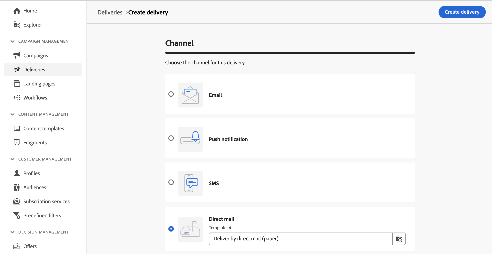

# Create a direct mail delivery {#create-direct-mail}

You can create a standalone direct mail delivery, or create a direct mail delivery in the context of a campaign workflow. The steps below detail the procedure for a standalone (one-shot) direct mail delivery. If you are working in the context of a campaign workflow, creation steps are detailed in [this section](../workflows/activities/channels.md#create-a-delivery-in-a-campaign-workflow).

To create a new standalone direct mail delivery, follow these steps:

1. Browse to the **[!UICONTROL Deliveries]** menu on the left rail, and click the **[!UICONTROL Create delivery]** button.

1. Under the **[!UICONTROL Channel]** section, choose **[!UICONTROL Direct mail]** as the channel, and select a template. [Learn more about templates](../msg/delivery-template.md)

1. Click the **[!UICONTROL Create delivery]** button to confirm.

    {zoomable="yes"}

1. Enter a **[!UICONTROL Label]** for the delivery, and access the **[!UICONTROL Additional options]** drop-down. If your delivery is based on an extended schema, specific **Custom options** fields are available.

    {zoomable="yes"}

    +++Configure the following settings based on your requirements.
    * **[!UICONTROL Internal name]**: Assign a unique identifier to the delivery.
    * **[!UICONTROL Folder]**: Store the delivery in a specific folder.
    * **[!UICONTROL Delivery code]**: Organize your deliveries using your own naming convention.
    * **[!UICONTROL Description]**: Provide a description for the delivery.
    * **[!UICONTROL Nature]**: Specify the delivery's nature for classification purposes.
    +++

1. Click the **[!UICONTROL Select audience]** button to target an existing audience or create your own.

    * [Learn how to select an existing audience](../audience/add-audience.md)
    * [Learn how to create a new audience](../audience/one-time-audience.md)

    {zoomable="yes"}

    >[!NOTE]
    >
    >Direct mail recipients must contain at least their names and postal addresses. An address is considered to be complete if the name, ZIP/Postal code field, and town/city fields are not empty. Any recipients with incomplete addresses will be excluded from direct mail deliveries.

1. Switch on the **[!UICONTROL Enable control group]** option to set a control group to measure the impact of your delivery. Messages are not sent to that control group, so you can compare the behavior of the population who received the message with the behavior of contacts who did not. [Learn how to work with control groups](../audience/control-group.md)

1. Click **[!UICONTROL Edit content]** to define the information (columns) to be exported into the extraction file. [Learn more](content-direct-mail.md)

    {zoomable="yes"}

1. To schedule your delivery to a specific date and time, switch on the **[!UICONTROL Enable scheduling]** option. After you initiate the delivery, the extraction file generates automatically at the exact date and time that you define. [Learn how to schedule deliveries](../msg/gs-deliveries.md#gs-schedule).

    >[!NOTE]
    >
    >When a delivery is sent in the context of a workflow, you must use the **Scheduler** activity. Learn more about [this page](../workflows/activities/scheduler.md).

1. Click **[!UICONTROL Settings]** to access advanced options related to your delivery template. [Learn more](../advanced-settings/delivery-settings.md)

    {zoomable="yes"}

1. Once your direct mail delivery is ready, click the **[!UICONTROL Review and send]** button to validate and send your delivery and generate the extraction file. [Learn how to preview and send a direct mail delivery](send-direct-mail.md)