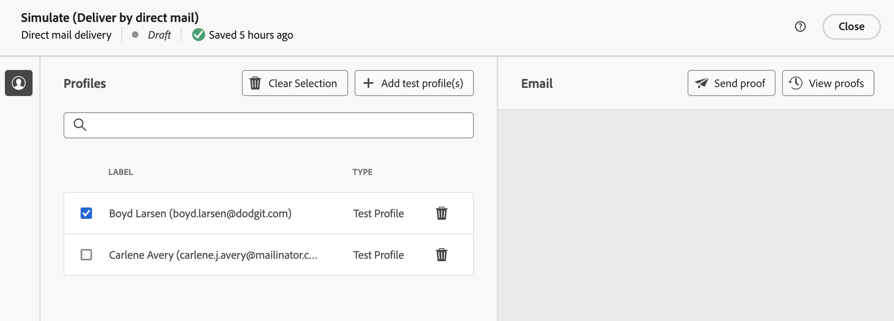

# Preview & send a direct mail delivery {#send-direct-mail}

Once you have configured the extraction file for your direct mail delivery, you can utilize test profiles to preview it and send proofs. If you have included personalized content, you can examine how this content is displayed in the columns by using test profile data. This allows you to ensure that the file content is being rendered correctly and that the personalized elements are being appropriately incorporated. Learn how to [preview the extraction file](#preview-dm) and [send proofs](#test-dm)

When the extraction file is ready, you can send the direct mail delivery in order to generate the file and share it with your direct mail provider. [Learn how to send your direct mail delivery](#dm-send)

## Preview the extraction file {#preview-dm}

The main steps to preview your extraction file are as follows. More details on how to preview deliveries are available in [this section](../preview-test/preview-content.md).

1. From your delivery content page, use **[!UICONTROL Simulate content]** to preview your personalized content.

    {zoomable="yes"}

1. Click **[!UICONTROL Add test profile(s)]** to select one or several profiles to preview their data in the extraction file content.

1. In the right pane, you will find a preview of the extraction file, where personalized elements are dynamically replaced with data from the selected profile.

    {zoomable="yes"}

## Send proofs {#test-dm}

<!-- what does the proof do ? does it send an email with extraction file attached?-->

what is sent as proof ? the extraction file or the mail to the provider?

Using **Adobe Campaign**, you have the ability to send proofs before sending them to your main audience. This step is important in validating your delivery and identifying any issues. 

Test recipients can review elements such as personalization settings, ensuring optimal performance and detecting any errors. This process helps you refine and optimize your extraction file before reaching your main audience. [Learn how to send proofs](../preview-test/test-deliveries.md#subscribers)

{zoomable="yes"}

## Send your direct mail delivery {#send-dm}

Once that you direct mail is ready to be sent to your customers, you can send the delivery in order to start the data extraction in the specified extraction file. To do this, follow these steps:

Once that you direct mail is ready to be sent to your customers, you can send the delivery in order to generate the extraction file to share it with your direct mail provider. To do this, follow these steps:

1. After designing the content of your extraction file, click **[!UICONTROL Review & send]** from your **[!UICONTROL Delivery]** page.

    {zoomable="yes"}

1. Click **[!UICONTROL Prepare]** and monitor the progress and statistics provided. 

    If any errors occur, refer to the **[!UICONTROL Logs]** menu for detailed information about the failure.

    {zoomable="yes"}

1. Send the messages by clicking on **[!UICONTROL Send]** to proceed with the final sending process. 

1. Confirm the send action by clicking the **[!UICONTROL Send]**. 

    If the direct mail delivery has been scheduled, click the **[!UICONTROL Send as scheduled]** button. Learn more about delivery scheduling in [this section](../msg/gs-messages.md#schedule-the-delivery-sending).

Once your delivery is sent, the extraction file is automatically generated and exported to the location specified in the **[!UICONTROL Routing]** external account selected in the delivery template's [advanced settings](../advanced-settings/delivery-settings.md).

You can track your KPIs (Key Performance Indicator) data from your delivery page and data from the **[!UICONTROL Logs]** menu.

<!-- Released later on ? to check when : You can also start measuring the impact of your message with built-in reports. [Learn more](../reporting/push-report.md)-->
