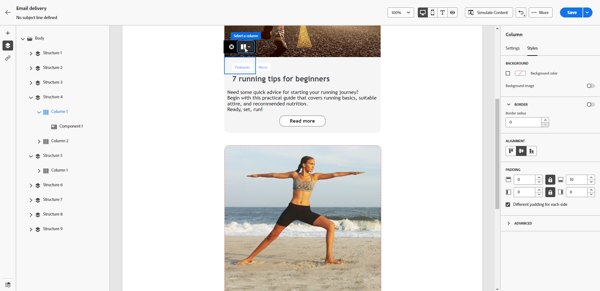

# Adjust vertical alignment and padding {#alignment-and-padding}

In this example, adjust padding and vertical alignment inside a structure component composed of three columns.

1. Select the structure component directly in the email, or use the **[!UICONTROL Navigation tree]** available in the left pane.

   {zoomable="yes"}

1. From the contextual toolbar, click **[!UICONTROL Select a column]** and choose the column you want to edit. You can also select it from the structure tree on the left.

   {zoomable="yes"}

1. The editable parameters for the selected column are displayed in the **[!UICONTROL Styles]** tab. Adjust the **[!UICONTROL Alignment]** using the dedicated section.

   {zoomable="yes"}

   For example, select **[!UICONTROL Bottom]**. The content component moves to the bottom of the column.

1. Under **[!UICONTROL Padding]**, define the top padding inside the column, and set the left and right padding for that column.

   >[!NOTE]
   >
   >Click the lock icon to break synchronization between the top and bottom or left and right padding.

   {zoomable="yes"}

1. Adjust the alignment and padding for the other columns in the same way.

1. Save the changes.