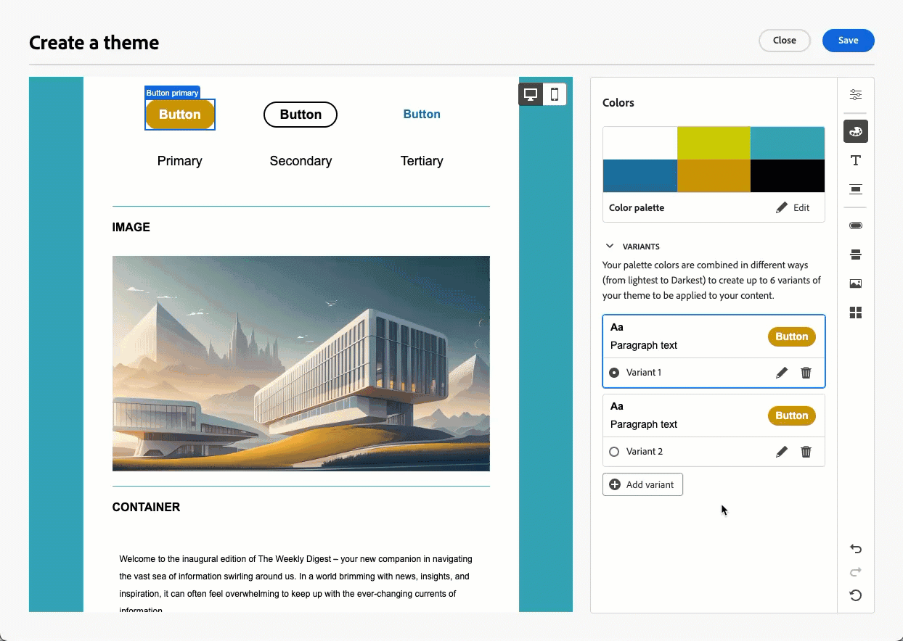
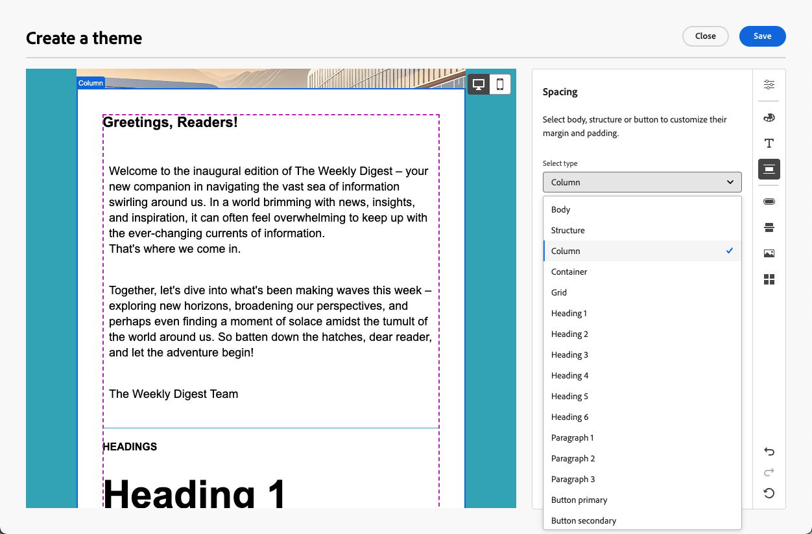
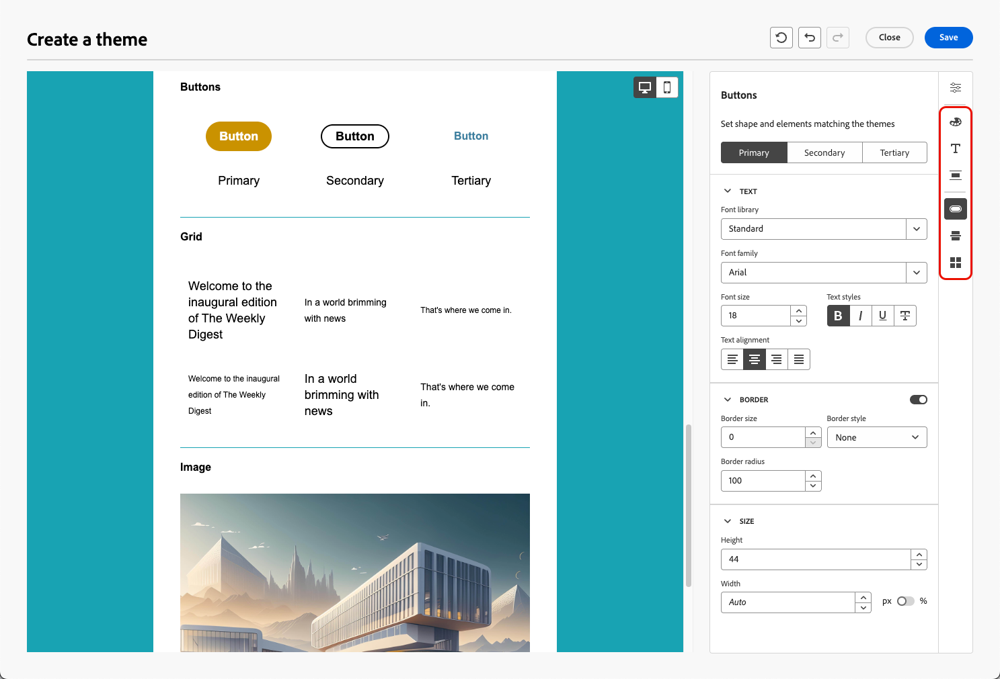
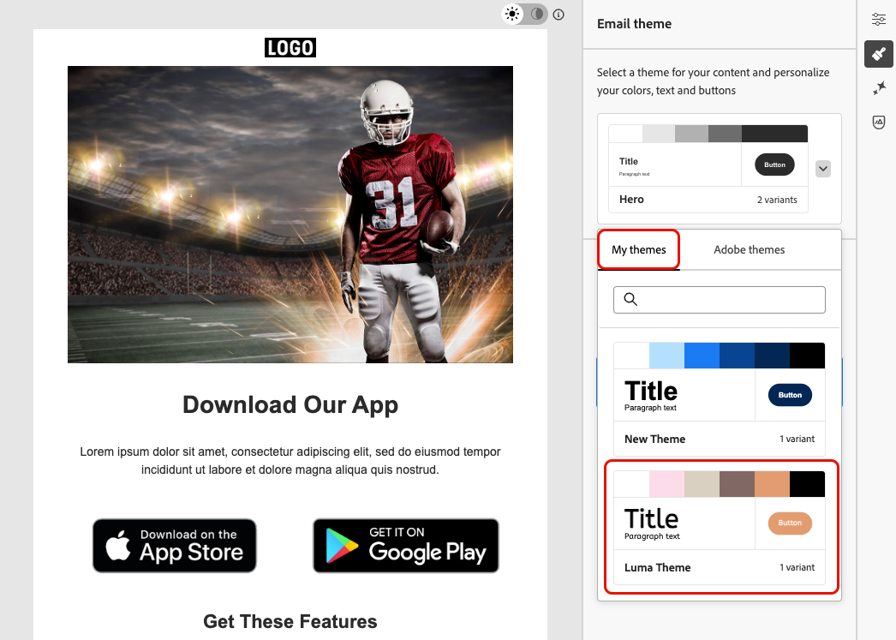
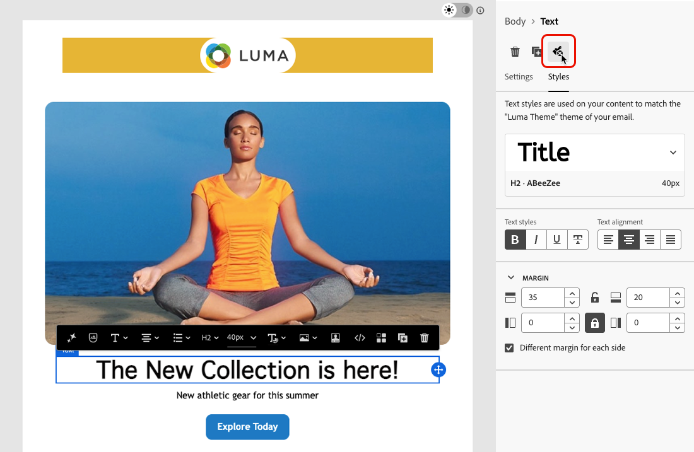
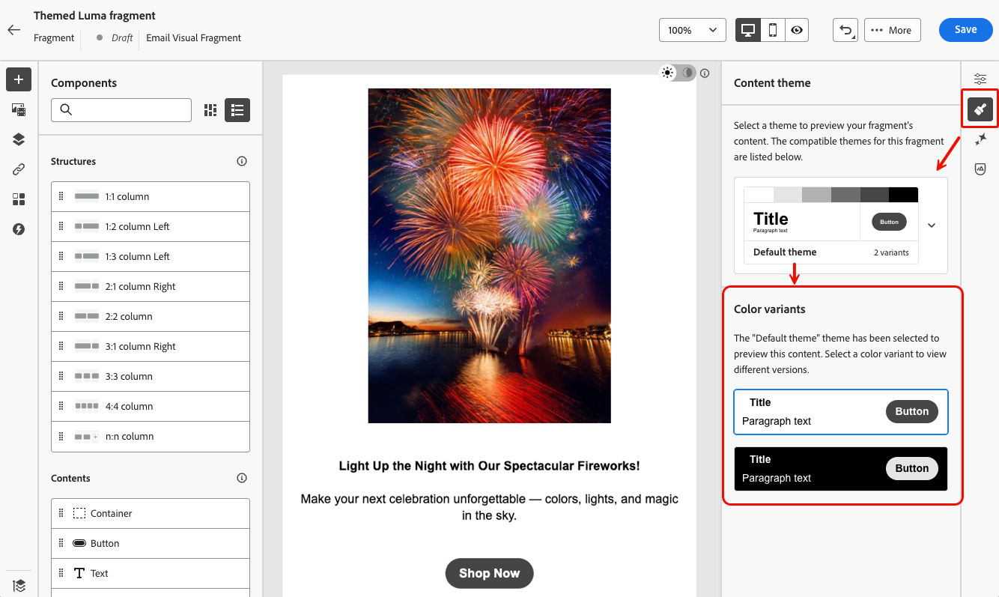
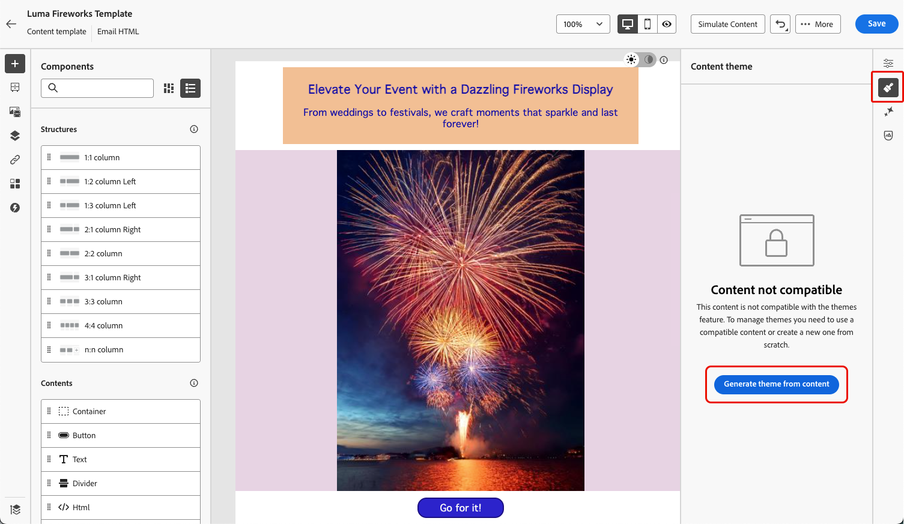

# Apply themes to your email content {#apply-email-themes}

>[!CONTEXTUALHELP]
>id="acw_email_apply_theme"
>title="Apply a theme to your email"
>abstract="Select a theme for your email to quickly apply a specific styling that fits your brand and design."

>[!AVAILABILITY]
>
>This capability is in Limited Availability. Contact your Adobe representative to gain access.

With themes, non-technical users have the ability to create reusable content that fits a specific brand and design language by adding custom styling on top of the standard templates<!-- to achieve brand specific results-->.

This feature empowers marketers to leverage visually appealing, brand-consistent emails faster and with less effort, while providing advanced customization options for unique design needs.

## Guardrails and limitations {#themes-guardrails}

* When creating an email from scratch, you can choose to start building your content using a theme to quickly apply a specific styling that fits your brand and design.

   If you choose the Manual Styling mode, you won't be able to apply any themes unless you reset your email.

* [Fragments](../content/fragments.md) are not cross-compatible between the Use Themes and Manual Styling modes.

   * Themed fragments are not available in email contents created without using themes.

   * To leverage a [fragment](../content/fragments.md) in a themed content, this fragment must have been created itself using themes. [Learn more](#leverage-themes-fragment)

   * When using a fragment in email content, make sure you are applying a theme that you have defined for this fragment. Failing to do so may cause display issues, especially in Outlook 2021 and previous versions. [Learn more](#leverage-themes-fragment)

* If using a content created in HTML, you will be in [compatibility mode](existing-content.md) and you cannot directly apply themes to this content.

   * To apply themes, you must first save the imported content [as a new template](../content/create-email-templates.md#save-as-template), then convert this template into a theme-compatible content. You can then use this template to create your email content. Learn how to convert a template created with manual styling in [this section](#theme-convertor).

   * You can also still convert your imported HTML content. [Learn more](existing-content.md)

   <!--To fully leverage all the capabilities of the Email Designer, including themes, you must either create a new content in Use Themes mode, or convert your imported HTML content. [Learn more](existing-content.md)-->

* When using custom web fonts (including Google fonts) in your themes, be aware that many email clients do not support them. Always define appropriate fallback fonts in your theme to ensure readability across all email clients.

   * Gmail and Yahoo! do not load external web fonts and will fall back to system fonts, regardless of the font family specified in your HTML/CSS.
   * The only Google fonts supported by Gmail are Roboto and Google Sans.
   * Email clients that *do* support web fonts include Apple Mail, iOS Mail, Android Mail, Thunderbird, and Outlook for macOS.

<!--If you apply a theme to a content using a [fragment](../content/fragments.md) created with Manual Styling mode, the rendering may not be optimal.-->

## Create a theme {#create-and-edit-themes}

To define a theme that you can leverage in your future email contents, follow the steps below.

1. To get started, create a new [content template](../content/create-email-templates.md).

1. Select the **[!UICONTROL Create or edit themes]** option.

   

1. Select an Adobe theme. In this example, select the **[!UICONTROL Default theme]** and click **[!UICONTROL Create]**.

   

1. You can also select a custom template from the **[!UICONTROL My themes]** tab and click **[!UICONTROL Edit]** to update it.

   

1. In the **[!UICONTROL General settings]** tab, start defining your theme by giving it a specific name suiting your brand. You can adjust the default viewport width for your emails<!--and also export the current theme for reuse-->.

   <!---->

1. Use the rail on the right to navigate through the different tabs and update your design settings.

   

1. From the **[!UICONTROL Colors]** tab:

   * Use the **[!UICONTROL Edit]** button to set up a **[!UICONTROL Color palette]** with default colors for your brand. Select a **[!UICONTROL Preset]** to quickly create a color scheme, or adjust each color of your theme individually. You can also use a combination of both.
   
      

   * Click **[!UICONTROL Add variant]** to create multiple color variants, such as light and dark mode, where each variant of your theme has its own color palette and nuance controls.

      

   * For each variant, click the **[!UICONTROL Edit]** icon to edit any individual element. You can use the default palette that you have created, or any custom colors.
   
      

1. In the **[!UICONTROL Text settings]**, you can set the global font that you want to use for your entire theme. For a more granular control, you also can edit each heading and paragraph type to adjust the font, size, style, and so on.

   

   >[!NOTE]
   >
   >When selecting custom web fonts, note that many email clients such as Gmail and Yahoo! do not support external web fonts and will fall back to system fonts. Consider including fallback fonts to ensure your content displays correctly across all email clients. [Learn more](#themes-guardrails)

1. In the **[!UICONTROL Spacing]** tab, select an individual element from the list to properly space it between the different components.

   <!---->

1. Using the other tabs on the right, you can manage separately each button element, divider, additional image formatting, and grid layout spacing for this theme.

   

1. Click **[!UICONTROL Save]** to store this theme for future use. It is now displayed in the **[!UICONTROL My themes]** tab.

<!--A little strange upon hitting Save, because once the theme is created, you need to hit Close to go back to Design your template screen, then click Cancel if you don't want to proceed with template creation.-->

## Apply themes to an email content {#apply-themes-email}

To apply default or custom styling themes to a content template or an email, follow the steps below.

1. In [!DNL Adobe Campaign], [create an email delivery](create-email.md) or work from an existing delivery, or create an email [content template](../content/create-email-templates.md#create-template-from-scratch), and [edit the email content](get-started-email-designer.md#start-authoring).

1. You can either select one of the following actions:

   * Select a built-in [email template](../content/use-email-templates.md) to open the Email Designer. A default theme specific to each template is automatically applied.

   * Design a [new content from scratch](create-email-content.md) and select **[!UICONTROL Use Themes]** to start with a predefined styling theme.

      

      >[!CAUTION]
      >
      >If you choose the Manual Styling mode, you won't be able to apply any themes unless you reset your design.
      >
      >To leverage a [fragment](../content/fragments.md) in a themed content, this fragment must have been created itself using themes. [Learn more](#leverage-themes-fragment)

1. Once in the Email Designer, click the **[!UICONTROL Themes]** button on the right rail. The default theme or the template's theme is displayed. You can switch between the two color variants for this theme.

   

1. Click the arrow next to the theme currently used. The list of available custom and Adobe themes displays.

   

1. Click **[!UICONTROL My themes]** and select a theme that you created.

   

1. Click outside of the drop-down list. The newly selected custom theme automatically applies its styles to all email components. You can toggle between the color variants if any.

1. When a theme is selected in a content template, you can click the **[!UICONTROL Edit theme]** button to update it. [Learn more](#create-and-edit-themes)

   {width="40%"}

   >[!NOTE]
   >
   >This option is not available when using themes in email contents.

1. If you leverage a theme using several color variants, you can choose a specific variant for a given structure component. This allows you to define a color variant for the whole content, and use a different variant for just one specific structure.

   >[!NOTE]
   >
   >You cannot perform this action on content components.

   To do this, select a structure component, click the **[!UICONTROL Use specific theme's variant option]** from the **[!UICONTROL Styles]** tab on the right, and apply the desired variant to that structure.

   

   In this example, the first color variant of the current theme is applied to the whole email content, but the third color variant is applied to the selected structure. You can see that the body and viewport background colors for that specific structure are different from the rest of the content.

You can switch themes at any time. The email content remains unchanged, but the styles are updated to reflect the new theme.

### Unlocking styles {#unlocking-styles}

When a component is selected, you can unlock its style using the dedicated icon in the **[!UICONTROL Styles]** tab.

{width="90%"}

The selected theme is still applied to that component, but you can override its styling elements. If you change themes, the new theme is only applied to the styling elements that were not overriden.<!--can you revert this action?-->

For example, if you unlock a text component, you can change <!--the font size from 11 to 14 and -->the font color from black to red:

{width="80%" align="center" zoomable="yes"}

If you change themes, <!--the font size is still 14 and -->the font color is still red for that component, but the background color for this component will change with the new theme:

{width="80%"}

## Leverage themes in a fragment {#leverage-themes-fragment}

To leverage a fragment in a template or email with [themes applied](#apply-themes-email), this fragment must have been created itself using themes. Otherwise, you will not be able to use this fragment in your themed content.

To create a fragment compatible with themes, follow the steps below.

1. In [!DNL Adobe Campaign], create a visual fragment and click **[!UICONTROL Create]** to design the content of your fragment. [Learn how](../content/create-fragment.md#create-from-scratch)

1. Select **[!UICONTROL Use Themes]** to start with a predefined styling theme.

      {width="100%"}

      >[!CAUTION]
      >
      >If you choose the Manual Styling mode, you won't be able to apply any themes unless you reset your fragment design.

1. Once in the Email Designer, you can start building your fragment.

1. Click the **[!UICONTROL Themes]** button on the right rail. The default theme is displayed. You can switch between the different color variants for this theme.

   {width="100%" align="center" zoomable="yes"}

1. You can select other themes to preview your fragment content. To do so, select the arrow next to the default theme and click **[!UICONTROL Select themes]**.

   {width="40%"}

1. You can navigate between the **[!UICONTROL Adobe themes]** and **[!UICONTROL My themes]** tabs, and select up to five compatible themes (from both tabs) for your fragment.

   {width=70%}

   >[!CAUTION]
   >
   >When using the fragment in an email content, make sure you [apply a theme](#apply-themes-email) that you have defined for this fragment. Failing to do so may cause display issues, especially in Outlook 2021 and previous versions.

1. Click **[!UICONTROL Close]**.

1. Select again the arrow next to the **[!UICONTROL Default theme]**. You can now toggle between the different themes you just selected to preview each style rendering.

   {width=90%}

1. Click **[!UICONTROL Select themes]** again to add more themes or change your selection.

## Make a template compatible with themes {#theme-convertor}

[!DNL Adobe Campaign] allows you to convert a template which was created using manual styling into a theme-compatible content. This can be particularly useful if you created content templates before themes were introduced into [!DNL Adobe Campaign], or if you are importing external contents.

>[!NOTE]
>
> Only **email templates** can be converted to be compatible with themes. Individual emails cannot be converted; you must save your content as a template first.

1. Open an email [content template](../content/create-email-templates.md) and edit its content using the Email Designer.

1. Select the **[!UICONTROL Themes]** icon on the right rail and click the **[!UICONTROL Generate theme from content]** button.

   {width=100%}

1. The **[!UICONTROL Create a theme]** window opens. [!DNL Adobe Campaign] automatically detects the styling elements and consolidates them into a new theme.

   {width=90% }

1. Provide a name for your theme.

1. Make your own adjustments as needed, just like you do when creating a theme from scratch, such as adding a color variant, editing fonts, etc. [Learn how](#create-and-edit-themes)

   {width=90%}

1. Click **[!UICONTROL Save]** to store this new theme for reuse. You can now apply this theme to your contents such as any other theme. [Learn how](#apply-themes-email)
