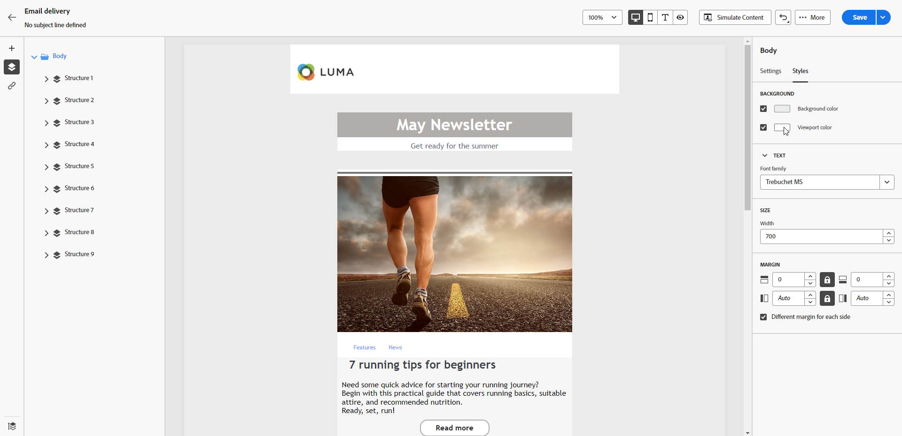
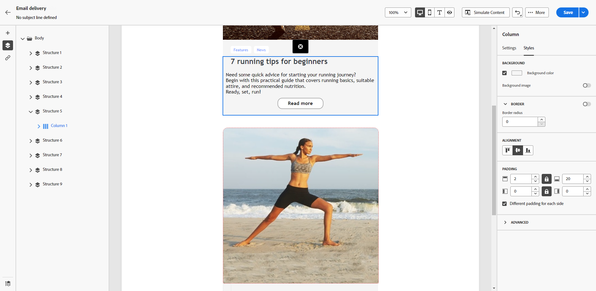

# Personalize your email background {#backgrounds}

>[!CONTEXTUALHELP]
>id="ac_edition_backgroundimage"
>title="Background settings"
>abstract="You can personalize the background color or background image for your content. Note that background image is not supported by all email clients."

When setting backgrounds with the Email Designer, Adobe recommends the following:

1. Apply a background color to the body of your email if required by your design.  
1. Set background colors at the column level in most cases.  
1. Avoid using background colors on image or text components, as they are difficult to manage.  

Below are the available background settings you can use:

* Set a **[!UICONTROL Background color]** for the whole email. Select the body settings in the navigation tree accessible from the left pane. 

  [Set a background color for the whole email body, accessible via the navigation tree.]  
  {zoomable="yes"}  

* Set the same background color for all structure components by selecting **[!UICONTROL Viewport background color]**. This option allows you to choose a different setting from the background color.

  [Set a uniform background color for all structure components using the viewport background color option.]  
  {zoomable="yes"}  

* Set a different background color for each structure component. Select a structure in the navigation tree on the left pane to apply a specific background color only to that structure.

  [Apply unique background colors to individual structure components via the navigation tree.]  
  {zoomable="yes"}  

  >[!NOTE]
  >Ensure you do not set a viewport background color, as it may hide the structure background colors.  

* Set a **[!UICONTROL Background image]** for the content of a structure component.

  [Add a background image to the content of a specific structure component.]  
  {zoomable="yes"}  

  >[!NOTE]
  >Some email programs do not support background images. When unsupported, the row background color is used instead. Select an appropriate fallback background color in case the image cannot be displayed.  

* Set a background color at the column level.

  [Apply a background color at the column level for greater flexibility.]  
  {zoomable="yes"}  

  >[!NOTE]
  >This is the most common use case. Adobe recommends setting background colors at the column level, as this provides more flexibility when editing the entire email content.  

  You can also set a background image at the column level, but this is rarely used.
