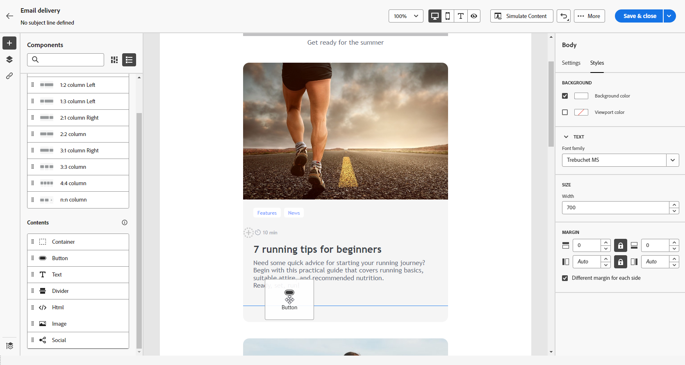

# Use content components {#content-components}

>[!CONTEXTUALHELP]
>id="ac_content_components_email"
>title="About Contents"
>abstract="Content components are empty content placeholders that you can use to create the layout of an email."

>[!CONTEXTUALHELP]
>id="ac_content_components_landing_page"
>title="About Contents"
>abstract="Content components are empty content placeholders that you can use to create the layout of a landing page."

>[!CONTEXTUALHELP]
>id="ac_content_components_fragment"
>title="About Contents"
>abstract="Content components are empty content placeholders that you can use to create the layout of a content fragment."

>[!CONTEXTUALHELP]
>id="ac_content_components_template"
>title="About Contents"
>abstract="Content components are empty content placeholders that you can use to create the layout of a template."

When creating your email content, **[!UICONTROL Content]** components allow you to personalize your email with raw, empty components that you can use once placed in an email.

You can add as many **[!UICONTROL Contents]** as needed inside a **[!UICONTROL Structure]**, which defines the layout of your email.

## Add Content components {#add-content-components}

To add content components to your email and adjust them to your needs, follow the steps below.

1. In the Email Designer, use an [existing content](existing-content.md) or drag and drop a **[!UICONTROL Structure]** into your empty content to define the layout of your email. [Learn how](create-email-content.md)

1. Drag and drop the **[!UICONTROL Content]** of your choice inside the relevant structures.

    {zoomable="yes"}

    >[!NOTE]
    >
    >You can add several components into a single structure and into each column of a structure.

1. Adjust the options for each component using the contextual **[!UICONTROL Settings]** tab. For example, choose to display it on desktop or mobile devices only, or both. You can also manage link options from this tab. [Learn more about managing links](message-tracking.md)

1. Adjust the styling attributes for each component using the **[!UICONTROL Style]** tab. For example, change the text style, padding, or margin of each component. [Learn more about alignment and padding](alignment-and-padding.md)

    {zoomable="yes"}

1. From the advanced menu of your **[!UICONTROL Content]** on the right pane, delete or duplicate any content component as needed.

## Container {#container}

You can add a simple container inside which you add another content component. This allows you to apply specific styling to the container, which is different from the component used inside.

For example, add a **[!UICONTROL Container]** component and then add a [Button](#button) component inside that container. Use a specific background for the container and another one for the button.

{zoomable="yes"}

## Button {#buttons}

Use the **[!UICONTROL Button]** component to insert one or multiple buttons into your email and redirect your email audience to another page.

1. From the **[!UICONTROL Contents]** list, drag and drop the **[!UICONTROL Button]** component into a **[!UICONTROL Structure]** component.

    {zoomable="yes"}

1. Click your newly added button to personalize the text and access the **[!UICONTROL Settings]** and **[!UICONTROL Styles]** tabs.

    {zoomable="yes"}

1. From the **[!UICONTROL Settings]** tab, in the **[!UICONTROL URL]** field, add the URL to redirect to when clicking the button.

1. Choose how the content is displayed using the **[!UICONTROL Target]** drop-down list:

    * **[!UICONTROL None]**: opens the link in the same frame as it was clicked (default).
    * **[!UICONTROL Blank]**: opens the link in a new window or tab.
    * **[!UICONTROL Self]**: opens the link in the same frame as it was clicked.
    * **[!UICONTROL Parent]**: opens the link in the parent frame.
    * **[!UICONTROL Top]**: opens the link in the full body of the window.

    {zoomable="yes"}

1. Further personalize your button by changing styling attributes such as **[!UICONTROL Border]**, **[!UICONTROL Size]**, **[!UICONTROL Margin]**, and others from the **[!UICONTROL Styles]** tab.

## Text {#text}

Use the **[!UICONTROL Text]** component to insert text into your email, and adjust the style (border, size, padding, etc.) using the **[!UICONTROL Settings]** and **[!UICONTROL Styles]** tabs.

1. From the **[!UICONTROL Contents]** menu, drag and drop **[!UICONTROL Text]** into a **[!UICONTROL Structure]** component.

    {zoomable="yes"}

1. Click on your newly added component to personalize the text and access the **[!UICONTROL Settings]** and **[!UICONTROL Styles]** tabs.

1. Change your text with the following options available from the contextual toolbar:

    {zoomable="yes"}

    * **[!UICONTROL Change text style]**: apply bold, italic, underline, or strike-through to your text.
    * **Change alignment**: choose between left, right, center, or justified alignment for your text.
    * **[!UICONTROL Create list]**: add bullet or number lists to your text.
    * **[!UICONTROL Set heading]**: add up to six heading levels to your text.
    * **Font size**: select the font size of your text in pixels.
    * **[!UICONTROL Edit image]**: add an image or an asset to your text component.
    * **[!UICONTROL Show the source code]**: display the source code of your text. It cannot be modified.
    * **[!UICONTROL Duplicate]**: add a copy of your text component.
    * **[!UICONTROL Delete]**: delete the selected text component from your email.
    * **[!UICONTROL Add personalization]**: add personalization fields to customize the content from your profiles data.
    * **[!UICONTROL Enable conditional content]**: add conditional content to adapt the component's content to the targeted profiles.

1. Adjust other styling attributes such as text color, font family, border, padding, margin, and others from the **[!UICONTROL Styles]** tab.

    {zoomable="yes"}

## Divider {#divider}

Use the **[!UICONTROL Divider]** component to insert a dividing line to organize the layout and content of your email.

You can adjust styling attributes such as the line color, style, and height from the **[!UICONTROL Styles]** tab.

{zoomable="yes"}

## HTML {#HTML}

Use the **[!UICONTROL HTML]** component to copy and paste parts of your existing HTML. This enables you to create free modular HTML components to reuse external content.

1. From **[!UICONTROL Components]**, drag and drop the **[!UICONTROL HTML]** component into a **[!UICONTROL Structure]** component.

    {zoomable="yes"}

1. Click on your newly added component, then select **[!UICONTROL Show the source code]** from the contextual toolbar to add your HTML.

    {zoomable="yes"}

>[!NOTE]
>
>To make external content compliant with the Email Designer, Adobe recommends [creating a message from scratch](create-email-content.md) and copying the content from your existing email into components.

## Image {#image}

>[!IMPORTANT]
>
>Access to the Assets menu is limited to users with an active Adobe Experience Manager as a Cloud Service license. If you do not hold this license, the Assets menu will be unavailable.

Use the **[!UICONTROL Image]** component to insert an image file from your computer into your email.

1. From the **[!UICONTROL Content]** menu, drag and drop **[!UICONTROL Image]** into a **[!UICONTROL Structure]** component.

    {zoomable="yes"}

1. Click **[!UICONTROL Browse]** to choose an image file from your assets. You can also choose to **[!UICONTROL Import your media]**.

    To learn more about uploading and adding assets in Adobe Experience Manager, refer to [Adobe Experience Manager as a Cloud Service documentation](https://experienceleague.adobe.com/docs/experience-manager-cloud-service/content/assets/manage/add-assets.html).

    {zoomable="yes"}

1. Navigate through your folders to locate the specific asset you need, or use the search bar to find it efficiently.

    Once you've found the asset you're looking for, click **[!UICONTROL Select]**.

    {zoomable="yes"}

1. Click your newly added component and set up your image properties using the **[!UICONTROL Settings]** tab:

    * **[!UICONTROL Image title]** lets you define a title for your image.
    * **[!UICONTROL Alt text]** lets you define the caption linked to your image. This corresponds to the alt HTML attribute.

    {zoomable="yes"}

1. Add a link to redirect your audience to another content. [Learn more](message-tracking.md)

1. Adjust other styling attributes such as margin, border, and others using the **[!UICONTROL Styles]** tab.

## Social {#social}

Use the **[!UICONTROL Social]** component to insert links to social media pages into your email content.

1. From the **[!UICONTROL Components]** menu, drag and drop the **[!UICONTROL Social]** component into a **[!UICONTROL Structure]** component.

1. Click your newly added component.

1. In the **[!UICONTROL Social]** field of the **[!UICONTROL Settings]** tab, choose which social media you want to add or remove.

    {zoomable="yes"}

1. Choose the size of your icons in the **[!UICONTROL Size of images]** field.

1. Click on each of your social media icons to configure the **[!UICONTROL URL]** to which your audience is redirected.

    {zoomable="yes"}

1. Change the icons of each of your social media if needed in the **[!UICONTROL Source]** field.

1. Adjust other styling attributes such as style, margin, border, and others from the **[!UICONTROL Styles]** tab.