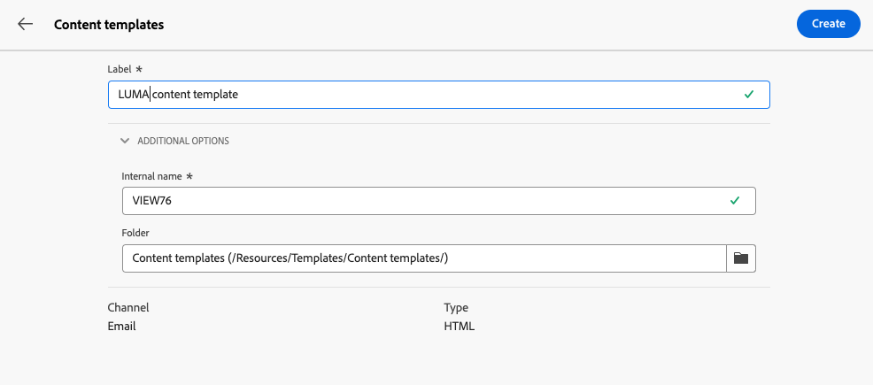

# Work with content templates {#content-templates}

>[!CONTEXTUALHELP]
>id="acw_contenttemplate_menu"
>title="Content templates"
>abstract="For an accelerated and improved design process, you can create standalone email templates to easily reuse custom content across Adobe Campaign. These content templates can be designed from scratch, based on built-in or custom templates, created from an existing content, or imported in the content template editor."
 
For an accelerated and improved design process, you can create standalone templates to easily reuse custom content across [!DNL Adobe Campaign]. These content templates can be designed from scratch, based on built-in or custom templates, created from an existing content, or imported in the content template editor.

This functionality enables content-oriented users to work on standalone templates so that marketing users can reuse and adapt them inside their own email campaigns.

>[!NOTE]
>
>Currently only **email** content templates are supported.

## Access content templates {#access-templates}

>[!CONTEXTUALHELP]
>id="acw_contenttemplate_edition"
>title="Edit your template content"
>abstract="Click the **Edit content** button to update your content with the Email Designer."

To access the content template list, browse to the **[!UICONTROL Content Management]** > **[!UICONTROL Content Templates]** menu from the left rail.

{zoomable="yes"}

This dashboard shows all the available content templates as a list. You can filter on a specific [folder](../get-started/permissions.md#folders) using the drop-down list or add rules using the [query modeler](../query/query-modeler-overview.md).

{zoomable="yes"}

From the list, you can edit, duplicate, or delete existing content templates. Use the button on the upper section to create a content template.

## Create content templates {#create-content-templates}

>[!CONTEXTUALHELP]
>id="acw_contenttemplate_design"
>title="Content template design"
>abstract="Content template design"

>[!CONTEXTUALHELP]
>id="acw_contenttemplate_selection"
>title="Content template selection"
>abstract="Content template selection"

Content templates can be created by [saving an existing email as a template](#save-as-template), or from the list of email templates, through the **Create content template** button, [as detailed below](#create-template-from-scratch).

Once saved, you can now use this template when building any [email](../email/create-email.md) within [!DNL Adobe Campaign]. [Learn how](use-email-templates.md)

>[!NOTE]
>
>* Changes made to content templates are not propagated to emails.
>
>* Similarly, when templates are used in an email, any edits you make to your email content do not impact the previously used content template.

### Create a new content template {#create-template-from-scratch}

>[!CONTEXTUALHELP]
>id="acw_contenttemplate_properties"
>title="Define your template properties"
>abstract="Define your email content template properties to retrieve is easily when needed."

To create a new content template from the content templates dashboard, follow these steps:

1. Browse to the content template list from the **[!UICONTROL Content Management]** > **[!UICONTROL Content templates]** left rail.

1. Select **[!UICONTROL Create template]**.

    {zoomable="yes"}

1. Enter the template label and properties. You can select the folder where you want to store your template. By default, content templates are stored in a dedicated folder of the Adobe Campaign hierarchy: **[!UICONTROL Explorer]** > **[!UICONTROL Resources]** > **[!UICONTROL Templates]** > **[!UICONTROL Content templates]**. Learn more about folders in [this page](../get-started/permissions.md#folders)

    {zoomable="yes"}

1. Click **[!UICONTROL Create]** and choose how you want to design your template from the different options:

    * [Design your content from scratch](create-email-content.md) through the Email Designer's interface.

    * [Code or copy-paste raw HTML](code-content.md) directly into the Email Designer.

    * [Import existing HTML content](existing-content.md) from a file or a .zip folder.

    * Use existing content from a list of built-in or custom templates. The steps to use a content template in an email are described in [this section](use-email-templates.md).

    {zoomable="yes"}

1. The Email Designer displays. Edit your content as needed, the same way you would do for any email, according to the option you selected. Learn how to use the Email Designer in [this section](get-started-email-designer.md).

    <!--You can test your content if needed. [Learn how](#test-template)-->

1. Once your template is ready, click **[!UICONTROL Save]**.

    If needed, click the arrow next to the template name to go back to the **[!UICONTROL Details]** screen and edit your template.

    {zoomable="yes"}

The template is available in the **[!UICONTROL Content templates]** list. [Learn more](#access-templates)

You can now use this template to build a new content: it is available in the **[!UICONTROL Saved templates]** tab of the Email Designer. [Learn how](use-email-templates.md)

### Save email content as template {#save-as-template}

Once you [designed an email](create-email-content.md), you can save this content as a template for future reuse. Saved templates are available to all users of your Adobe Campaign environment.

To save an email content as a template, follow the steps below:

1. From the email designer, click the **[!UICONTROL More]** button on top right of the screen.

1. Select **[!UICONTROL Save as content template]** from the drop-down menu.

    {zoomable="yes"}

1. Enter a name for this template, and save.

    {zoomable="yes"}

The template is saved and displayed in the **[!UICONTROL Content templates]** list. It becomes a standalone content template that can be accessed, edited and deleted as any other item on that list. [Learn more](#access-manage-templates)

You can now use this template to build a new content: it is available in the **[!UICONTROL Saved templates]** tab of the Email Designer. [Learn how](use-email-templates.md)

{zoomable="yes"}

>[!NOTE]
>
>Any change to that new template is not propagated to the email it comes from. Similarly, when the original content is edited within that email, the new template is not modified.

<!--

Test your content template {#test-template}

You can test the rendering of any email content template, whether created from scratch or from an email. To do so, follow the steps below.

1. Access the content template list.

1. Click **[!UICONTROL Edit content]** from the **[!UICONTROL Template properties]**.

1. Click **[!UICONTROL Simulate Content]** and select a test profile to check your email rendering. You can choose the desktop or mobile view.

1. You can send a proof to test your content and have it approved by some internal users before using it. To do so, click the **[!UICONTROL Send proof]** button and follow the steps described in .

-->

## Modify a content template {#modify-delete}

To update an existing content template, follow these steps:

1. From the list of content templates, click on the label of the template to modify to edit it. 

1. Click the **[!UICONTROL Edit content]** button to update your content with the [Email Designer](get-started-email-designer.md).

{zoomable="yes"}

>[!NOTE]
>
>Changes made to content templates are not propagated to emails using this content template.

## Delete a content template {#content-delete}

You have two ways to delete a content template:

* from the list of content templates, click the ellipsis button then select **Delete**

    
    
* from the content template itself, click the **More** button then select **Delete**

>[!NOTE]
>
>Deleting a content template does not impact deliveries created using this template.

## Duplicate a content template {#content-duplicate}

You have two ways to duplicate a content template:

* from the list of content templates, click the ellipsis button then select **Duplicate**
    
* from the content template itself, click the **More** button then select **Duplicate**

In both cases, confirm the duplication to create the new content template. The label of the new content template is **Copy of `<label of the initial campaign`**. Browse to the template settings to update this label.
    