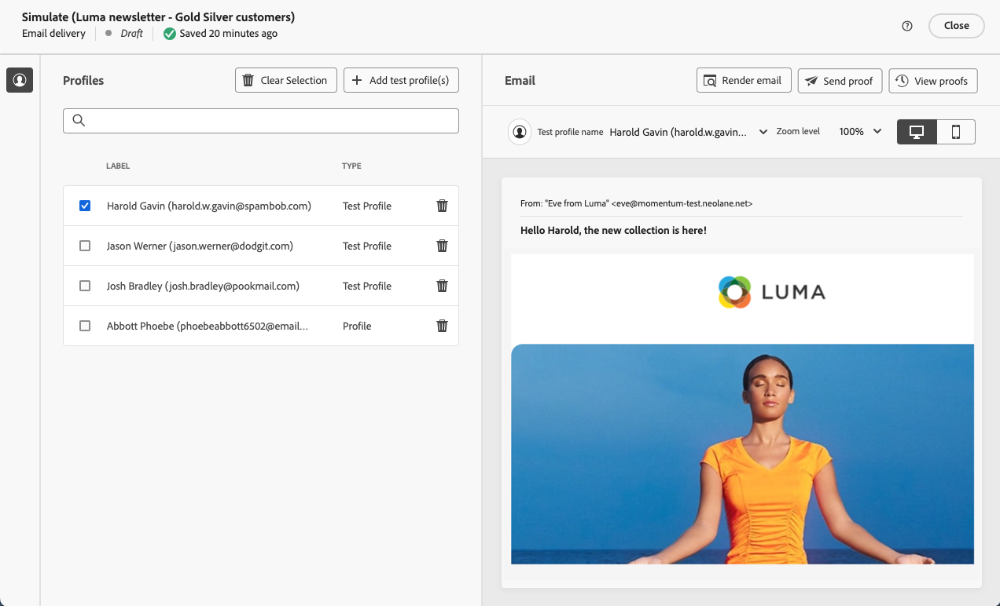

# Send your first email {#first-email}

>[!NOTE]
>
>This documentation is under construction and frequently updated. The final version of this content will be ready in January 2023.

This use case presents how to create your first email. We are going to schedule the sending of an email on a specific date to silver and gold loyalty customers. This email will be designed using a predefined template and will include personalization using profile's attributes.

## Create the email {#create-email}

>[!CONTEXTUALHELP]
>id="acw_deliveries_email_template_selection"
>title="Select an email template"
>abstract="A template is defined in the Adobe Campaign v8 console. This is a specific delivery configuration that contains predifined parameters like typology rules, personnalization or routing parameters."

>[!CONTEXTUALHELP]
>id="acw_deliveries_email_properties"
>title="Email Properties"
>abstract="The properties are the common delivery parameters that helps you to name and classify your delivery. If your delivery is based on an extended schema defined in the Adobe Campaign v8 console, some specific **Custom Options** fields are available."

1. Create a new delivery from the **[!UICONTROL Deliveries]** menu.

1. Select the **[!UICONTROL Email]** channel and the template to use then click **[!UICONTROL Create]**.

    >[!NOTE]
    >
    >A template is a specific delivery configuration that has been saved as a template in order to be re-used. Delivery templates are configured by admin users in Adobe Campaign console. [Learn how to work with delivery templates](https://experienceleague.adobe.com/docs/campaign-classic/using/sending-messages/using-delivery-templates/about-templates.html){target="_blank"}

    

1. Provide a label for the email and configure additional options based on your needs:

    * **[!UICONTROL Internal name]**: assign a unique identifier to the delivery,
    * **[!UICONTROL Folder]**: store the delivery in a specific folder,
    * **[!UICONTROL Delivery code]**: use this field to organize your deliveries based on your own naming convention,
    * **[!UICONTROL Description]**: specify a description for the delivery,
    * **[!UICONTROL Nature]**: specify the nature of the email for classification purposes.<!--The content of the list is defined in the delivery template selected when creating the email.-->

    >[!NOTE]
    >
    >If you have extended your schema with specific custom fields, you can access them from the **[!UICONTROL Custom options]** section.

    

    Additionally, advanced settings (typology rule, target mappings, etc.) are available from the button located next to the delivery name. They are predefined in the template selected when creating the email. You can edit them if necessary.

## Create the email content {#create-content}

>[!CONTEXTUALHELP]
>id="acw_homepage_card3"
>title="Learn how to design your email content by using the Email Designer."
>abstract="Learn how to design your content"

In this use case, we are going to design the email using a predefined template. Detailed information on how to configure email content are available in [this section](../content/edit-content.md).

1. Click the **[!UICONTROL Edit content]** button to start creating the content of your email. 

   This screen allows you to configure the email content and design it using the Email Designer. 

    

1. Specify the subject of your email and personalize it using the Expression Editor. [Learn how to personalize your content](../personalization/personalize.md)

    

1. Click the **[!UICONTROL Edit email body]** button to create and design the content of your email.

    Choose the method to use to create your email content. In this example, we want to use an existing design template.

    

<!--1. Select the HTML or ZIP file to import then click **[!UICONTROL Next]**.

    If your folder contains assets, choose the instance and folder where they should be stored then click **[!UICONTROL Import]**. (+ link to doc on assets?)

    -->

1. Once you have selected the template, it displays in the Email Designer, allowing you to edit it if needed and to add personalization.

    In this example, we want to add personalization in the email title. To do this, select the component block then click **[!UICONTROL Add Personalization]**.

    

1. Once your content is ready, save it then click the arrow to go back to the email creation screen.

    

## Define the audience {#define-audience}

>[!CONTEXTUALHELP]
>id="acw_deliveries_email_audience"
>title="Define the audience"
>abstract="Select the best audience for your marketing message. You can choose an existing audience already defined in a Campaign v8 instance or from Adobe Experience Platform or you can choose to create a new audience with the segment builder."

In this use case we are going to send the email to an existing audience. Additional information on how to work with audiences are available in [this section](../audience/about-audiences.md).

1. Click the **[!UICONTROL Select audience]** button then choose an existing audience to target.

    In this example, we want to use an existing audience targeting customers belonging to the silver and gold loyalty points levels.

    

    >[!NOTE]
    >
    >Audiences available in the list originate either from your Campaign V8 instance or from Adobe Experience Platform if the Destination / Sources integration has been configured on your instance.
    >
    >The Destination / Sources integration allows you to send Experience Platform segments to Adobe Campaign, and to send Campaign delivery and tracking logs over to Adobe Experience Platform. [Learn how work with Campaign and Adobe Experience Platform](https://experienceleague.adobe.com/docs/campaign/campaign-v8/connect/ac-aep.html)

1. Once your audience has been selected, you can refine the target using additional rules.

    You can also set a control group to analyse the behavior of the email recipients compared to the behavior of profiles which were not targeted. [Learn how to work with control groups](../audience/control-group.md)

## Schedule the sending {#schedule}

>[!CONTEXTUALHELP]
>id="acw_deliveries_email_schedule"
>title="Schedule the sending"
>abstract="Define the date and the exact time for your sending. By choosing the most appropriate time for your marketing message, you will maximise open rates."

To schedule the sending of the email, click **[!UICONTROL Enable]** then specify the desired date and time for the sending. 

By default, the **[!UICONTROL Confirm before sending]** option is enabled, meaning that you will need to confirm the sending to allow the email to be sent at the specified date and time. Disable this option to allow the email to be sent at the scheduled date and time with no confirmation needed.

## Preview and test the email {#preview-test}

Once your email is ready, you can preview and test it before launching its sending.

In this use case, we are going to preview the email and send a proof using existing profiles.

Additional information on how to preview and test emails are available in [this section](../preview-test/preview-test.md).

1. Click **[!UICONTROL Review to send]**. A preview of your email displays, along with all the configured properties, audience and schedule. You can edit any of these elements using the modify button.

1. Click the **[!UICONTROL Simulate content]** button to preview the email and send proofs.

    

1. In the left-hand side area, select the profile(s) to use to preview the email.

1. A preview of the email displays in the right pane based on the selected profile. If you have added multiple profiles, you can switch between each of them to preview the corresponding email.

    

   <!-- !NOTE
    >
    >Additionally, the **[!UICONTROL Render email]** button allows you to preview the email using mutiple devices or mail providers. Learn on how to preview email rendering-->

1. To send proofs of your email, click the **[!UICONTROL Test]** button then select the profiles that will receive the proof.

    <!--TO REPLACE WITH SUBSTITUTION PROFILE-->In this example, we want to send the proofs to a specific test profile, which is a seed address that is not part of the target. [Learn how to work with seed addresses](https://experienceleague.adobe.com/docs/campaign-classic/using/sending-messages/using-seed-addresses/about-seed-addresses.html){target="_blank"}

    

    >[!NOTE]
    >
    >You can also test your messages by impersonating some of the targeted profiles and sending the proof message to the email address of your choice. [Learn how to send proofs](../preview-test/preview-test.md)

1. Click **[!UICONTROL Send test email ]** then confirm the sending.

    Once the proofs have been sent, you can then check their status by clicking the **[!UICONTROL View test email log]** button.

## Send and monitor the email {#prepare-send}

Once you have reviewed and tested your email, you can launch its preparation and send it.

1. Click **[!UICONTROL Prepare]** to launch the preparation of the message. [Learn how to prepare an email](../monitor/prepare-send.md)
    
    
 
1. Once your email is ready to be sent, click **[!UICONTROL Send]** then confirm the sending.

    You can track the sending in real-time, along with statistics. Additionally, the **[!UICONTROL Logs]** button allows you to access detailed information on the email sending. [Learn how to monitor delivery logs](../monitor/delivery-logs.md)
         

1. After the email has been sent, you can access dedicated [reports](../reporting/reports.md) for further analysis purposes. 

    
