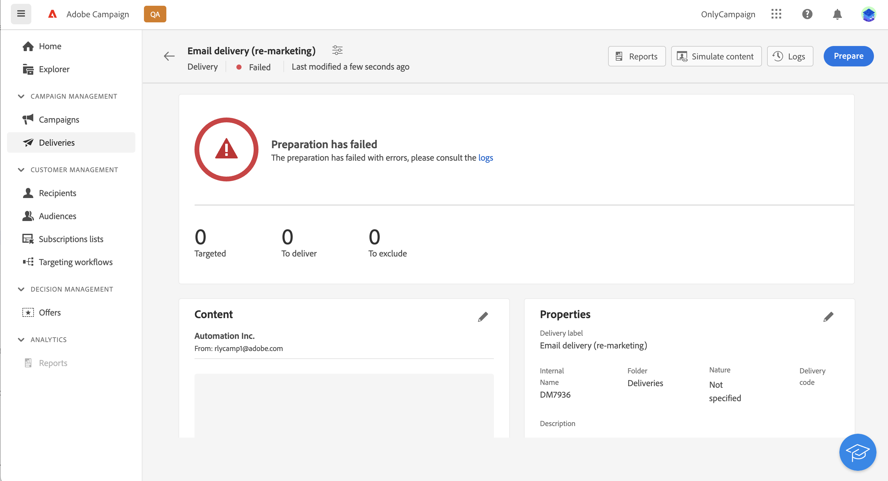

# Send your first email {#first-email}

This use case presents how to create your first email 

In this example, we will schedule the sending of an email on a specific date to silver and gold loyalty customers. This email will be designed using a predefined HTML template from a ZIP file and will include personalization using profile's attributes.

## Create the email {#create-email}

1. Create a new delivery from the **[!UICONTROL Deliveries]** menu.
1. Select the **[!UICONTROL Email]** channel and the template to use then click **[!UICONTROL Create]**.

    >[!NOTE]
    >
    >info on templates. check info in V7 doc

    

1. Provide a label for the delivery and configure additional options depending on your needs:

    * Internal name: 
    * Folder: 
    * Delivery code: 
    * Description: 
    * Nature: 
    
    check which settings are defined in the template and mention them(description? folder?, nature?)

    

    >[!NOTE]
    >
    >info on delivery settings button + link to doc

## Create the email content {#create-content}

>[!CONTEXTUALHELP]
>id="acw_deliveries_email_content"
>title="Create the email content"
>abstract="TBC"

1. Click the **[!UICONTROL Edit content]** button to start creating the content of your email. 

   This screen allows you to configure the email content and design it using the Email Designer.

    

    >[!NOTE]
    >
    >The From name and From email information are predefined in the selected email template.
    >
    >By default, email tracking is enabled for opens and clicks. To disable these options, unselect them from the Optional features section.

1. Specify the subject of your email using the Expression Editor. [Learn how to personalize your content](../personalization/personalize.md)

    In this example, we want to personalize the subject line using the profiles' first name.

    

1. Add an attached file to your email if necessary. Learn how to edit email content

1. Click the **[!UICONTROL Edit email body]** button to create and design the content of your email.

    Choose the method to use to create your email content. In this example, we want to import an existing HTML content.

    

1. Select the HTML or ZIP file to import then click **[!UICONTROL Next]**.

    If your folder contains assets, choose the instance and folder where they should be stored then click **[!UICONTROL Import]**. (+ link to doc on assets?)

    

1. Once your content has been imported, it displays in the Email Designer, allowing you to edit it if needed and to add personalization.

    In this example, we want to add personalization in the email title. To do this, select the component block then click **[!UICONTROL Add Personalization]**.

    

1. Once your content is ready, save it then click the arrow to go back to the email creation screen.

    

## Define the audience {#define-audience}

>[!CONTEXTUALHELP]
>id="acw_deliveries_email_audience"
>title="Define the audience"
>abstract="TBC"

1. Click the **[!UICONTROL Select audience]** button then choose an existing audience or create a new one.

    In this example, we want to use an existing audience targeting customers belonging to the silver and gold loyalty points levels.

    

    >[!NOTE]
    >
    >Audiences available in the list originate either from your Campaign V8 instance or from Adobe Experience Platform if the Destination / Sources intgeration has been implemented on your instance. Learn how to select the email audience 

1. Once your audience has been selected, you can edit the rules if necessary. You can also set a control group to analyse the behavior of the email recipients compared to the behavior of profiles which were not targeted. Learn how to work with control groups

## Schedule the sending {#schedule}

>[!CONTEXTUALHELP]
>id="acw_deliveries_email_schedule"
>title="Schedule the sending"
>abstract="TBC"

To schedule the sending of the email, click Enable then specify the desired date and time. 

= confirm before sending option : what happens at scheduled date: notification to confirm the sending of the message?

## Preview and test the email {#preview-test}

Once your email is ready, you can preview and test it before launching its sending.

1. Click **[!UICONTROL Review to send]**. A preview of your email displays, along with all the configured properties, audience and schedule. You can edit any of these elements using the modify button.

    

1. Click the **[!UICONTROL Simulate content]** button to preview the email and send proofs.

1. Add profiles to use to preview the email. To do thisSelect profiles. in this example: targeted profile (profiles tab)

    

1. choose to profile to preview on the right

1. render to test rendering (desktop, web, mobile...). rendering on gmail

1. send proof: click test + choose substitute from main target mode

1. add address + specify email address, and targeted profile to use

1. click send test email and confirm

1. view test email log

## Prepare and send {#prepare-send}

1. Click **[!UICONTROL Prepare]** to launch the preparation of the message.
    
    
 
1. Once the preparation is completed, you can access logs

1. Monitor + ref to monitor section

## Access reports {#reports}

1. access deliver reports

