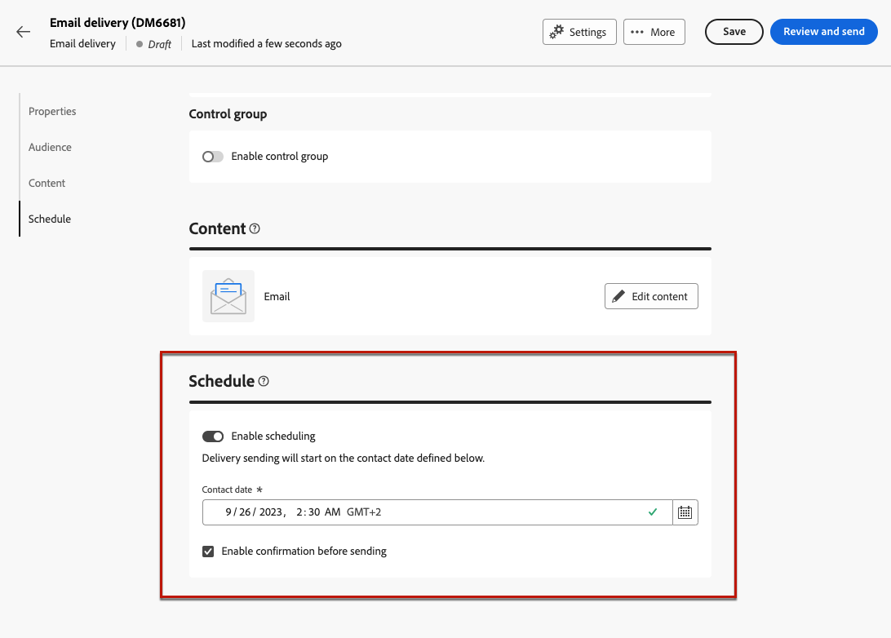

# Send your first email {#first-email}

>[!NOTE]
>
>This documentation is under construction and frequently updated. The final version of this content will be ready in January 2023.

This use case presents how to create your first email 

In this example, we will schedule the sending of an email on a specific date to silver and gold loyalty customers. This email will be designed using a predefined HTML template from a ZIP file and will include personalization using profile's attributes.

## Create the email {#create-email}

1. Create a new delivery from the **[!UICONTROL Deliveries]** menu.
1. Select the **[!UICONTROL Email]** channel and the template to use then click **[!UICONTROL Create]**.

    >[!NOTE]
    >
    >info on templates. check info in V7 doc

    

1. Provide a label for the delivery and configure additional options depending on your needs:

    * Internal name: 
    * Folder: 
    * Delivery code: 
    * Description: 
    * Nature: 
    
    check which settings are defined in the template and mention them(description? folder?, nature?)

    

    >[!NOTE]
    >
    >info on delivery settings button + link to doc

## Create the email content {#create-content}

>[!CONTEXTUALHELP]
>id="acw_homepage_card3"
>title="Create your first email content"
>abstract="Create your first email content"

>[!CONTEXTUALHELP]
>id="acw_deliveries_email_content"
>title="Create the email content"
>abstract="TBC"

1. Click the **[!UICONTROL Edit content]** button to start creating the content of your email. 

   This screen allows you to configure the email content and design it using the Email Designer.

    

    >[!NOTE]
    >
    >The From name and From email information are predefined in the selected email template.
    >
    >By default, email tracking is enabled for opens and clicks. To disable these options, unselect them from the Optional features section.

1. Specify the subject of your email using the Expression Editor. [Learn how to personalize your content](../personalization/personalize.md)

    In this example, we want to personalize the subject line using the profiles' first name.

    

1. Add an attached file to your email if necessary. Learn how to edit email content

1. Click the **[!UICONTROL Edit email body]** button to create and design the content of your email.

    Choose the method to use to create your email content. In this example, we want to import an existing HTML content.

    

1. Select the HTML or ZIP file to import then click **[!UICONTROL Next]**.

    If your folder contains assets, choose the instance and folder where they should be stored then click **[!UICONTROL Import]**. (+ link to doc on assets?)

    

1. Once your content has been imported, it displays in the Email Designer, allowing you to edit it if needed and to add personalization.

    In this example, we want to add personalization in the email title. To do this, select the component block then click **[!UICONTROL Add Personalization]**.

    

1. Once your content is ready, save it then click the arrow to go back to the email creation screen.

    

## Define the audience {#define-audience}

>[!CONTEXTUALHELP]
>id="acw_deliveries_email_audience"
>title="Define the audience"
>abstract="TBC"

1. Click the **[!UICONTROL Select audience]** button then choose an existing audience or create a new one.

    In this example, we want to use an existing audience targeting customers belonging to the silver and gold loyalty points levels.

    

    >[!NOTE]
    >
    >Audiences available in the list originate either from your Campaign V8 instance or from Adobe Experience Platform if the Destination / Sources intgeration has been implemented on your instance. Learn how to select the email audience 

1. Once your audience has been selected, you can edit the rules if necessary. You can also set a control group to analyse the behavior of the email recipients compared to the behavior of profiles which were not targeted. Learn how to work with control groups

## Schedule the sending {#schedule}

>[!CONTEXTUALHELP]
>id="acw_deliveries_email_schedule"
>title="Schedule the sending"
>abstract="TBC"

To schedule the sending of the email, click Enable then specify the desired date and time. 

= confirm before sending option : what happens at scheduled date: notification to confirm the sending of the message?

## Preview and test the email {#preview-test}

Once your email is ready, you can preview and test it before launching its sending.

1. Click **[!UICONTROL Review to send]**. A preview of your email displays, along with all the configured properties, audience and schedule. You can edit any of these elements using the modify button.

    

1. Click the **[!UICONTROL Simulate content]** button to preview the email and send proofs.

1. In the left-hand side area, select the profiles to use to preview the email. You can use targeted profiles or dedicated test profiles.

1. A preview of the email displays in the right hand-side area based on the selected profile. If you have added multiple profiles, you can switch between each of them to preview the corresponding email.

    

    >[!NOTE]
    >
    >Additionally, the **[!UICONTROL Render email]** button allows you to preview the email using mutiple devices or mail providers. Learn on how to preview email rendering

1. To send proofs of your email, click the **[!UICONTROL Test]** button then select the profiles that will receive the proof. In this example, we want to send the proofs to a specific test profile.

    

    >[!NOTE]
    >
    >You can also test your messages by impersonating some of the targeted profiles and sending the proof message to the email address of your choice. Learn how to use Substitute from target mode

1. Click **[!UICONTROL Send test email ]** then confirm the sending.

    Once the proofs have been sent, you can then check their status by clicking the **[!UICONTROL View test email log]** button.

## Send and monitor the email {#prepare-send}

Once you have reviewed and tested your email, you can launch its preparation and send it.

1. Click **[!UICONTROL Prepare]** to launch the preparation of the message.
    
    You can track the preparation progress in real-time, along with statistics. Once the preparation is completed, you can access detailed logs for further analysis. Learn how to monitor deliveries
    
    
 
1. Once your email is ready to be sent, click **[!UICONTROL Send]** then confirm the sending.

    You can track the sending in real-time, along with statistics. Additionally, the **[!UICONTROL Logs]** button allows you to access detailed information on the email sending. Learn how to monitor deliveries

         

1. After the email has been sent, you can access dedicated reports for further analysis purposes. 

         
