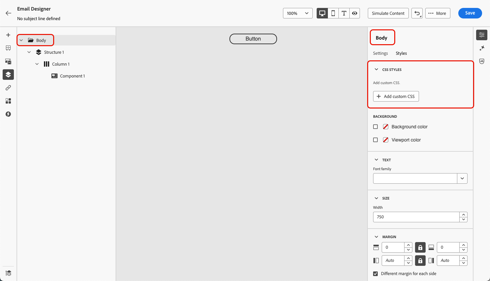
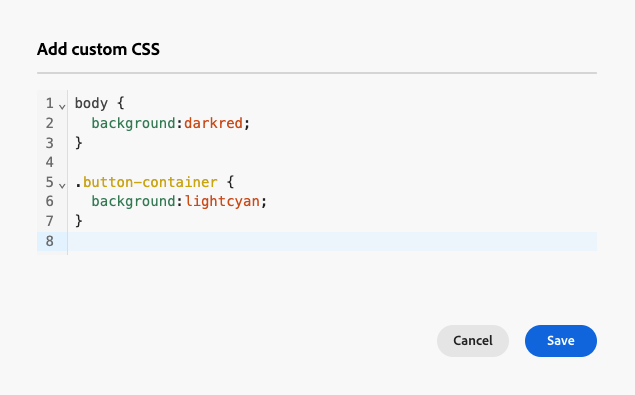

# Add custom CSS to your email content {#email-metadata}

>[!CONTEXTUALHELP]
>id="ac_edition_css"
>title="Enter your own CSS"
>abstract="For greater flexibility and control over the appearance of your content, you can add custom CSS directly within the Email Designer to apply advanced and specific styling."

When designing your emails, you can add your own custom CSS directly within the [Email Designer](get-started-email-designer.md). This capability enables you to apply advanced and specific styling, for greater flexibility and control over the appearance of your content.

## Define custom CSS {#define-custom-css}

To add custom CSS to your email content, follow the steps below.

1. Ensure there is some content defined in the Email Designer by adding at least one [component](content-components.md).

1. Select **[!UICONTROL Body]**, either from the **[!UICONTROL Navigation tree]** on the left, or on top of the right pane. The **[!UICONTROL CSS styles]** section displays on the right.
 
    {width="85%"}

    >[!NOTE]
    >
    >The **[!UICONTROL CSS styles]** section is only available when content is already present in the editor. 

1. Click the **[!UICONTROL Add Custom CSS]** button.

1. Enter your CSS code in the dedicated text area that pops up. Make sure the custom CSS is valid and follows the proper syntax. [Learn more](#use-valid-css)

    {width="65%"}

    >[!NOTE]
    >
    >The **[!UICONTROL Add custom CSS]** button is only available when **[!UICONTROL Body]** is selected. However, you can apply custom CSS styles to all the components inside your content.
    

1. Save your custom CSS and check that your custom CSS is correctly applied to your content. If this is not the case, check the [Troubleshooting](#troubleshooting) section.

    {width="85%"} 

1. If you remove all content, the section disappears, and the previously defined custom CSS is no longer applied.

1. Add content back to the editor to make the **[!UICONTROL CSS styles]** section reappear. The custom CSS is applied again.

## Ensure using valid CSS {#use-valid-css}
 
You can input any valid CSS string in the **[!UICONTROL Add custom CSS]** text area. Properly formatted CSS is immediately applied to the content.

>[!CAUTION]
>
>Users are responsible for the security of their custom CSS. Ensure that your CSS does not introduce vulnerabilities or conflicts with the existing content. 
>
>Avoid using CSS that could unintentionally break the layout or functionality of the content.

+++ Samples of a valid CSS


```css
.acr-component[data-component-id="form"] {
  display: flex;
  justify-content: center;
  background: none;
}

.acr-Form {
  width: 100%;
  padding: 20px 100px;
  border-spacing: 0px 8px;
  box-sizing: border-box;
  margin: 0;
}

.acr-Form .spectrum-FieldLabel {
  width: 20%;
}

.acr-Form.spectrum-Form--labelsAbove .spectrum-FieldLabel,
.acr-Form [data-form-item="checkbox"] .spectrum-FieldLabel {
  width: auto;
}

.acr-Form .spectrum-Textfield {
  width: 100%;
}

#acr-form-error,
#acr-form-confirmation {
  width: 100%;
  padding: var(--spectrum-global-dimension-static-size-500);
  display: flex;
  align-items: center;
  flex-direction: column;
  justify-content: center;
  gap: var(--spectrum-global-dimension-static-size-200);
}

.spectrum-Form-item.is-required .spectrum-FieldLabel:after{
  content: '*';
  font-size: 1.25rem;
  margin-left: 5px;
  position: absolute;
}

/* Error field placeholder */
.spectrum-HelpText {
  display: none !important;
}

.spectrum-HelpText.is-invalid,
.is-invalid ~ .spectrum-HelpText {
  display: flex !important;
}
```

```css
@media only screen and (min-width: 600px) {
  .acr-paragraph-1 {
    width: 100% !important;
  }
}
```

+++

+++ Samples of invalid CSS

If invalid CSS is entered, an error message is displayed, indicating that the CSS cannot be saved. Below are examples of invalid CSS.
 
Using `<style>` tags is not accepted:

```html
<style type="text/css">
  .acr-Form {
    width: 100%;
    padding: 20px 100px;
    border-spacing: 0px 8px;
    box-sizing: border-box;
    margin: 0;
  }
</style>
```
 
Invalid syntax such as missing braces is not accepted:

```css
body {
  background: red;
```

+++

## Technical implementation {#implementation}
 
Your custom CSS is added to the end of the `<head>` section as part of a `<style>` tag with the `data-name="global-custom"` attribute, such as in the example below. This ensures that the custom styles are applied globally to the content.

+++ See sample 

```html
<!DOCTYPE html>
<html>
  <head>
    <meta charset="utf-8">
    <meta name="content-version" content="3.3.31">
    <meta name="x-apple-disable-message-reformatting">
    <meta name="viewport" content="width=device-width,initial-scale=1.0">
    <style data-name="default" type="text/css">
      td { padding: 0; }
      th { font-weight: normal; }
    </style>
    <style data-name="grid" type="text/css">
      .acr-grid-table { width: 100%; }
    </style>
    <style data-name="acr-theme" type="text/css" data-theme="default" data-variant="0">
      body { margin: 0; font-family: Arial; }
    </style>
    <style data-name="media-default-max-width-500px" type="text/css">
      @media screen and (max-width: 500px) {
        body { width: 100% !important; }
      }
    </style>
    <style data-name="global-custom" type="text/css">
      /* Add you custom CSS here */
    </style>
  </head>
  <body>
    <!-- Minimal content -->
  </body>
</html>
```

+++

The custom CSS is not interpreted or validated by the Email Designer's **[!UICONTROL Settings]** pane. It is entirely independent and can only be modified through the **[!UICONTROL Add Custom CSS]** option.

If the `global-custom` style tag has the attribute `data-disabled` set to `true`, the custom CSS will not be applied. 

+++ See sample

For example:

```html
<style data-name="global-custom" type="text/css" data-disabled="true"> body: { color: red; } </style>
```

+++

## Guardrails

If you want to use custom CSS with content imported into the Email Designer, consider the following:

* If importing external HTML content including CSS, unless converting that content, it will be in **[!UICONTROL Compatibility mode]**, where the **[!UICONTROL CSS styles]** section is not available. [Learn more on importing existing content](existing-content.md)

* If importing content created with the Email Designer including CSS applied through the **[!UICONTROL Add custom CSS]** option, the CSS previously applied will be visible and editable from the same option.

<!--
* If importing content created with the Email Designer with CSS applied externally, the CSS code previously applied cannot be accessed within the **[!UICONTROL Add custom CSS]** pop-up window, but you can still override it with new custom CSS.-->

## Troubleshooting {#troubleshooting}

If your custom CSS is not applied, consider the options below.

* Ensure that your CSS is valid and free of syntax errors (such as missing braces, incorrect property names). [Learn how](#use-valid-css)

* Ensure that your CSS is being added to the `<style>` tag with the `data-name="global-custom"` attribute and that `data-disabled` is not applied to `global-custom`. [Learn more](#implementation)

<!--
* Ensure that your CSS is not overridden by other CSS rules, including any [theme](apply-email-themes.md) applied to your content.
 
  * Use your browser developer tools to inspect the content and verify that your CSS is targeting the correct selectors.
  
  * Consider adding `!important` to your declarations to ensure they take precedence. 
    
    For example:

    ```css
    .acr-Form {
      background: red !important;
    }
    ```
    -->
