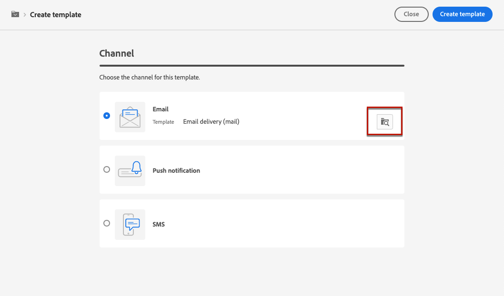
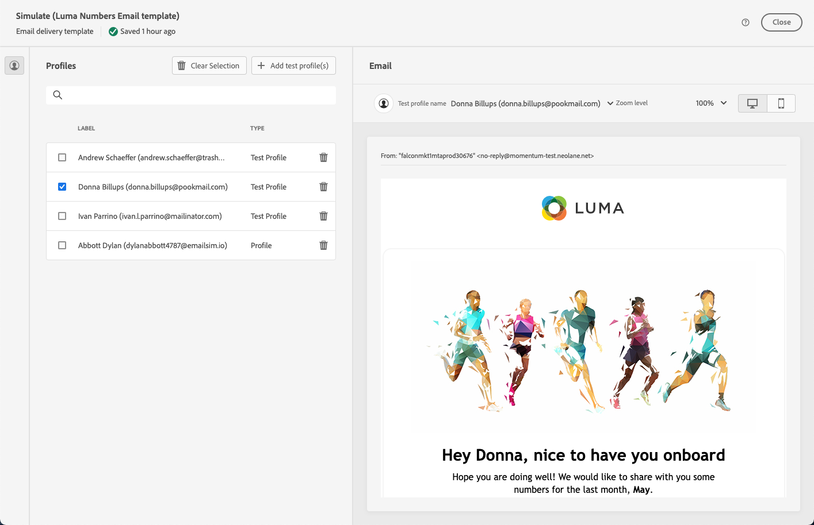

# Work with delivery templates {#work-with-delivery-templates}

For an accelerated and improved design process, you can create standalone delivery templates to easily reuse custom content across your campaigns. This functionality enables you to standardize the creative look and feel, in order to be quicker in executing and launching campaigns.

Say goodbye to the tedious task of starting from scratch every time, and hello to template management on web UI. With our built-in feature, you can effortlessly create and save your existing campaigns for future use. This streamlined process will save you time and increase efficiency, giving you more freedom to focus on creating and executing winning campaigns.

A template can include:

* Typologies
* Sender and reply-to addresses
* Basic personalization blocks
* Links to mirror page and unsubscription links
* Content, company logo, or signature
* Other delivery properties, such as resource validity, retry parameters, or quarantine settings.

## Access and manage templates {#access-manage-templates}

To access the content template list, select **[!UICONTROL Campaign Management]** > **[!UICONTROL Deliveries]** from the left menu, and browse to the **Templates** tab.

All the templates that were [created](#create-a-delivery-template) on the current environment are displayed.

You can filter content templates on channels and folders. You can also set advanced filters by building a rule using delivery attributes. [Learn more on the rule builder](../audience/segment-builder.md)

To edit a template, click the desired item from the list. From there, you can modify its content, properties, audience and any offers attached to it. You can also test your template. [Learn more](#test-template)

To delete or [duplicate](#copy-an-existing-template) a template, select the corresponding action from the **[!UICONTROL More actions]** menu, either from the **[!UICONTROL Templates]** list or the template edition screen.

>[!NOTE]
>
>When a template is edited or deleted, emails created using this template are not impacted.

## Create a template {#create-a-delivery-template}

To create a delivery template, you can duplicate a built-in template, convert an existing delivery into a template or create a delivery template from scratch.

### Duplicate an existing template {#copy-an-existing-template}

Campaign comes with a set of built-in templates for each channel: email, push, SMS.

The easiest way to create a delivery template is to duplicate and customize a built-in template.

To duplicate a delivery template, follow the steps below:

1. Browse to the **Templates** tab, from the **Deliveries** left menu. [Learn more](#access-manage-templates)
1. Click the **[!UICONTROL More actions]** button on the right, next to the name of the desired template.
1. Select  **[!UICONTROL Duplicate]**.
1. Confirm duplication.

    
    
1. The new template dashboard opens in the central screen. Define the template settings and save the new template.

    

The template is added to the list of delivery templates. You can now select it when creating a new delivery.

### Convert a delivery to a template {#convert-an-existing-delivery}

Any delivery can be converted to a template for new repeated delivery actions. 

To convert a delivery to a template, follow the steps below:

1. Go to the **[!UICONTROL Campaign management]** > **[!UICONTROL Deliveries]** menu.
1. In the **[!UICONTROL Browse]** tab, click the three dots button on the right, next to the name of the delivery to save as a template.
1. Select  **[!UICONTROL Copy as a template]**.

    
    
1. Confirm duplication: the new template opens in the central screen.

### Create a new template {#create-a-new-template}

>[!NOTE]
>
>To avoid configuration errors, Adobe recommends that you [duplicate a built-in template](#copy-an-existing-template) and customize its properties rather than create a new template.

To configure a delivery template from scratch, follow the steps below:

1. Browse to the **[!UICONTROL Templates]** tab, from the **[!UICONTROL Campaign management]** > **[!UICONTROL Deliveries]** left menu.
1. Click the  **[!UICONTROL Create template]** button.
1. Select the channel for the template.
1. For each channel, you can also select an existing template to start building your own template on. Use the dedicated button to choose a template from the current list for that channel.

    

1. Define the template properties, [audience](../audience/add-audience.md) and content according to the selected channel.

    

    >[!NOTE]
    >
    >Learn more about delivery channels and how to define a delivery content in these sections:
    >
    > * [Email channel](../email/create-email.md)
    > * [Push notification channel](../push/gs-push.md)
    > * [SMS channel](../sms/create-sms.md)

1. Click the **[!UICONTROL Review]** button to save and review the new template. You can still edit all its settings, delete and duplicate it.

## Test your content template {#test-template}

You can test the rendering of any email content template, whether created from scratch or from an existing content. To do so, follow the steps below.

1. Access the template list through the **[!UICONTROL Campaign management]** > **[!UICONTROL Deliveries]** menu and select any template.

1. Click **[!UICONTROL Edit content]** from the **[!UICONTROL Template properties]**.

1. Click **[!UICONTROL Simulate Content]** and select a test profile to check your email rendering. You can choose the desktop or mobile view. [Learn more](../preview-test/preview-content.md)

    

>[!NOTE]
>
>You cannot use email rendering or send proofs.

