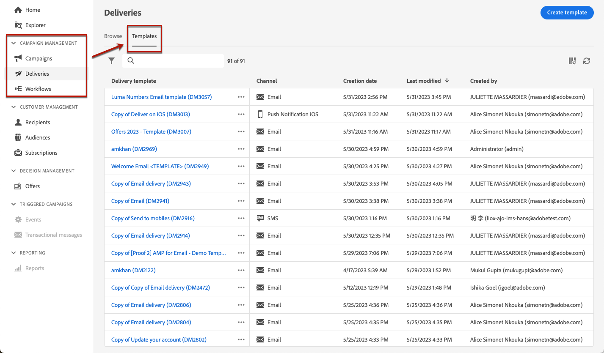

# Work with delivery templates {#work-with-delivery-templates}

For an accelerated and improved design process, you can create standalone delivery templates to easily reuse custom content across your campaigns. This functionality enables you to standardize the creative look and feel, in order to be quicker in executing and launching campaigns.

Say goodbye to the tedious task of starting from scratch every time, and hello to template management on web UI. With our built-in feature, you can effortlessly create and save your existing campaigns for future use. This streamlined process will save you time and increase efficiency, giving you more freedom to focus on creating and executing winning campaigns.

A template can include:

* Typologies
* Sender and reply-to addresses
* Basic personalization blocks
* Links to mirror page and unsubscription links
* Content, company logo, or signature
* Other delivery properties, such as resource validity, retry parameters, or quarantine settings.

## Access and manage templates {#access-manage-templates}

To access the content template list, select **[!UICONTROL Campaign Management]** > **[!UICONTROL Deliveries]** from the left menu, and browse to the **Templates** tab

All the templates that were [created](#create-a-delivery-template) on the current environment are displayed.

You can sort content templates by channels or folders.

You can set advanced filters by building a rule using delivery attributes.

To edit a template, click the desired item from the list. From there, you can modify its content, properties, audience rules or offers.

To delete a template, select the trash icon next to the desired template.

>[!NOTE]
>
>When a template is edited or deleted, emails created using this template are not impacted.

## Create a template {#create-a-delivery-template}

To create a delivery template, you can duplicate a built-in template, convert an existing delivery into a template or create a delivery template from scratch.

### Duplicate an existing template {#copy-an-existing-template}

Campaign comes with a set of built-in templates for each channel: email, push, SMS.

The easiest way to create a delivery template is to duplicate and customize a built-in template.

To duplicate a delivery template, follow the steps below:

1. Browse to the **Templates** tab, from the **Deliveries** left menu.
1. Click the three dots button on the right, next to the name of the template to duplicate.
1. Select  **[!UICONTROL Duplicate]**.
1. Confirm duplication: the new template dashboard opens in the central screen.
1. Define the template settings and save the new template.

The template is added to the list of delivery templates. You can now select it when creating a new delivery.

### Convert an existing delivery to a template {#convert-an-existing-delivery}

Any delivery can be converted to a template for new repeated delivery actions. 

To convert a delivery to a template, follow the steps below:

1. Go to the **[!UICONTROL Campaign management]** > **[!UICONTROL Deliveries]** menu.
1. In the **[!UICONTROL Browse]** tab, click the three dots button on the right, next to the name of the delivery to save as a template.
1. Select  **[!UICONTROL Copy as a template]**.

    
    
1. Confirm duplication: the new template opens in the central screen.

### Save content as template {#save-as-template}

Once you designed your email content, you can save as a template it for future reuse. Saved templates are available to all users of your Adobe Campaign environment.

To save an email content as a template, follow the steps below:

1. From the Email designer, click the ellipsis on top right of the screen.

1. Select **[!UICONTROL Save design template]** from the drop-down menu.

    

1. Enter a name for this template, and save

    

You can now [use this template](#use-saved-template) to build a new content: it is available in the Saved templates tab of the Email designer.

### Create a new template {#create-a-new-template}

>[!NOTE]
>
>To avoid configuration errors, Adobe recommends that you [duplicate a built-in template](#copy-an-existing-template) and customize its properties rather than create a new template.

To configure a delivery template from scratch, follow the steps below:

1. Browse to the **Templates** tab, from the **Deliveries** left menu.
1. Click the  **[!UICONTROL Create template]** button.
1. Select the channel for the template.
1. Define the template name and settings. 
1. Click the **[!UICONTROL Review]** button to define the template content and change its properties.
1. Save the new template.
