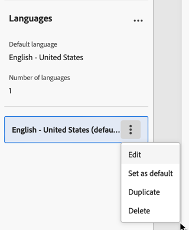

# Configure the email content {#edit-content}

>[!CONTEXTUALHELP]
>id="acw_deliveries_email_content"
>title="Define the email content"
>abstract="The **Edit content** screen allows you to define basic elements of your message like the sender address and subject line, perform additional actions such as adding attachments or offers, and access the Email Designer to give your message a polished look."

>[!CONTEXTUALHELP]
>id="acw_deliveries_email_header"
>title="Set the email properties"
>abstract="The **Basic details** section allows you to update the sender's address and reply-to address, and define the subject line using the Expression Editor."

>[!CONTEXTUALHELP]
>id="acw_deliveries_email_attachment"
>title="Attach files to your email"
>abstract="Select one or multiples files to insert into your message. To avoid performance issue, it is recommended not to include more than one attachment per email."

>[!CONTEXTUALHELP]
>id="acw_deliveries_email_options"
>title="Edit tracking"
>abstract="By default, tracking is enabled for the delivery, meaning all links included in the message content are tracked. You can disable this option from here."
>additional-url="https://experienceleague.adobe.com/en/docs/campaign-web/v8/content/email-design/design-content/message-tracking" text="Add links and track messages"

The email **[!UICONTROL Edit content]** screen allows you to:

* Define basic elements of your message such as the sender's address and the subject line
* Perform additional actions such as adding attachments or setting up offers
* Access the [Email Designer](get-started-email-designer.md#start-authoring) to start building the proper content of your email
* Add language variants to your deliveries.

>[!NOTE]
>
>All the editable text fields of this screen can be filled in using personalization fields. [Learn how to personalize content](../personalization/personalize.md)

To configure or edit the content of an email, follow the steps below.

1. Click the **[!UICONTROL Edit content]** button from the [email delivery dashboard](../email/create-email.md) screen.

    {zoomable="yes"}

1. The email content edition screen opens.

    {zoomable="yes"}

    >[!NOTE]
    >
    >If your are configuring a new email, the **[!UICONTROL From name]** and **[!UICONTROL From email]** fields are already populated.

1. The **[!UICONTROL From name]** field is defined in the email template. If you want to modify it, use a name that is easily identifiable by the recipients, such as your brand's name, to increase the opening rate of your deliveries.

    >[!NOTE]
    >
    >To further improve the recipient's experience, you can add a person's name, for example "Eve from Luma".

1. The **[!UICONTROL From email]** address field is also defined in the email template. Make sure the address domain is the same as the subdomain that you delegated to Adobe.

    >[!NOTE]
    >
    >You can change the part preceding the '@', but not the domain address.

1. Expand the **[!UICONTROL Reply-to fields]** section. The sender's name and addresses are used by default for replies. However, Adobe recommends using an existing real address such as your brand's customer care. In this case, if a recipient sends a reply, the customer care will be able to handle it.

    {zoomable="yes"}

1. Define the email **[!UICONTROL Subject line]**. Type your subject directly into the dedicated field, or open the Expression Editor to add [personalization](../personalization/personalize.md) using various attributes and expression fragments, or offers.

1. If you want to attach a file to the email, click the **[!UICONTROL Add attachment]** button then select one or multiple file(s).
    
    >[!NOTE]
    >
    >    To avoid performance issue, it is recommended not to include more than one attachment per email.

    <!--limitation on size + number of files?-->

1. If you want to send offers with your email, select them using the **[!UICONTROL Set up offers]** button.

    You are then able to insert them into the email using personalization fields. [Learn how to send offers](../msg/offers.md)

1. Click the **[!UICONTROL Edit email body]** button to structure and design the content of the email using the [Email Designer](get-started-email-designer.md#start-authoring). Additional information on how to design email content are available in these sections:

    * [Author emails from scratch](create-email-content.md)
    * [Style your content](get-started-email-style.md)

    >[!NOTE]
    >
    >You can also hover over the email preview and select **[!UICONTROL Open email designer]**.

1. By default, tracking is enabled for the delivery. You can disable this option from the **[!UICONTROL Optional features]** section. [Learn how to add links and manage tracking](message-tracking.md)

1. Once the content of your email has been defined, use the **[!UICONTROL Simulate content]** button to check how it displays before sending it. [Learn how to preview and test your email](../preview-test/preview-test.md).

## Add language variants

>[!CONTEXTUALHELP]
>id="acw_deliveries_email_multilingual"
>title="Add languages"
>abstract="Add languages."

The message is sent in the default language that has been set up. You can create variants by adding other languages with the **[!UICONTROL Add language]** button and also change the default language.

{zoomable="yes"}

1. Click the Add language button.

1. A window opens up, you can click on the **[!UICONTROL Language]** drop-down button to show a list of languages that can be chosen.

    {zoomable="yes"}

1. When chosing a language, a new variant will be created. You can find it in the **[!UICONTROL Languages]** panel to the left with the language tag.

1. The **[!UICONTROL Language]** panel shows you the list of languages you have chosen, the number of different languages and also the default language. You can click on the expand button to the top right corner to delete every languages.

1. In the **[!UICONTROL Languages]** panel, you can choose any language that you have added and click on the three dots in the right side of the tab. There, you can choose to edit the language, duplicate the language, choose it as default or delete it.

    {zoomable="yes"}

1. You can also choose any language and edit the content of the email with the [Email Designer](get-started-email-designer.md#start-authoring) by clicking on the **[!UICONTROL Edit email body]** button.

    >[!NOTE]
    >
    >You can also hover over the email preview and select **[!UICONTROL Open email designer]**.

1. You can preview the delivery by clicking on the **[!UICONTROL Simulate content]** button, and choose the profile and language in which the email is displayed.

1. While in the Simulate content window, you can switch profiles to preview the content of the email corresponding to the language that has been set up for that profile.

    {zoomable="yes"}

1. Click the **[!UICONTROL Close]** button to go back to the Content page and click the **[!UICONTROL Save]** button to save all of your changes. You will then be brought back to the **[!UICONTROL Delivery]** page.

### Example

To create a multilingual delivery in English and French, click **[!UICONTROL Add languages]** in the **[!UICONTROL Content]** page. Choose the standard language, here we will pick English as our default language and French as a variant.

