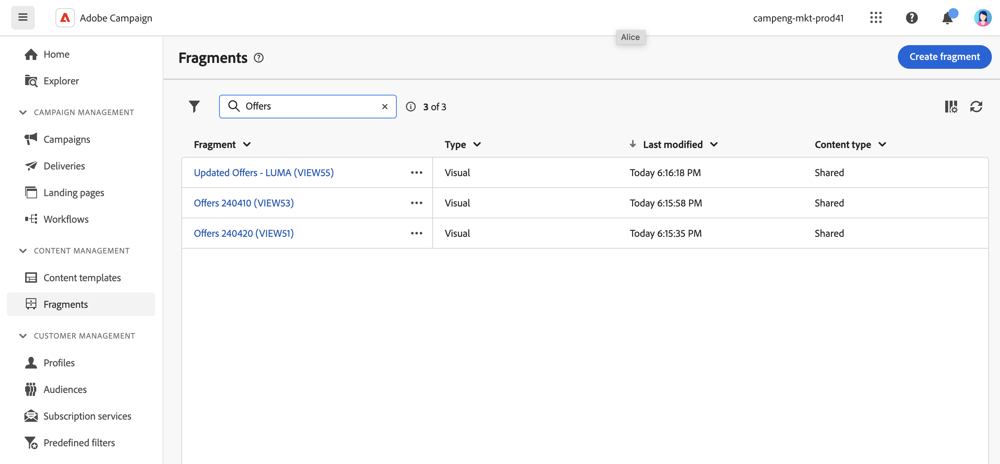
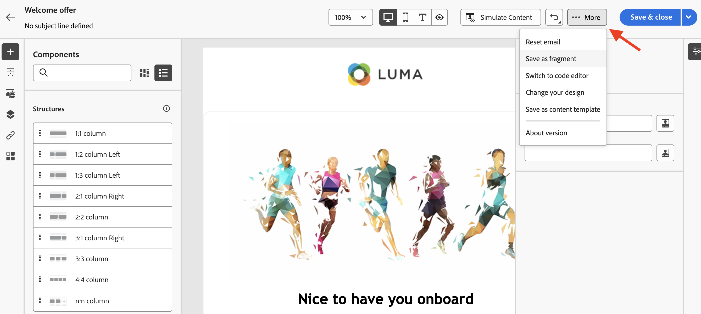

# Create content fragments {#fragments}

>[!CONTEXTUALHELP]
>id="acw_fragments_menu"
>title="Define your own fragments"
>abstract="A fragment is a reusable component that can be referenced in one or more emails across campaigns."

>[!CONTEXTUALHELP]
>id="acw_fragments_save"
>title="Fragments save"
>abstract="Fragments save"

>[!CONTEXTUALHELP]
>id="acw_fragments_create"
>title="Define your own fragments"
>abstract="A fragment is a reusable component that can be referenced in one or more emails across campaigns."

>[!CONTEXTUALHELP]
>id="acw_fragments_properties"
>title="Fragments properties"
>abstract="Fragments properties"

>[!CONTEXTUALHELP]
>id="acw_fragments_type"
>title="Type of fragment"
>abstract="Select the type of fragment. For now, only visual fragments for emails are available."

>[!CONTEXTUALHELP]
>id="acw_fragments_list"
>title="Define your own fragments"
>abstract="A fragment is a reusable component that can be referenced in one or more emails across campaigns. You can also use fragments in your email templates. For now, only visual fragments are available."

>[!CONTEXTUALHELP]
>id="acw_fragments_details"
>title="Fragments details"
>abstract="Fragments details"

>[!CONTEXTUALHELP]
>id="acw_create_fragment"
>title="Define your own fragments"
>abstract="A fragment is a reusable component that can be referenced in one or more emails across campaigns."

A fragment is a reusable component that can be referenced in one or more emails across campaigns. When modifying a fragment, every content using it is updated.

This functionality allows to prebuild multiple custom content blocks that can be used by marketing users to quickly assemble email contents in an improved design process.

To make the best use of fragments:

* Create your own visual fragments, as detailed below.
* Use them as many times as needed in your content, via the Email Designer. See [Add visual fragments to your emails](../email/use-visual-fragments.md).

## Create a visual fragment {#create-fragments}

There are two ways you can create fragments:

* Create a fragment from scratch, using the **[!UICONTROL Fragments]** dedicated menu. [Learn how](#create-from-scratch)

* When designing content, save a portion of your content as fragment. [Learn how](#save-as-fragment)

Once saved, your fragment is available for use in an email or an email template. Whether created from scratch or from an existing content, you can now use this fragment when building any content within Campaign. See [Add visual fragments](../email/use-visual-fragments.md).

### Create a fragment from scratch {#create-from-scratch}

To create a fragment from scratch, follow the steps below.

1. [Access the fragment list](#access-manage-fragments) through the **[!UICONTROL Content Management]** > **[!UICONTROL Fragments]** left menu.

    
    
1. Select **[!UICONTROL Create fragment]**.

1. Enter the label of the fragment. 

    
    
1. If needed, you can define additional options, such as the fragment internal name, its folder, and a description.

    >[!NOTE]
    >
    >For now, you can only create visual fragments.

1. Click the **Create** button to configure the content of your fragment.

1. The [Email Designer](../email/get-started-email-designer.md) displays. Edit your content as needed, the same way you would do for any email inside a campaign. You can add images, link, personalization fields and dynamic content.

    

1. Once your fragment is ready, click **[!UICONTROL Save & close]**. It is added to the [fragment list](#access-manage-fragments).

This fragment is now ready to be used when building any [email](../email/get-started-email-designer.md) or [content template](use-email-templates.md) within Campaign. [Learn how](../email/use-visual-fragments.md)

### Save a content as fragment {#save-as-fragment}

Any email content can be saved as fragment for future reuse. When designing a [content template](use-email-templates.md) or an [email](../email/get-started-email-designer.md) delivery, you can save a portion of your content as visual fragment. To do this, follow the steps below:

1. In the [Email Designer](../email/get-started-email-designer.md), click the **More** button on top right of the screen.

1. Select **[!UICONTROL Save as fragment]** from the drop-down menu.

    

1. The **[!UICONTROL Save as fragment]** screen displays. There select the elements you want to include into your fragment, including personalization fields and dynamic content.

    >[!CAUTION]
    >
    >You can only select sections that are adjacent to each other. You cannot select an empty structure or another fragment.

    

1. Click **[!UICONTROL Create]**. Fill in the fragment name and save it.

    

    This content is now a standalone fragment , added to the [fragment list](#manage-fragments), and accessible from the dedicated menu. You can now use this fragment when building any [email](../email/get-started-email-designer.md) or [content template](use-email-templates.md) within Campaign. [Learn how](../email/use-visual-fragments.md)

>[!NOTE]
>
>Any change to that new fragment is not propagated to the email or template it comes from. Similarly, when the original content is edited within that email or template, the new fragment is not modified.

## Manage your fragments {#manage-fragments}

You can edit, update, duplicate or delete a fragment from the fragment list.

### Edit and update a fragment {#edit-fragments}

To edit a fragment, follow the steps below.

1. Click on the name of the fragment to edit from the **[!UICONTROL Fragments]** list.
1. Click the **Edit content** button to open the content of this fragment.

    

1. Make the necessary changes and save your modifications.

>[!CAUTION]
>
>Any change to a fragment is propagated to the email deliveries or templates using it. 

### Delete a fragment {#delete-fragments}

To delete a Fragment, follow these steps:

1. Browse to the fragment list, and click the **[!UICONTROL More actions]** button next to the fragment to delete. 
1. Click **Delete** and confirm.

    

>[!CAUTION]
>
>When deleting a content fragment, email deliveries and templates using it are updated and the fragment is removed from their message content. You can break inheritance if needed. [Learn more](use-visual-fragments.md#break-inheritance)
>

### Duplicate a fragment {#duplicate-fragments}

You can easily duplicate a fragment to create a new one. To duplicate an existing fragment, follow these steps:

1. Browse to the fragment list, and click the **[!UICONTROL More actions]** button next to the fragment to delete. 
1. Click **Duplicate** and confirm.
1. Enter the label of the new fragment and save your changes.

    The fragment is added to the list of fragments. You can edit it and configure it as needed.
