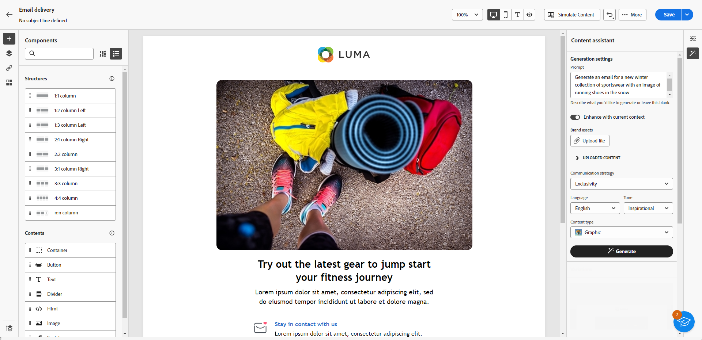

# Generate an email with the Content Assistant {#generative-email}

The Content Assistant enhances your communication's impact by automatically generating complete email content, saving you time and ensuring consistent quality. Using Generative AI, you can effortlessly craft compelling emails that resonate with your audience, making your communication more effective and efficient.

>[!NOTE]
>
>Before starting using this capability, read out related [Guardrails and Limitations](generative-gs.md#guardrails-and-limitations).

To generate an email content with the Content Assistant, follow the steps below. You can also improve an existing content with the Content Assistant, as detailed in [this page](generative-content.md).

1. After creating and configuring your Email delivery, click **[!UICONTROL Create content]**.

    For more information on how to configure your email delivery, refer to [this page](../email/create-email-content.md).

1. Fill in the **[!UICONTROL Basic details]** for your delivery. Once done, click **[!UICONTROL Edit email body]**.

1. Pick the design template that you want the Content Assistant to base the generated email on.

    You can also import an HTML file.

1. From the right-hand menu, select **[!UICONTROL Experience generation]**.

    {zoomable="yes"}

1. Fine tune the content by describing what you want to generate. 

    Here are some prompt examples:

    * For a Newsletter: Generate a monthly newsletter featuring travel articles, destination highlights, and exclusive subscriber offers.
    * For Feedbacks and Surveys: Create an email inviting customers to provide feedback on their recent software experience and participate in a product improvement survey.
    * For Anniversary or Birthday Emails: Generate a birthday email, celebrating the customer's special day and offering them a birthday discount.
    
    {zoomable="yes"}

1. Select **[!UICONTROL Upload file]** if you want to add any brand asset which contains content that can provide additional context the Content Assistant.  

    You can also click **[!UICONTROL Uploaded content]** to find previously updated files. Note that the uploaded content is exclusively available for reuse by the current user.

1. Select the **[!UICONTROL Communication strategy]** that best suits your needs. This will affect the tone and style of the generated email.

1. Choose the **[!UICONTROL Language]** and **[!UICONTROL Tone]** that you want the generated text to have. This will ensure that the text is appropriate for your audience and purpose.

    {zoomable="yes"}  

1. Customize the **[!UICONTROL Content type]** assets settings to match your desired asset characteristics.

1. Once your prompt is ready, click **[!UICONTROL Generate]**.

1. Browse the **[!UICONTROL Variation suggestions]** to find the desired email. Click **[!UICONTROL Preview]** to view a full-screen version of the selected variation.

    {zoomable="yes"}

1. Click **[!UICONTROL Select]** once you found the appropriate content.

    {zoomable="yes"}

1. Insert personalization fields to customize your email content based on profiles data or further personalize your content if needed. [Learn more about content personalization](../personalization/personalize.md)

1. After defining your email content, click the **[!UICONTROL Simulate content]** button to control the rendering, and check personalization settings with test profiles.  [Learn more](../preview-test/preview-content.md)

    {zoomable="yes"}

1. When you have defined your content, audience and schedule, you are ready to prepare your email delivery. [Learn more](../monitor/prepare-send.md)
