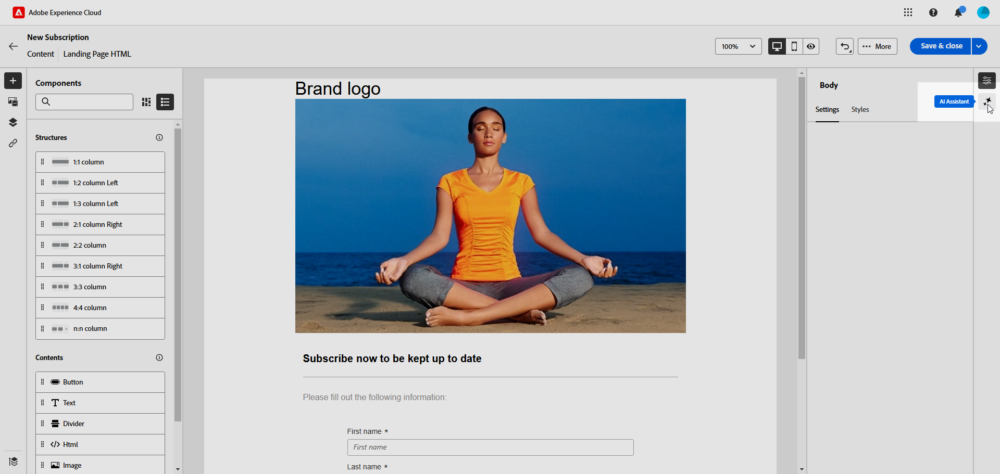
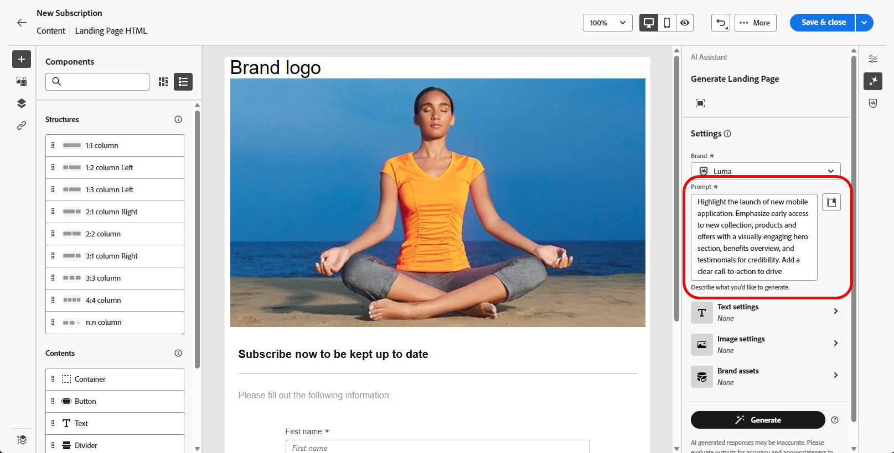
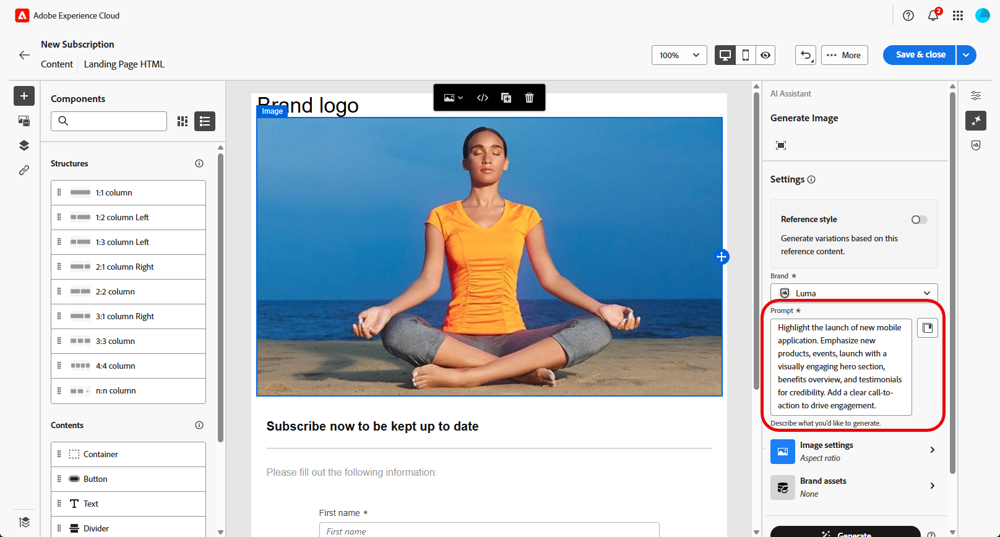

# Landing page generation with AI Assistant{#generative-lp}

>[!CONTEXTUALHELP]
>id="acw_homepage_welcome_rn5"
>title="Generate Landing pages with AI"
>abstract="You can now use AI Assistant to create your landing page deliveries, enabling you to generate text, images, or complete page layouts."
>additional-url="https://experienceleague.adobe.com/docs/campaign-web/v8/release-notes/release-notes.html" text="See release notes"

>[!IMPORTANT]
>
>Before starting using this capability, read the related [Guardrails and Limitations](generative-gs.md#generative-guardrails).
> 
>
>You must agree to a [user agreement](https://www.adobe.com/legal/licenses-terms/adobe-dx-gen-ai-user-guidelines.html) before you can use AI Assistant in Adobe Campaign Web. For more information, contact your Adobe representative.

Transform your landing pages with AI Assistant in Adobe Campaign Web, powered by generative AI. 

Effortlessly create impactful content, including complete pages, tailored text snippets, and customized visuals that resonate with your audience, driving higher engagement and interaction.

Explore the tabs below to learn how to use AI Assistant in Adobe Campaign Web.

>[!BEGINTABS]

>[!TAB Full landing page generation]

In the following example, learn how to leverage AI Assistant to refine an existing landing page template.

1. After creating and configuring your landing page, click **[!UICONTROL Edit content]**.

    For more information on how to configure your landing page, refer to [this page](../landing-pages/create-lp.md).

1. Personalize your layout as needed, and access the **[!UICONTROL AI Assistant]** menu.

    {zoomable="yes"}

1. Enable the **[!UICONTROL Use original content]** option for AI Assistant to personalize new content based on the selected content.

1. Fine-tune the content by describing what you want to generate in the **[!UICONTROL Prompt]** field. 

    If you need assistance in crafting your prompt, access the **[!UICONTROL Prompt Library]**, which provides a diverse range of prompt ideas to improve your landing page.

    {zoomable="yes"}

1. Tailor your prompt with the **[!UICONTROL Text settings]** option:

    * **[!UICONTROL Communication strategy]**: Choose the most suitable communication style for your generated text.
    * **[!UICONTROL Tone]**: The tone of your landing page should resonate with your audience. Whether you want to sound informative, playful, or persuasive, AI Assistant can adapt the message accordingly.

    {zoomable="yes"}

1. Choose your **[!UICONTROL Image settings]**:

    * **[!UICONTROL Content type]**: Categorize the nature of the visual element, distinguishing between different forms of visual representation such as photos, graphics, or art.
    * **[!UICONTROL Visual intensity]**: Control the image's impact by adjusting its intensity. A lower setting (2) creates a softer appearance, while a higher setting (10) makes the image more vibrant.
    * **[!UICONTROL Color & tone]**: Adjust the overall appearance of the colors within an image and the mood or atmosphere it conveys.
    * **[!UICONTROL Lighting]**: Modify the lighting present in an image to shape its atmosphere and highlight specific elements.
    * **[!UICONTROL Composition]**: Arrange elements within the frame of an image.

    {zoomable="yes"}

1. From the **[!UICONTROL Brand assets]** menu, click **[!UICONTROL Upload brand asset]** to add any brand asset that provides additional context to AI Assistant, or select a previously uploaded one.

    Previously uploaded files are available in the **[!UICONTROL Uploaded brand assets]** drop-down. Toggle the assets you wish to include in your generation.

    {zoomable="yes"}

1. Once your prompt is ready, click **[!UICONTROL Generate]**.

1. Browse through the generated **[!UICONTROL Variations]**, and click **[!UICONTROL Preview]** to view a full-screen version of the selected variation.

1. Navigate to the **[!UICONTROL Refine]** option within the **[!UICONTROL Preview]** window to access additional customization features:

    * **[!UICONTROL Rephrase]**: AI Assistant can rephrase your message in different ways, keeping your writing fresh and engaging for diverse audiences.
    * **[!UICONTROL Use simpler language]**: Simplify your language to ensure clarity and accessibility for a wider audience.

    You can also change the **[!UICONTROL Tone]** and **[!UICONTROL Communication strategy]** of your text.

    {zoomable="yes"}

1. Click **[!UICONTROL Select]** once you find the appropriate content. 

1. Insert personalization fields to customize your landing page content based on profile data. Then, click the **[!UICONTROL Simulate content]** button to control the rendering and check personalization settings with test profiles. [Learn more](../landing-pages/create-lp.md#test-landing-page).

Once your landing page is ready, publish it to make it available for use in a message. [Learn more](../landing-pages/create-lp.md#publish-landing-page).

>[!TAB Text only generation]

In the following example, learn how to leverage AI Assistant to enhance the content of your landing page.

1. After creating and configuring your landing page, click **[!UICONTROL Edit content]**.

    For more information on how to configure your landing page, refer to [this page](../landing-pages/create-lp.md).

1. Select a **[!UICONTROL Text component]** to target specific content, and access the **[!UICONTROL AI Assistant]** menu.

    {zoomable="yes"}

1. Enable the **[!UICONTROL Use original content]** option for AI Assistant to personalize new content based on the selected content.

1. Fine-tune the content by describing what you want to generate in the **[!UICONTROL Prompt]** field. 

    If you need assistance in crafting your prompt, access the **[!UICONTROL Prompt Library]**, which provides a diverse range of prompt ideas to improve your landing pages.

    {zoomable="yes"}

1. Tailor your prompt with the **[!UICONTROL Text settings]** option:

    * **[!UICONTROL Communication strategy]**: Choose the most suitable communication style for your generated text.
    * **[!UICONTROL Tone]**: The tone of your landing page should resonate with your audience. Whether you want to sound informative, playful, or persuasive, AI Assistant can adapt the message accordingly.
    * **Text Length**: Use the slider to select the desired length of your text.

    {zoomable="yes"} 
    
1. From the **[!UICONTROL Brand assets]** menu, click **[!UICONTROL Upload brand asset]** to add any brand asset that provides additional context to AI Assistant, or select a previously uploaded one.

    Previously uploaded files are available in the **[!UICONTROL Uploaded brand assets]** drop-down. Toggle the assets you wish to include in your generation.

    {zoomable="yes"}

1. Once your prompt is ready, click **[!UICONTROL Generate]**.

1. Browse through the generated **[!UICONTROL Variations]**, and click **[!UICONTROL Preview]** to view a full-screen version of the selected variation.

1. Navigate to the **[!UICONTROL Refine]** option within the **[!UICONTROL Preview]** window to access additional customization features:

    * **[!UICONTROL Use as reference content]**: The chosen variant will serve as the reference content for generating other results.
    * **[!UICONTROL Elaborate]**: Expand on specific topics, providing additional details for better understanding and engagement.
    * **[!UICONTROL Summarize]**: Condense lengthy information into clear, concise summaries that grab attention and encourage further reading.
    * **[!UICONTROL Rephrase]**: Rephrase your message in different ways, keeping your writing fresh and engaging for diverse audiences.
    * **[!UICONTROL Use simpler language]**: Simplify your language to ensure clarity and accessibility for a wider audience.

    You can also change the **[!UICONTROL Tone]** and **[!UICONTROL Communication strategy]** of your text.

    {zoomable="yes"}

1. Click **[!UICONTROL Select]** once you find the appropriate content.

1. Insert personalization fields to customize your landing page content based on profile data. Then, click the **[!UICONTROL Simulate content]** button to control the rendering and check personalization settings with test profiles. [Learn more](../landing-pages/create-lp.md#test-landing-page).

Once your landing page is ready, publish it to make it available for use in a message. [Learn more](../landing-pages/create-lp.md#publish-landing-page).

>[!TAB Image only generation]

In the example below, learn how to leverage AI Assistant to optimize and improve your assets, ensuring a more user-friendly experience. 

1. After creating and configuring your landing page, click **[!UICONTROL Edit content]**.

    For more information on how to configure your landing page, refer to [this page](../landing-pages/create-lp.md).

1. Select the asset you want to change with AI Assistant.

1. From the right-hand menu, select **[!UICONTROL AI Assistant]**.

    {zoomable="yes"}

1. Enable the **[!UICONTROL Reference style]** option for AI Assistant to personalize new content based on the reference content. You can also upload an image to add context to your variation.

1. Fine-tune the content by describing what you want to generate in the **[!UICONTROL Prompt]** field. 

    If you need assistance in crafting your prompt, access the **[!UICONTROL Prompt Library]**, which provides a diverse range of prompt ideas to improve your landing pages.

    {zoomable="yes"}

1. Tailor your prompt with the **[!UICONTROL Image settings]** option:

    * **[!UICONTROL Aspect ratio]**: Determine the width and height of the asset. Choose from common ratios such as 16:9, 4:3, 3:2, or 1:1, or enter a custom size.
    * **[!UICONTROL Content type]**: Categorize the nature of the visual element, distinguishing between different forms of visual representation such as photos, graphics, or art.
    * **[!UICONTROL Visual intensity]**: Control the image's impact by adjusting its intensity. A lower setting (2) creates a softer appearance, while a higher setting (10) makes the image more vibrant.
    * **[!UICONTROL Color & tone]**: Adjust the overall appearance of the colors within an image and the mood or atmosphere it conveys.
    * **[!UICONTROL Lighting]**: Modify the lighting present in an image to shape its atmosphere and highlight specific elements.
    * **[!UICONTROL Composition]**: Arrange elements within the frame of an image.

    {zoomable="yes"}

1. From the **[!UICONTROL Brand assets]** menu, click **[!UICONTROL Upload brand asset]** to add any brand asset that provides additional context to AI Assistant, or select a previously uploaded one.

    Previously uploaded files are available in the **[!UICONTROL Uploaded brand assets]** drop-down. Toggle the assets you wish to include in your generation.

1. Once you are satisfied with your prompt configuration, click **[!UICONTROL Generate]**.

1. Browse the **[!UICONTROL Variation suggestions]** to find the desired asset.

    Click **[!UICONTROL Preview]** to view a full-screen version of the selected variation.

1. Choose **[!UICONTROL Generate Similar]** if you want to view related images to this variant.

    {zoomable="yes"}

1. Click **[!UICONTROL Select]** once you find the appropriate content.

1. After defining your message content, click the **[!UICONTROL Simulate content]** button to control the rendering and check personalization settings with test profiles. [Learn more](../landing-pages/create-lp.md#test-landing-page).

Once your landing page is ready, publish it to make it available for use in a message. [Learn more](../landing-pages/create-lp.md#publish-landing-page).

>[!ENDTABS]