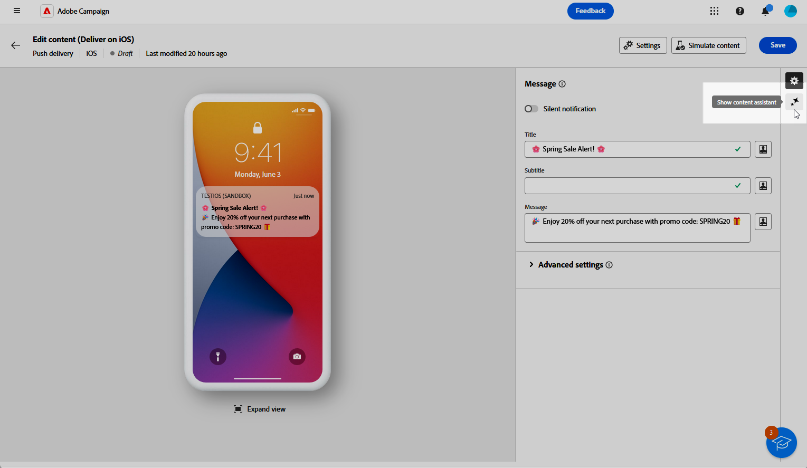
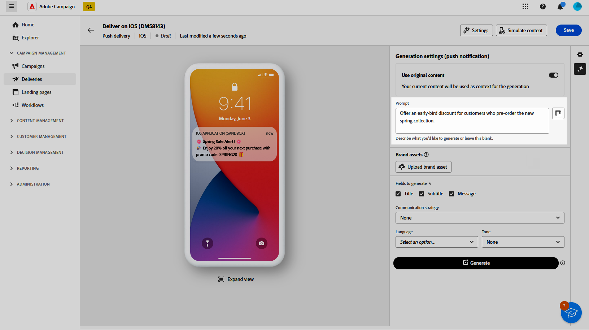

# Push notification generation with the AI Assistant {#generative-push}

>[!IMPORTANT]
>
>Before starting using this capability, read out related [Guardrails and Limitations](generative-gs.md#generative-guardrails).
> 
>
>You must agree to a [user agreement](https://www.adobe.com/legal/licenses-terms/adobe-dx-gen-ai-user-guidelines.html) before you can use the AI Assistant in Adobe Campaign Web. For more information, contact your Adobe representative.

The AI Assistant can help you optimize the impact of your deliveries by suggesting different content that is more likely to resonate with your audience.

In the following example, we will leverage the AI assistant to craft compelling messaging to create a more engaging customer experience.

1. After creating and configuring your Push notification delivery, click **[!UICONTROL Edit content]**.

    For more information on how to configure your push delivery, refer to [this page](../push/create-push.md).

1. Access the **[!UICONTROL Show AI Assistant]** menu.

    {zoomable="yes"}

1. Enable the **[!UICONTROL Use original content]** option for the AI Assistant to personalize new content based on the selected content.

1. Fine tune the content by describing what you want to generate in the **[!UICONTROL Prompt]** field. 

    If you are looking for assistance in crafting your prompt, access the **[!UICONTROL Prompt Library]** which provides a diverse range of prompt ideas to improve your deliveries.
    
    {zoomable="yes"}

1. Choose which field you want to generate: **[!UICONTROL Title]**, **[!UICONTROL Message]** and/or **[!UICONTROL Image]**.

1. Tailor your prompt with the **[!UICONTROL Text settings]** option:

    * **[!UICONTROL Communication strategy]**: Choose the most suitable communication style for your generated text.
    * **[!UICONTROL Tone]**: The tone of your email should resonate with your audience. Whether you want to sound informative, playful, or persuasive, the AI Assistant can adapt the message accordingly.

    {zoomable="yes"} 

1. Choose your **[!UICONTROL Image settings]**:

    * **[!UICONTROL Content type]**: This categorizes the nature of the visual element, distinguishing between different forms of visual representation such as photos, graphics, or art.
    * **[!UICONTROL Visual intensity]**: You can control the image's impact by adjusting its intensity. A lower setting (2) will create a softer, more restrained appearance, while a higher setting (10) will make the image more vibrant and visually powerful.
    * **[!UICONTROL Lighting]**: This refers to the lightning present in an image, which shapes its atmosphere and highlights specific elements.
    * **[!UICONTROL Composition]**: This refers to the arrangement of elements within the frame of an image

    {zoomable="yes"} 

1. From the **[!UICONTROL Brand assets]** menu, click **[!UICONTROL Upload brand asset]** to add any brand asset which contains content that can provide additional context the AI Assistant or select a previously uploaded one.

    Previously uploaded files are available in the **[!UICONTROL Uploaded brand assets]** drop-down. Simply toggle the assets you wish to include in your generation.

1. Once your prompt is ready, click **[!UICONTROL Generate]**.

1. Browse through the generated **[!UICONTROL Variations]** and click **[!UICONTROL Preview]** to view a full-screen version of the selected variation.

1. Navigate to the **[!UICONTROL Refine]** option within the **[!UICONTROL Preview]** window to access additional customization features:

    * **[!UICONTROL Use as reference content]**: The chosen variant will serve as the reference content for generating other results.

    * **[!UICONTROL Rephrase]**: The AI Assistant can rephrase your message in different ways, keeping your writing fresh and engaging for diverse audiences.

    * **[!UICONTROL Use simpler language]**: Leverage the AI Assistant to simplify your language, ensuring clarity and accessibility for a wider audience.
    
    You can also change the **[!UICONTROL Tone]** and **[!UICONTROL Communication strategy]** of your text.

    {zoomable="yes"}

1. Click **[!UICONTROL Select]** once you found the appropriate content.

1. Insert personalization fields to customize your email content based on profiles data. Then, click the **[!UICONTROL Simulate content]** button to control the rendering, and check personalization settings with test profiles. [Learn more](../preview-test/preview-content.md)

    {zoomable="yes"}

When you have defined your content, audience and schedule, you are ready to prepare your push delivery. [Learn more](../monitor/prepare-send.md)

