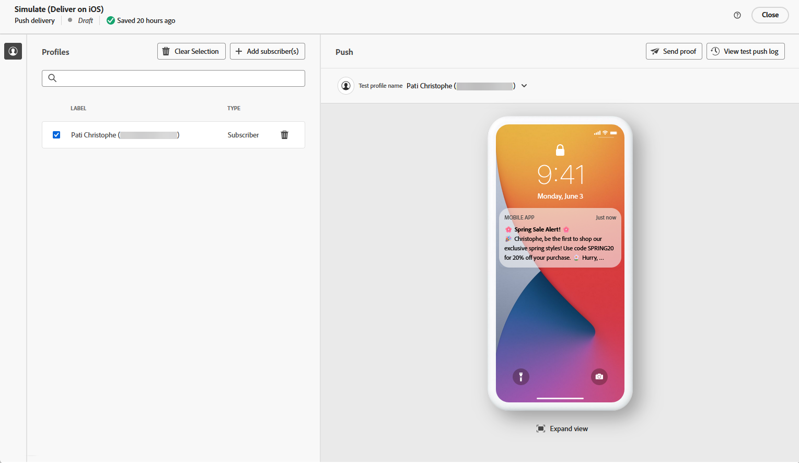

# Push notification generation with the AI Assistant {#generative-push}

>[!BEGINSHADEBOX]

**Table of content**

* [Get started with the AI Assistant](generative-gs.md)
* [Email generation with the AI Assistant](generative-content.md)
* [SMS generation with the AI Assistant](generative-sms.md)
* **[Push notification generation with the AI Assistant](generative-push.md)**

>[!ENDSHADEBOX]

Once you have created and personalized your emails, use the AI Assistant in Campaign powered by generative AI to take your content to the next level.

The AI Assistant can help you optimize the impact of your deliveries by suggesting different content that is more likely to resonate with your audience.

>[!NOTE]
>
>Before starting using this capability, read out related [Guardrails and Limitations](generative-gs.md#guardrails-and-limitations).

1. After creating and configuring your Push notification delivery, click **[!UICONTROL Edit content]**.

    For more information on how to configure your push delivery, refer to [this page](../push/create-push.md).

1. Fill in the **[!UICONTROL Basic details]** for your delivery. Once done, click **[!UICONTROL Edit content]**.

1. Personalize your push notification as needed. [Learn more](../push/content-push.md)

1. Access the **[!UICONTROL AI Assistant]** menu.

    {zoomable="yes"}

1. Fine tune the content by describing what you want to generate in the **[!UICONTROL Prompt]** field. 

    If you are looking for assistance in crafting your prompt, access the **[!UICONTROL Prompt Library]** which provides a diverse range of prompt ideas to improve your deliveries.
    
    {zoomable="yes"}

1. Enable the **[!UICONTROL Enhance with current context]** option for the AI Assistant to personalize new content based on your delivery, delivery name, and selected audience.

    >[!IMPORTANT]
    >
    > Your prompt must always be tied to a specific context by uploading a brand asset or enabling the **[!UICONTROL Enhance current content]** option.

    {zoomable="yes"}

1. Select **[!UICONTROL Upload brand asset]** to add any brand asset which contains content that can provide additional context the AI Assistant.

1. Choose which field you want to generate: **[!UICONTROL Title]**, **[!UICONTROL Subtitle]** or **[!UICONTROL Message]**.

1. Select the **[!UICONTROL Communication strategy]** that best suits your needs. This will affect the tone and style of the generated text.

1. Choose the **[!UICONTROL Language]** and **[!UICONTROL Tone]** that you want the generated text to have. This will ensure that the text is appropriate for your audience and purpose.

    {zoomable="yes"}  

1. Once your prompt is ready, click **[!UICONTROL Generate]**.

1. Browse through the generated **[!UICONTROL Variations]** and click **[!UICONTROL Apply]** once you found the appropriate content.

    Click **[!UICONTROL Preview]** to view a full-screen version of the selected variation.

    {zoomable="yes"}  

1. Insert personalization fields to customize your email content based on profiles data. [Learn more about content personalization](../personalization/personalize.md)

    {zoomable="yes"}  

1. After defining your message content, click the **[!UICONTROL Simulate content]** button to control the rendering, and check personalization settings with test profiles. [Learn more](../preview-test/preview-content.md)

    {zoomable="yes"}

1. When you have defined your content, audience and schedule, you are ready to prepare your email delivery. [Learn more](../monitor/prepare-send.md)
