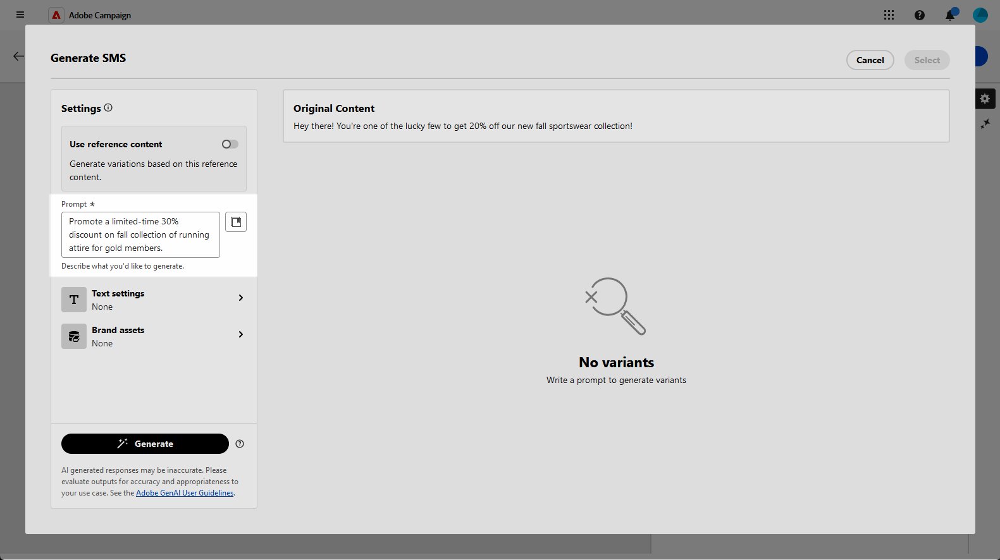

# SMS generation with the AI Assistant for Content Accelerator{#generative-sms}

Once you have crafted and personalized your SMS messages to suit your audience, take your communication to the next level with the help of the AI Assistant for Content Accelerator in Campaign, powered by innovative AI technology. 

This handy tool provides intelligent suggestions for refining your content, ensuring that your messages resonate effectively and maximize engagement.

>[!NOTE]
>
>Before starting using this capability, read out related [Guardrails and Limitations](generative-gs.md#generative-guardrails).

>[!BEGINTABS]

>[!TAB Full SMS generation]

1. After creating and configuring your SMS delivery, click **[!UICONTROL Edit content]**.

    For more information on how to configure your SMS delivery, refer to [this page](../sms/create-sms.md).

1. Fill in the **[!UICONTROL Basic details]** for your delivery. Once done, click **[!UICONTROL Edit content]**.

1. Access the **[!UICONTROL Show AI Assistant]** menu.

    {zoomable="yes"}

1. Fine tune the content by describing what you want to generate in the **[!UICONTROL Prompt]** field. 

    If you are looking for assistance in crafting your prompt, access the **[!UICONTROL Prompt Library]** which provides a diverse range of prompt ideas to improve your deliveries.

    {zoomable="yes"}

1. Tailor your prompt with the **[!UICONTROL Text settings]** option:

    * **[!UICONTROL Communication strategy]**: Choose the most suitable communication style for your generated text.
    * **[!UICONTROL Tone]**: The tone of your email should resonate with your audience. Whether you want to sound informative, playful, or persuasive, the AI Assistant can adapt the message accordingly.
    * **Text Length**: Use the slider to select the desired length of your text.

    {zoomable="yes"} 
 
1. From the **[!UICONTROL Brand assets]** menu, click **[!UICONTROL Upload brand asset]** to add any brand asset which contains content that can provide additional context the AI Assistant or select a previously uploaded one.

    Previously uploaded files are available in the **[!UICONTROL Uploaded brand assets]** drop-down. Simply toggle the assets you wish to include in your generation.

1. Once your prompt is ready, click **[!UICONTROL Generate]**.

1. Browse through the generated **[!UICONTROL Variations]** and click **[!UICONTROL Preview]** to view a full-screen version of the selected variation.

    {zoomable="yes"} 

1. Navigate to the **[!UICONTROL Refine]** option within the **[!UICONTROL Preview]** window to access additional customization features and fine-tune your variation to your preferences:

    * **[!UICONTROL Use as reference content]**: The chosen variant will serve as the reference content for generating other results.

    * **[!UICONTROL Use simpler language]**: The AI assistant helps you write clear, concise messages that everyone can understand.

    * **[!UICONTROL Rephrase]**: The AI Assistant rephrases your message to keep things engaging for different audiences.
    
    You can also change the **[!UICONTROL Tone]** and **[!UICONTROL Communication strategy]** of your text.

    {zoomable="yes"}  

1. Click **[!UICONTROL Select]** once you found the appropriate content.

1. Insert personalization fields to customize your SMS content based on profiles data. [Learn more about content personalization](../personalization/personalize.md)

    {zoomable="yes"}  

1. After defining your message content, click the **[!UICONTROL Simulate content]** button to control the rendering, and check personalization settings with test profiles. [Learn more](../preview-test/preview-content.md)

    {zoomable="yes"}

When you have defined your content, audience and schedule, you are ready to prepare your SMS delivery. [Learn more](../monitor/prepare-send.md)

>[!TAB Text only generation]

1. After creating and configuring your SMS delivery, click **[!UICONTROL Edit content]**.

    For more information on how to configure your SMS delivery, refer to [this page](../sms/create-sms.md).

1. Fill in the **[!UICONTROL Basic details]** for your delivery. Once done, click **[!UICONTROL Edit content]**.

1. Personalize your SMS message as needed. [Learn more](../sms/content-sms.md)

1. Access the **[!UICONTROL AI Assistant]** menu next to your **[!UICONTROL Message]** field.

    {zoomable="yes"}

1. Enable the **[!UICONTROL Use reference content]** option for the AI Assistant for Content Accelerator to personalize new content based on your campaign content, name, and selected audience.

1. Fine tune the content by describing what you want to generate in the **[!UICONTROL Prompt]** field. 

    If you are looking for assistance in crafting your prompt, access the **[!UICONTROL Prompt Library]** which provides a diverse range of prompt ideas to improve your campaigns.

    {zoomable="yes"}

1. Tailor your prompt with the **[!UICONTROL Text settings]** option:

    * **[!UICONTROL Communication strategy]**: Select the desired communication approach for the generated text.
    * **[!UICONTROL Language]**: Choose the language for the variant's content.
    * **[!UICONTROL Tone]**: Ensure that the text is appropriate for your audience and purpose.
    * **[!UICONTROL Length]**: Select the length of your content using the range slider. 

    {zoomable="yes"}  

1. From the **[!UICONTROL Brand assets]** menu, click **[!UICONTROL Upload brand asset]** to add any brand asset which contains content that can provide additional context the AI Assistant or select a previously uploaded one.

    Previously uploaded files are available in the **[!UICONTROL Uploaded brand assets]** drop-down. Simply toggle the assets you wish to include in your generation.

1. Once your prompt is ready, click **[!UICONTROL Generate]**.

1. Browse through the generated **[!UICONTROL Variations]** and click **[!UICONTROL Preview]** to view a full-screen version of the selected variation.

1. Navigate to the **[!UICONTROL Refine]** option within the **[!UICONTROL Preview]** window to access additional customization features and fine-tune your variation to your preferences:

    * **[!UICONTROL Use as reference content]**: The chosen variant will serve as the reference content for generating other results.

    * **[!UICONTROL Rephrase]**:The AI Assistant can rephrase your message in different ways, keeping your writing fresh and engaging for diverse audiences.

    * **[!UICONTROL Use simpler language]**: Leverage the AI Assistant to simplify your language, ensuring clarity and accessibility for a wider audience.

    You can also change the **[!UICONTROL Tone]** and **[!UICONTROL Communication strategy]** of your text.

    {zoomable="yes"}  

1. Click **[!UICONTROL Select]** once you found the appropriate content.

1. Insert personalization fields to customize your SMS content based on profiles data. [Learn more about content personalization](../personalization/personalize.md)

1. After defining your message content, click the **[!UICONTROL Simulate content]** button to control the rendering, and check personalization settings with test profiles. [Learn more](../preview-test/preview-content.md)

    {zoomable="yes"}

When you have defined your content, audience and schedule, you are ready to prepare your SMS delivery. [Learn more](../monitor/prepare-send.md)

>[!ENDTABS]
