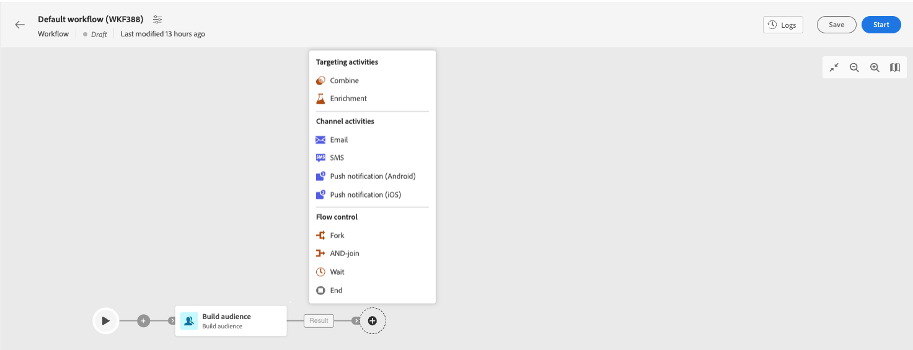

# Get started with messages in Campaign Web {#gs-messages}

With Adobe Campaign, you can send cross-channel campaigns including emails, SMS, and Push notifications, and measure their effectiveness using various dedicated reports. These messages are designed and sent though deliveries, and can be personalized for each recipient. These deliveries can be standalone or included in the context of a marketing campaign.

Adobe Campaign v8 comes with the following delivery channels:

* **Email channel**: email deliveries let you send personalized emails to the target population. Learn how to create and send an email in [this page](../email/create-email.md).

* **SMS channel**: deliveries on mobile channels let you send personalized SMS to the target population.  Learn how to create and send SMS in [this page](../sms/create-sms.md).

* **Mobile application channel**: mobile app deliveries let you send notifications to iOS and Android systems.  Learn how to create and send push notifications in [this page](../push/gs-push.md).

## Create a delivery

You can create standalone deliveries from the **Deliveries** left menu, or create deliveries in the context of a marketing campaign, from the **Campaigns** left menu. 

>[!BEGINTABS]

>[!TAB Create a standalone delivery]

To create a standalone delivery, follow these steps:

1. Browse to the **[!UICONTROL Deliveries]** menu on the left navigation, and click the **[!UICONTROL Create delivery]** button.
1. Choose a channel for the delivery. Learn more about delivery channels and how to define a delivery content in these sections: 

    * [Email channel](../email/create-email.md)
    * [Push notification channel](../push/gs-push.md)
    * [SMS channel](../sms/create-sms.md)

1. Define the delivery audience, for the main target and the control group. Learn more about audiences in [this section](../audience/about-audiences.md).
1. Define the message content.
1. (optional) Define the delivery schedule. If no schedule is defined, messages are sent immediatly after clicking the **[!UICONTROL Send]** button.
1. Click the  **[!UICONTROL Review and send]** button to check your settings.
1. Use the  **[!UICONTROL Simulate content]** button to test your delivery, and personalization settings. Learn more about message simulation in [this section](../preview-test/preview-test.md).
1. Click the  **[!UICONTROL Prepare]** button to compute the target population and generate the messages. Preparation step can take a few minutes. When preparation is complete, messages are ready for sending. In case of an error, browse to the **Logs** to check alerts and warning.
1. Check results, and click the  **[!UICONTROL Send]** button to start sending messages.
1. Once messages are sent, browse to the Reports section to access key metrics. Learn more about delivery reports in [this section](../reporting/reports.md).

>[!TAB Create a delivery in a campaign]

To create a delivery in a campaign, follow these steps:

1. Create a campaign or open an existing campaign.
1. Create a workflow or open an existing workflow.
1. Add and configure a **Build audience** activity, and click the `+`button.
    
1. Select a delivery activity: Email, SMS, Push notification (Android) or Push notification (iOS). Learn more about delivery channels and how to define a delivery content in these sections: 

    * [Email channel](../email/create-email.md)
    * [Push notification channel](../push/gs-push.md)
    * [SMS channel](../sms/create-sms.md)

1. Start the workflow, and check logs.

For more information on how to configure a campaign,

>[!ENDTABS]

## Choose how to send your messages{#gs-send-msg}

Once your message has been created and its content designed and tested, you can choose how you want to send it.

Campaign offers a set of capabilities to:

* Send messages manually to the main target

* Send messages associated to a [marketing campaign](../campaigns/gs-campaigns.md)

* Send messages via a [workflow](../workflows/channel-activities.md)

## Add personalization{#personalization}

Messages delivered by Adobe Campaign can be personalized in various ways

## Delivery and tracking logs{#gs-tracking-logs}

Monitoring your deliveries after they have been sent is a key step to ensure your maketing campaigns are efficient and reach out to your customers. You can monitor after sending a delivery, as well as understand how delivery failures and quarantines are managed.
