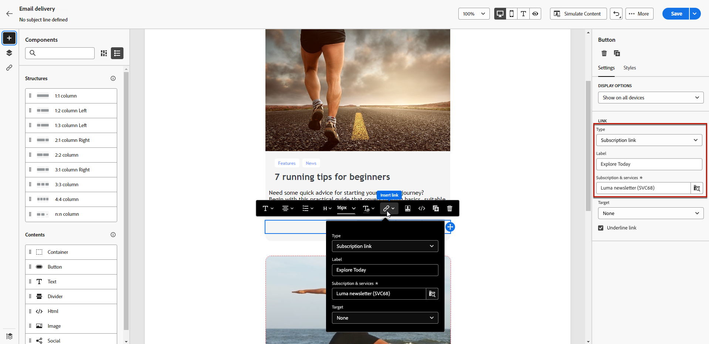
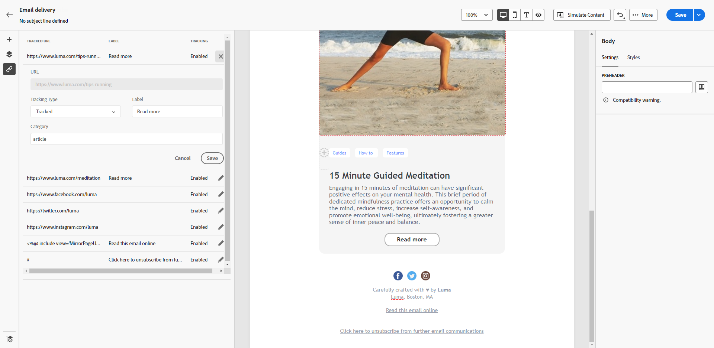

# Add links and track messages {#tracking}

Use the Email Designer to add links to your content and track the messages sent, allowing you to monitor the behavior of your recipients.

## Insert links {#insert-links}

When designing a message, you can add links to your content.

>[!NOTE]
>
>When tracking is enabled, all links included in the message content are tracked.

To insert links into your email content, follow these steps:

1. Select an element, and click **[!UICONTROL Insert link]** from the contextual toolbar.

1. Choose the type of link you want to create:

    {zoomable="yes"}

    * **[!UICONTROL External link]**: Insert a link to an external URL.

    * **[!UICONTROL Landing page]**: Insert a link to a landing page. If you select a dynamic landing page (with the **[!UICONTROL Service from URL]** option selected), you can select any service from the list. [Learn more](../landing-pages/create-lp.md#define-actions-on-form-submission)

        {zoomable="yes"}

    * **[!UICONTROL Subscription link]**: Insert a link to a subscription service. When users click the link, they are directed to the subscription landing page referenced in the selected service. [Learn more](../audience/manage-services.md#create-service)

        {zoomable="yes"}

    * **[!UICONTROL Unsubscription link]**: Insert a link to an unsubscription service. When subscribers click the link, they are directed to the unsubscription landing page referenced in the selected service. [Learn more](../audience/manage-services.md#create-service)

    <!--* **[!UICONTROL Mirror page]**: Add a link to display the email content in a web browser. [Learn more]-->

1. Enter the desired URL in the corresponding field, or select a landing page or a service, and define the link settings and styles.

1. Add a **[!UICONTROL Label]** and a **[!UICONTROL Link]**.

1. Save your changes.

1. After creating the link, modify it from the **[!UICONTROL Settings]** tab if needed.

    * Edit the link and change its **[!UICONTROL Target]**.
    * Choose whether to underline the link by checking the corresponding option.

    {zoomable="yes"}

>[!NOTE]
>
>Marketing-type email messages must include an opt-out link, which is not required for transactional messages. The message category (**[!UICONTROL Marketing]** or **[!UICONTROL Transactional]**) is defined at the channel surface level and when creating the message.

Include a specific link to the mirror page in all your email messages. Learn more about the mirror page in [this section](mirror-page.md).

## Manage tracking {#manage-tracking}

The [Email Designer](create-email-content.md) allows you to manage tracked URLs, such as editing the tracking type for each link.

1. Click the **[!UICONTROL Links]** icon from the left pane to display the list of all URLs in your content to be tracked.

    This list provides a centralized view and helps locate each URL in the email content.

1. To edit a link, click the corresponding pencil icon.

    {zoomable="yes"}

1. Modify the **[!UICONTROL Tracking Type]** if needed:

   {zoomable="yes"}

    For each tracked URL, set the tracking mode to one of these values:

    * **[!UICONTROL Tracked]**: Activates tracking for this URL.
    * **[!UICONTROL Opt out]**: Marks this URL as an opt-out or unsubscription URL.
    * **[!UICONTROL Mirror page]**: Marks this URL as a mirror page URL.
    * **[!UICONTROL Never]**: Prevents tracking of this URL. <!--This information is saved: if the URL appears again in a future message, its tracking is automatically deactivated.-->

1. Add a **[!UICONTROL Category]** to your link to group tracked links, and click **[!UICONTROL Save]**.

    {zoomable="yes"}

1. After sending your delivery, access your delivery report. Under the **[!UICONTROL Tracking]** menu, the **[!UICONTROL URLs and click streams]** report displays which URLs from your delivery are the most visited. [Learn more](../reporting/gs-reports.md)