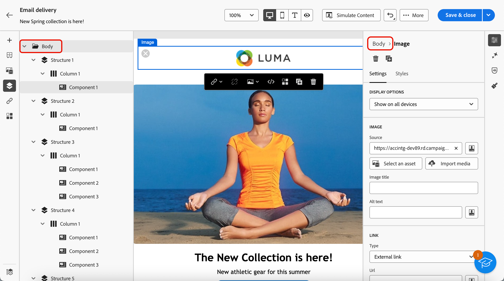

# Add metadata to your email content {#email-metadata}

>[!CONTEXTUALHELP]
>id="ac_edition_preheader"
>title="Define a preheader"
>abstract="A preheader is a short summary text that follows the subject line when viewing an email from your email client. In many cases, it provides a short summary of the email, and is typically one sentence long."

When designing your emails, for better readability and improved accessibility, you can define additional meta attributes for your content. The [!DNL Journey Optimizer] [Email Designer](get-started-email-designer.md) enables you to specify the following elements:

* **[!UICONTROL Preheader]**: A preheader is a short summary text that follows the subject line when viewing an email from your email client. In many cases, it provides a short summary of the email, and is typically one sentence long. 

    >[!NOTE]
    >
    >Preheaders are not supported by all email clients. When not supported, the preheader does not display.

* **[!UICONTROL Document title]**: This field, which corresponds to the `<title>` element, provides descriptive information about your email content, typically displayed as a tooltip on mouse hover. It can help users with disabilities by providing additional context, and can contribute to a better understanding of your content by search engines.

* **[!UICONTROL Document language]**: To ensure accessibility, you can specify the language that screen readers will use to convert text and images into speech or braille - for people with visual impairments, or learning disabilities. This setting corresponds to the `lang` attribute in the `<html>` element.

To configure these settings, follow the steps below.

1. From the [Email Designer](create-email-content.md), add at least a **[!UICONTROL Structure component]** to start designing your email.

1. Click **[!UICONTROL Body]**, either from the **[!UICONTROL Navigation tree]** on the left, or on top of the right pane.

    

1. From the **[!UICONTROL Settings]** tab, type some text inside the **[!UICONTROL Preheader]**, **[!UICONTROL Document title]**, and/or **[!UICONTROL Document language]** fields.

1. You can also click the personalization icon next to each field to customize your content from profile attributes, audiences, contextual attributes, and more. [Learn more about personalization](../personalization/gs-personalization.md)

    

1. Click **[!UICONTROL Save]** to confirm your changes.