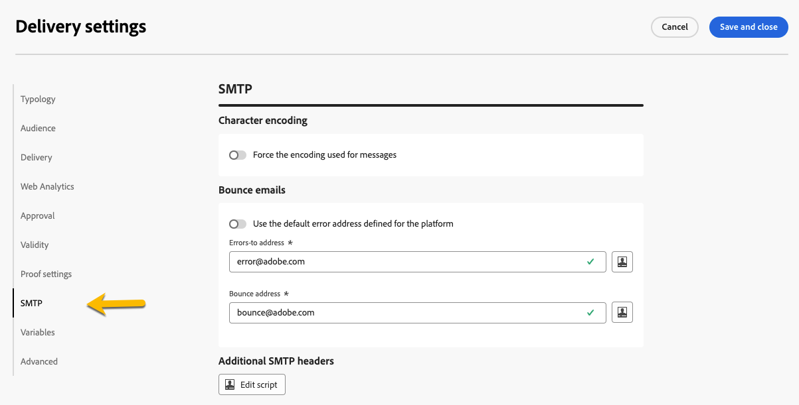

# SMTP settings for email delivery {#smtp}

You can add additional SMTP parameters to your email delivery. You can do it in the SMTP tab of the delivery settings.

{zoomable="yes"}

## Character encoding {#character-encoding}

The **[!UICONTROL Character encoding]** section allows you to set a specific encoding.
The default encoding is UTF-8, which works for most characters. However, some email providers might not display special characters correctly if they do not support the UTF-8 standard encoding.

For example, if you want to send an email with Japanese characters, it is better to use an encoding that specifically supports those characters, so your audience in Japan can see everything correctly.

To do this,  activate the **[!UICONTROL Force the encoding used for messages]** toggle, and select the right encoding from the list that supports your special characters.

{zoomable="yes"}

## Bounce emails {#bounce-emails}

The **[!UICONTROL SMTP]** tab of the delivery settings lets you also configure the management of bounce mails.

* **[!UICONTROL Errors-to-address]**: If you activate the **[!UICONTROL Use the default error address defined for the platform]** toggle, bounced emails are received in the default error box of the platform. If you do not activate it, you can define a specific error address for your delivery.

* **[!UICONTROL Bounce address]**: You can also define another address to which the unprocessed bounced emails are forwarded. This address allows to investigate the reasons for bouncing when emails could not be automatically qualified by the application.

These two fields can be personalized as described in [this section](../personalization/gs-personalization.md). 

{zoomable="yes"}

## Additional SMTP headers

You can add **[!UICONTROL SMTP headers]** to your email delivery, in the SMTP tab of the delivery settings.

The script entered in this window must reference one header per line in the following form: name:value.

Values are encoded automatically if necessary.

>[!IMPORTANT]
>
>Adding a script for inserting additional SMTP headers is reserved for advanced users.
The syntax of this script must comply with the requirements of this content type: no unused space, no empty line, etc.

{zoomable="yes"}
