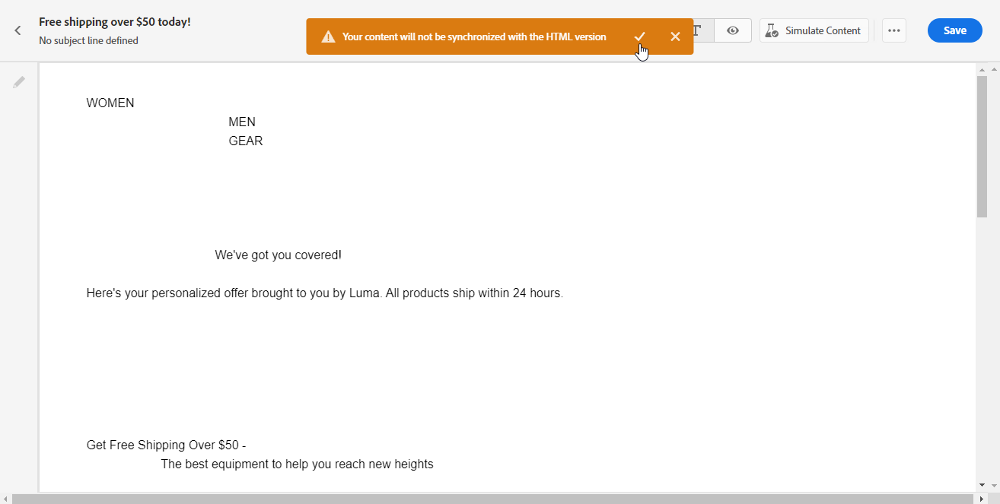

# Create the text version of an email {#text-version-email}

It is recommended to create a text version of your email body, which is used when HTML content cannot be displayed.

By default, the Email Designer creates a **[!UICONTROL Plain text]** version of your email, including personalization fields. This version is automatically generated and synchronized with the HTML version of your content.

If you prefer using different content for the plain text version, follow the steps below:

1. From your email, select the **[!UICONTROL Plain text]** tab.

    {zoomable="yes"}

1. Use the **[!UICONTROL Sync with HTML]** toggle to disable synchronization.

    {zoomable="yes"}

1. Click the check mark to confirm your choice.

    {zoomable="yes"}

1. Edit the plain text version as desired.

>[!CAUTION]
>
>* Changes made in the **[!UICONTROL Plain text]** view are not reflected in the HTML view.
>
>* If you re-enable the **[!UICONTROL Sync with HTML]** option after updating your plain text content, your changes are lost and replaced with text content generated from the HTML version.