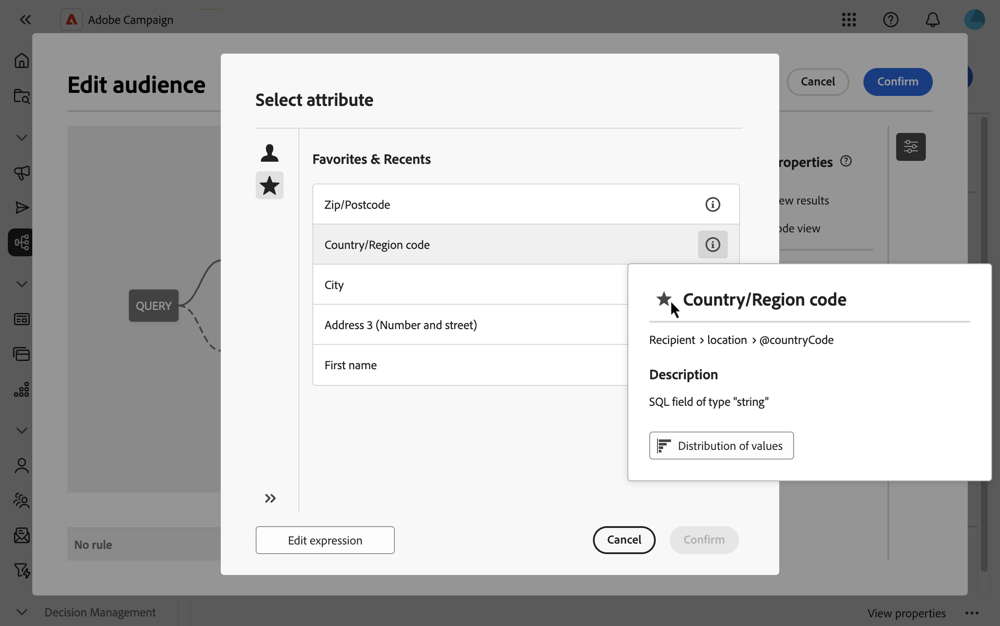

# Select attributes and add them to favorites {#folders}

The Campaign Web user interface allows you to select attributes from the database at various locations, depending on the action you want to perform. For example, you can select attributes when defining output columns for a direct mail delivery or a file to extract. Similarly, attributes can be selected when using the query modeler to create rules, filters or build audiences.

To quickly reuse attributes that are frequently used, you can add them to favorites. This ensures they are readily accessible for future tasks. In addition to favorites, you can also view and use the most recently selected attributes. 

The interface also provides a distribution of values tool, which allows you to visualize the distribution of an attribute's values within a table. This tool can help you identify the range and frequency of values, ensuring data consistency when creating queries or expressions.

## Favorites & recent attributes {#favorites}

>[!CONTEXTUALHELP]
>id="acw_attribute_picker_favorites_recents"
>title="Favorites & Recents"
>abstract="The **[!UICONTROL Favorites & Recents]** menu in the attribute picker provides an organized view of attributes that you have added to favorites, along with a list of recently used attributes. Favorite attributes appear first, followed by recently used ones, making it easy to locate the attributes you need."

The **[!UICONTROL Favorites & Recents]** menu in the attribute picker provides an organized view of attributes that you have added to favorites, along with a list of recently used attributes. Favorite attributes appear first, followed by recently used ones, making it easy to locate the attributes you need.

To add an attribute to favorites, hover over its information button and select the star icon. The attribute will then be added to your favorites list automatically. If you no longer wish to keep an attribute as a favorite, you can remove it by selecting the star icon again. 

You can add up to 20 attributes favorites. Favorite and recent attributes are associated with each user within an organization. This means they are accessible from different machines, ensuring a seamless experience across devices.

## Identify the distribution of values within a table {#distribution}

The **Distribution of Values** button, available in an attribute's information pane, allows you to analyze the distribution of values for that attribute within the table. This feature is particularly helpful for understanding the values available, their counts, and percentages. It also helps to avoid issues such as inconsistent capitalization or spelling when building queries or creating expressions.

For attributes with a large number of values, the tool displays only the first twenty. In such cases, a **[!UICONTROL Partial load]** notification will appear to indicate this limitation. You can apply advanced filters to refine the displayed results and focus on specific values or subsets of data. Detailed guidance on using filters can be found [here](../get-started/work-with-folders.md#filter-the-values).

For additional information on using the distribution of values tool in different contexts, refer to the following sections:

- [Distribution of values in a folder](../get-started/work-with-folders.md##distribution-values-folder)
- [Distribution of values in a query](../query/build-query.md#distribution-values-query)
