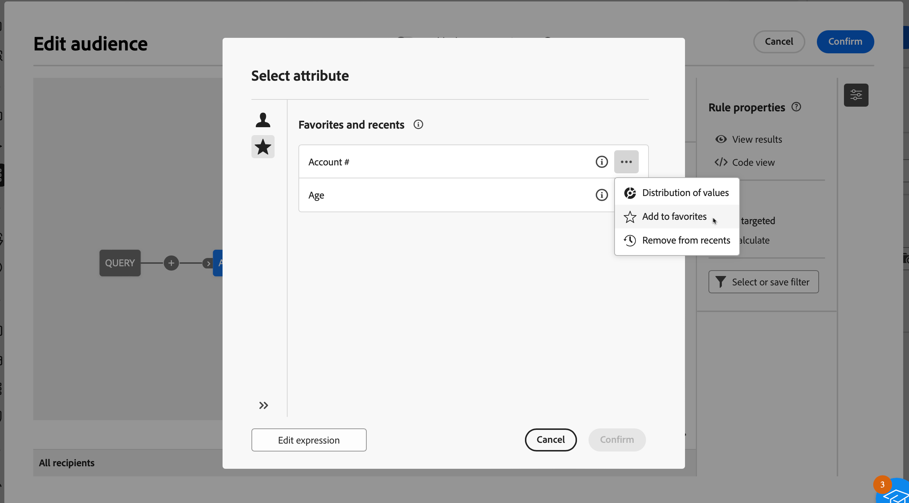

# Select attributes and add them to favorites {#folders}

The Campaign Web user interface allows users to select attributes from the database at various locations, depending on the action being performed. For example, attributes can be selected when defining output columns for a direct mail delivery or a file to extract. Similarly, attributes can be selected when using the query modeler to create rules, filters, or build audiences.

To quickly reuse attributes that are frequently used, add them to favorites. This ensures they are readily accessible for future tasks. In addition to favorites, users can view and use the most recently selected attributes.

The interface also provides a distribution of values tool, which allows you to visualize the distribution of an attribute's values within a table. This tool helps identify the range and frequency of values, ensuring data consistency when creating queries or expressions.

## Favorites & recent attributes {#favorites}

>[!CONTEXTUALHELP]
>id="acw_attribute_picker_favorites_recents"
>title="Favorites & Recents"
>abstract="The **[!UICONTROL Favorites & Recents]** menu in the attribute picker provides an organized view of attributes that you have added to favorites, along with a list of recently used attributes. Favorite attributes appear first, followed by recently used ones, making it easy to locate the attributes you need."

The **[!UICONTROL Favorites & Recents]** menu in the attribute picker provides an organized view of attributes added to favorites, along with a list of recently used attributes. Favorite attributes appear first, followed by recently used ones, making it easy to locate the required attributes.

To add an attribute to favorites, click the expand button and select **[!UICONTROL Add to favorites]**. The attribute is then added to the favorites list automatically. To remove an attribute from favorites, select the star icon again.

Users can add up to 20 attributes to favorites. Favorite and recent attributes are associated with each user within an organization, ensuring accessibility across different machines and providing a seamless experience across devices.

## Identify the distribution of values within a table {#distribution}

The **Distribution of Values** button, available when clicking the expand button next to the attribute, allows users to analyze the distribution of values for that attribute within the table. This feature is helpful for understanding the available values, their counts, and percentages. It also helps avoid issues such as inconsistent capitalization or spelling when building queries or creating expressions.

For attributes with a large number of values, the tool displays only the first twenty. In such cases, a **[!UICONTROL Partial load]** notification appears to indicate this limitation. Apply advanced filters to refine the displayed results and focus on specific values or subsets of data. Detailed guidance on using filters is available [here](../get-started/work-with-folders.md#filter-the-values).

For additional information on using the distribution of values tool in different contexts, refer to the following sections:

* [Distribution of values in a folder](../get-started/work-with-folders.md##distribution-values-folder)
* [Distribution of values in a query](../query/build-query.md#distribution-values-query)