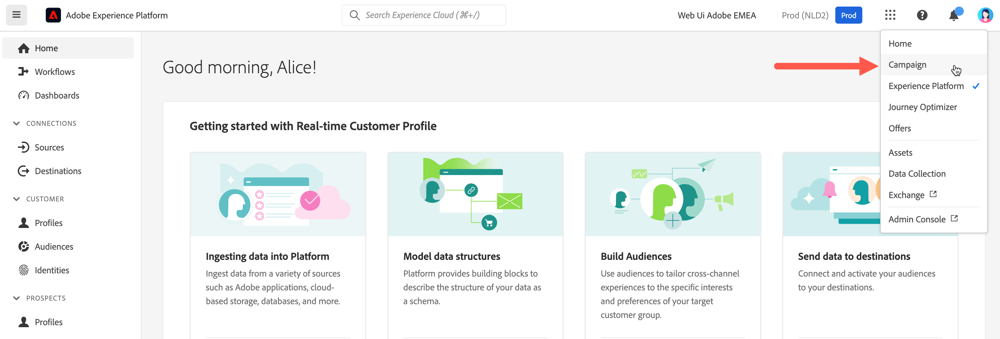

# Connect to Adobe Campaign {#connect-to-campaign}

Experience Cloud is Adobe's integrated family of digital marketing applications, products, and services. From its intuitive interface, you can quickly access your cloud applications, product features, and services. Learn how to connect to Adobe Experience Cloud, and access Adobe Campaign Web interface in this page.

## Sign in to Adobe Experience Cloud {#sign-in-to-exc}

You can only use Single Sign-On (SSO) to connect to Campaign. Typically, Experience Cloud administrators grant access to applications and services. Follow the steps in your email invitation to the Experience Cloud.

To sign in to Adobe Experience Cloud, basic steps are:

1. Browse to [Adobe Experience Cloud](https://experience.adobe.com/){target="_blank"}.

1. Log in using your Adobe ID or Enterprise ID. Learn more about idenfity types at Adobe in [this article](https://helpx.adobe.com/enterprise/using/identity.html){target="_blank"}.
    
    After signing in to Experience Cloud, you can quickly access all your solutions and apps.

    

1. Verify that you are in the right organization. 

    {width="50%" align="left"}

    Learn more about Organizations in Adobe Experience Cloud in [this article](https://experienceleague.adobe.com/docs/core-services/interface/administration/organizations.html){target="_blank"}.

## Access to Adobe Campaign {#access-to-campaign}

To access your Campaign environment, select **Campaign** from the **Quick Access** section of the Adobe Experience Cloud home page. 

If you are already connected to another Adobe Experience Cloud solution, you can also browse to your Campaign environment from the solution switcher on the top right of your screen.

If you have access to multiple environments, including Campaign Control Panel, click the **Launch** button for the correct instance. 

You are now connected to Campaign. Learn how to start using the user interface in [this page](user-interface.md).

## Adobe Experience Cloud top navigation {#top-bar}

Browse the top bar of the interface to:

* share feedback about Campaign Web user interface
* switch between your organizations
* switch between your Adobe Experience Cloud solutions and apps
* search for help on [Adobe Experience League](https://experienceleague.adobe.com/docs/){target="_blank"}
* check your product notifications
* edit your Adobe profile and manage settings, such as [update your favorite language](#language-pref) or [switch to light/dark theme](#dark-theme)

{width="50%" align="left"}

## Supported browsers {#browsers}

Adobe Campaign Web is designed to work optimally in the latest version of Google Chrome, Safari, and Microsoft Edge. You might have trouble using certain features on older versions, or other browsers.

## Language preferences {#language-pref}

Adobe Campaign Web is currently available in the following languages:

* English (US) - EN-US
* French - FR
* German - DE
* Italian - IT
* Spanish - ES
* Portuguese (Brazilian) - PTBR
* Japanese - JP
* Korean - KR
* Simplified Chinese - CHS
* Traditional Chinese - CHT

Your default language for Campaign Web is determined by the preferred language specified in your user profile. It does not relate to the language of your Campaign server and client console.

To change your language:

1. Click on your profile icon, on the top right, then select **Preferences**.
1. Then click the language link displayed under your email address.
1. Select your preferred language and click **Save**. You can select a second language in case the component you are using is not localized into your first language.

>[!CAUTION]
>
>If you plan to use [AI-powered contextual help](using-ai.md) capabilities, you must set your prefered language to English. Other languages are not supported.
>

## Dark and light themes {#dark-theme}

Adobe Campaign is available in light and dark themes. By default, the user interface is enabled in light theme. To switch to the dark theme, click on your profile icon, and use the **Dark theme** toggle to enable/disable it.

User profile settings and account preferences are detailed in [this section](https://experienceleague.adobe.com/docs/core-services/interface/experience-cloud.html#preferences){target="_blank"}. 

Learn more about Experience Cloud Central Interface Components in [this documentation](https://experienceleague.adobe.com/docs/core-services/interface/experience-cloud.html){target="_blank"}.
