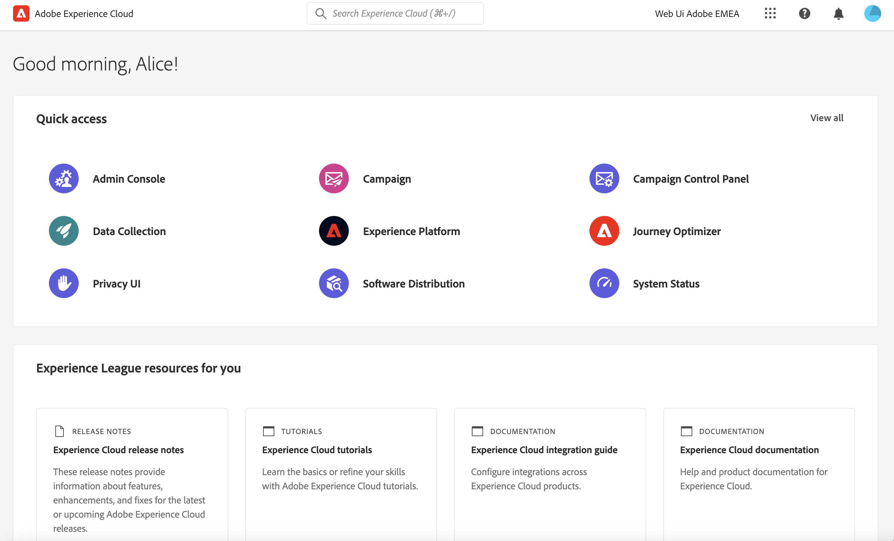
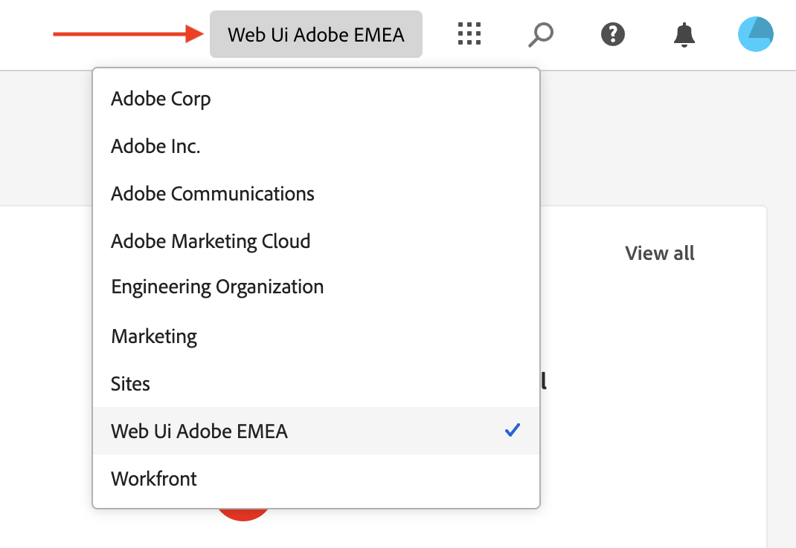
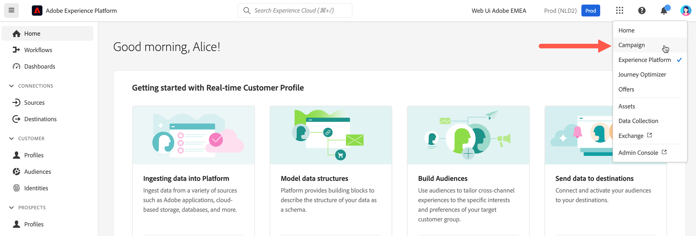
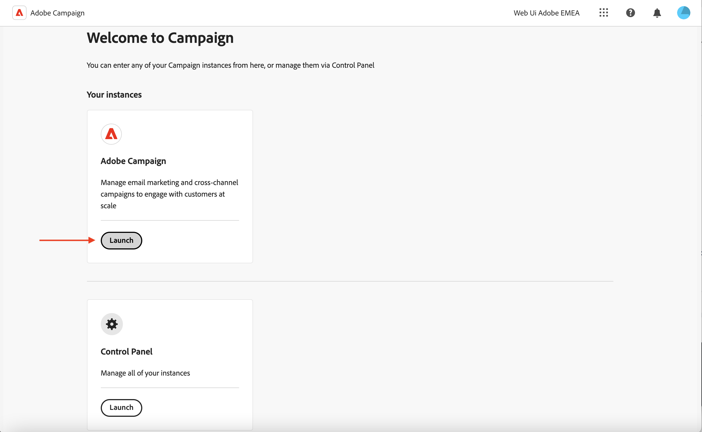

# Connect to Adobe Campaign {#connect-to-campaign}

Experience Cloud is Adobe's integrated family of digital marketing applications, products, and services. From its intuitive interface, you can quickly access your cloud applications, product features, and services. Learn how to connect to Adobe Experience Cloud and access the Adobe Campaign Web interface on this page.

## Sign in to Adobe Experience Cloud {#sign-in-to-exc}

You can only use Single Sign-On (SSO) to connect to Campaign. Typically, Experience Cloud administrators grant access to applications and services. Follow the steps in your email invitation to the Experience Cloud.

To sign in to Adobe Experience Cloud, follow these basic steps:

1. Browse to [Adobe Experience Cloud](https://experience.adobe.com/){target="_blank"}.

1. Log in using your Adobe ID or Enterprise ID. Learn more about identity types at Adobe in [this article](https://helpx.adobe.com/enterprise/using/identity.html){target="_blank"}.

    After signing in to Experience Cloud, you can quickly access all your solutions and apps.

    {zoomable="yes"}

1. Verify that you are in the correct organization.

    {zoomable="yes"}{width="50%"}

    Learn more about organizations in Adobe Experience Cloud in [this article](https://experienceleague.adobe.com/docs/core-services/interface/administration/organizations.html){target="_blank"}.

## Access to Adobe Campaign {#access-to-campaign}

To access your Campaign environment, select **Campaign** from the **Quick Access** section of the Adobe Experience Cloud home page.

If you are already connected to another Adobe Experience Cloud solution, browse to your Campaign environment from the solution switcher on the top right of your screen.

{zoomable="yes"}

If you have access to multiple environments, including Campaign Control Panel, click the **Launch** button for the correct instance.

{zoomable="yes"}

You are now connected to Campaign. Learn how to start using the user interface in [this page](user-interface.md).

### Access control {#access-control}

>[!CONTEXTUALHELP]
>id="acw_explorer_permissions_create"
>title="Permission required"
>abstract="Your admin must grant you permission before you can create this object."

>[!CONTEXTUALHELP]
>id="acw_audiences_read_only"
>title="This audience is read only"
>abstract="You do not have permissions to edit this audience. If needed, contact your administrator to grant you access."

>[!CONTEXTUALHELP]
>id="acw_subscription_services_read_only"
>title="This service is read only"
>abstract="You do not have permissions to edit this service. If needed, contact your administrator to grant you access."

>[!CONTEXTUALHELP]
>id="acw_recipients_readonlyprofile"
>title="Recipients read only profile"
>abstract="You do not have permissions to edit this profile. If needed, contact your administrator to grant you access."

>[!CONTEXTUALHELP]
>id="acw_campaign_read_only"
>title="This campaign is read only"
>abstract="You do not have permissions to edit this campaign. If needed, contact your administrator to grant you access."

>[!CONTEXTUALHELP]
>id="acw_deliveries_read_only"
>title="This delivery is read only"
>abstract="You do not have permissions to edit this delivery. If needed, contact your administrator to grant you access."

>[!CONTEXTUALHELP]
>id="acw_wf_read_only"
>title="This workflow is read only"
>abstract="You do not have permissions to edit this workflow. If needed, contact your administrator to grant you access."

Access control restricts access to objects and data from main lists, such as deliveries, recipients, or workflows. These restrictions also apply in the Explorer navigation tree. In addition, you need permissions to create, delete, duplicate, and edit objects from the user interface.

All permissions in Campaign Web synchronize with Campaign Client Console permissions. Only Campaign Administrators can define and modify user permissions.

As you browse the Campaign Web user interface, you can access data, objects, and capabilities depending on your permissions. For example, if you do not have access permissions to a folder, you cannot see it. Your permissions also affect objects and data management. Without Write permissions for a specific folder, you cannot create a delivery in that folder, even if you can see it in the user interface.

You can learn how to [view and manage permissions here](permissions.md).

## Adobe Experience Cloud top navigation {#top-bar}

The top bar of the interface gives you quick access to core Experience Cloud features.

{zoomable="yes"}

Use the top bar to:

* Share feedback about the Campaign Web user interface.
* Switch between your organizations.
* Switch between your Adobe Experience Cloud solutions and apps.
* Search for help on [Adobe Experience League](https://experienceleague.adobe.com/docs/){target="_blank"}.
* View your product notifications.
* Edit your Adobe profile and manage settings, such as [updating your preferred language](#language-pref) or [switching between light and dark themes](#dark-theme).

## Supported browsers {#browsers}

Adobe Campaign Web is designed to work optimally in the latest version of Google Chrome, Safari, and Microsoft Edge. You might encounter issues using certain features on older versions or other browsers.

## Language preferences {#language-pref}

Adobe Campaign Web is currently available in the following languages:

* English (US) - EN-US
* French - FR
* German - DE
* Italian - IT
* Spanish - ES
* Portuguese (Brazilian) - PTBR
* Japanese - JP
* Korean - KR
* Simplified Chinese - CHS
* Traditional Chinese - CHT

Additionally, locale-specific formatting (such as dates, times, calendars, numbers) may also be available in variants of the languages supported by the user interface:

* English (Israel)
* English (United Kingdom)
* Spanish (Mexico)
* Spanish (Latin America)
* French (Canada)

Your default language for Campaign Web is determined by the preferred language specified in your user profile. It does not relate to the language of your Campaign server and client console.

To change your language:

1. Click on your profile icon, on the top right, then select **Preferences**.
1. Click the language link displayed under your email address.
1. Select your preferred language and click **Save**. You can select a second language in case the component you are using is not localized into your first language.

## Dark and light themes {#dark-theme}

Adobe Campaign is available in light and dark themes. By default, the user interface is enabled in light theme. To switch to the dark theme, click on your profile icon, and use the **Dark theme** toggle to enable or disable it.

User profile settings and account preferences are detailed in [this section](https://experienceleague.adobe.com/docs/core-services/interface/experience-cloud.html#preferences){target="_blank"}.

Learn more about Experience Cloud Central Interface Components in [this documentation](https://experienceleague.adobe.com/docs/core-services/interface/experience-cloud.html){target="_blank"}.