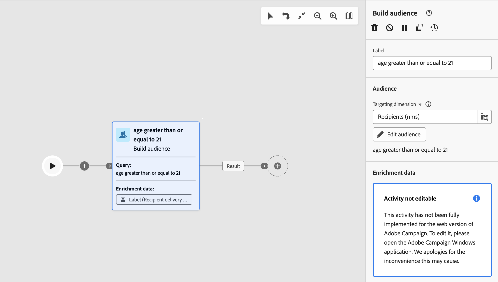

# Guardrails and limitations {#guardrails-limitations}

When working in Campaign web UI with components created or modified in Campaign client console, the guardrails and limitations listed below apply.

## Workflows {#wf-guardrails-limitations}

### Activities

Workflow activities that are not supported yet in the web UI are read-only and displayed as incompatible activities. You can still execute the workflow, send messages, check the logs, etc. Workflow activities that are available both in the web UI and the client console are editable. 

| Console | Web UI |
| --- | --- |
|  |  |

Workflow activity settings that are not supported yet in the web UI are not displayed. However, when the worflow is executed, these settings apply.

| Console | Web UI |
| --- | --- |
|  |  |

In the console, the **Enrichment** activity can perform both reconciliation and enrichment. In the web UI, reconciliation capabilities are not available yet. If you have defined, in the console, reconciliation settings in the **Enrichment** activity, it will be displayed as a non-compatible read-only activity in the web UI. 

| Console | Web UI |
| --- | --- |
|  |  |

### Canvas

When creating a new workflow in the web UI, the canvas only supports one entry point. However, if you created a worflow in the console with multiple entry points, you can open and edit it in the web UI. 

| Console | Web UI |
| --- | --- |
|  |  |

Loops are not available yet in the web UI. If you created a wokflow including a loop using the console, you cannot access it from the web UI. An error message is displayed.

| Console | Web UI |
| --- | --- |
|  | 

The positioning of the nodes is refreshed everytime an activity is added or removed. If you create a workflow in the console, modify it using the web UI and re-open it in the console, you may notice some minor positioning imperfections. This has no impact on the workflow's 

| Initial workflow | Positionning change |
| --- | --- |
|  |  |

## Predefined filters {#filters-guardrails-limitations}

When selecting the audience of a delivery, or when building an audience in a workflow, some predefined filters are not available in the user interface, in that version of the product. 

A specific error message is displayed. Even if you cannot view the graphic representation of the query in the rule builder, and cannot edit the filter, you can still use it, and see the filtering conditions, and the results. You can also access the SQL query to check the exact settings. 

{width="70%" align="left"}
 

Note that if you build a filter in the Web interface and modify it in the console with unsupported attributes, the graphic representation can no longer be available in the Web interface. In any cases, you can still use the filter.

Unsupported attributes are listed below.

### Unsupported data types {#unsupported-data-type}

The following data types available in the client console are not supported when displaying a filter or a rule in the Web interface:

* datetime
* time
* timespan
* double
* float

### Unsupported filtering capabilities {#unsupported-filtering-capabilities}

When a filter is built with complex expressions and functions in the client console, it cannot be edited in the Web interface.

In addition, the following operators are not supported:

* Numeric type
    * is included in
    * no in

* String type
    * greater than
    * less than
    * greater than or equals to
    * less than or equals to
    * like
    * not like

* Date type
    * on or after
    * on or before
    * not equals to
    * is empty
    * is not empty
    * is included in
    * not in
    * in last

* 1-N links
    * COUNT, SUM, AVG, MIN, MAX